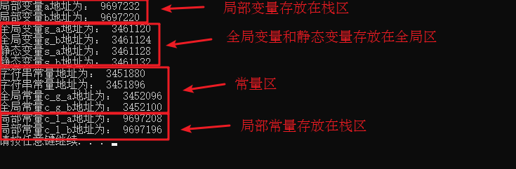

## 1 内存分区模型

C++程序在执行时，将内存大方向划分为**4个区域**

- 代码区：存放函数体的二进制代码，由操作系统进行管理的
- 全局区：存放全局变量和静态变量以及常量
- 栈区：由编译器自动分配释放, 存放函数的参数值,局部变量等
- 堆区：由程序员分配和释放,若程序员不释放,程序结束时由操作系统回收


**内存四区意义：**

不同区域存放的数据，赋予不同的生命周期, 给我们更大的灵活编程


### 1.1 程序运行前 (代码区和全局区)

​	在程序编译后，生成了exe可执行程序，**未执行该程序前**分为两个区域

​	**代码区：**

​		存放 CPU 执行的机器指令

​		代码区是**共享**的，共享的目的是对于频繁被执行的程序，只需要在内存中有一份代码即可

​		代码区是**只读**的，使其只读的原因是防止程序意外地修改了它的指令

​	**全局区：**

​		**全局变量**和**静态变量**存放在此.

​		全局区还包含了**常量区**, 字符串常量和其他常量也存放在此.

​		==该区域的数据在程序结束后由操作系统释放==


**示例：**

```c++
#include<iostream>
using namespace std;

// 全局变量
int g_a = 10;
int g_b = 10;

// 全局常量
const int c_g_a = 10;
const int c_g_b = 10;

int main()
{
    // 局部变量
    int a = 10;
    int b = 10;

    // 打印地址
    cout << "局部变量a地址为： " << (int)&a << endl;
    cout << "局部变量b地址为： " << (int)&b << endl;

    cout << "全局变量g_a地址为： " << (int)&g_a << endl;
    cout << "全局变量g_b地址为： " << (int)&g_b << endl;

    // 静态变量
    static int s_a = 10;
    static int s_b = 10;

    cout << "静态变量s_a地址为： " << (int)&s_a << endl;
    cout << "静态变量s_b地址为： " << (int)&s_b << endl;

    cout << "字符串常量地址为： " << (int)&"hello world" << endl; 
    cout << "字符串常量地址为： " << (int)&"hello world1" << endl;

    cout << "全局常量c_g_a地址为： " << (int)&c_g_a << endl; 
    cout << "全局常量c_g_b地址为： " << (int)&c_g_b << endl;

    const int c_l_a = 10;
    const int c_l_b = 10;

    cout << "局部常量c_l_a地址为： " << (int)&c_l_a << endl;
    cout << "局部常量c_l_b地址为： " << (int)&c_l_b << endl;

    return 0;

}
/*
在Linux中，直接打印16位地址结果：
局部变量a地址为： 0x7ffdf9032ff8
局部变量b地址为： 0x7ffdf9032ffc
全局变量g_a地址为： 0x602070
全局变量g_b地址为： 0x602074
静态变量s_a地址为： 0x602078
静态变量s_b地址为： 0x60207c
字符串常量地址为： 0x400d07
字符串常量地址为： 0x400d13
全局常量c_g_a地址为： 0x400c38
全局常量c_g_b地址为： 0x400c3c
局部常量c_l_a地址为： 0x7ffdf9033000
局部常量c_l_b地址为： 0x7ffdf9033004
*/
```

(代码见: [01_全局区.cpp](./01_全局区.cpp))

打印结果：



总结：

* C++中在程序运行前分为全局区和代码区
* 代码区特点是共享和只读
* **全局区**中存放全局变量、静态变量、常量(常量区)
* **常量区**中存放 const修饰的全局常量  和 字符串常量


### 1.2 程序运行后 (栈区和堆区)

​	**栈区：**

​		由编译器自动分配释放, 存放函数的参数值,局部变量等

​		注意事项：**不要返回局部变量的地址，栈区开辟的数据由编译器自动释放**

**示例：**

```c++
#include<iostream>
using namespace std;

// 栈区的数据由编译器管理开辟和释放
// ！！不要返回局部变量的地址

int *func(int b)   // 形参数据也会放在栈区，如这里的b
{
    b = 100;
    int a = 10;    // 局部变量,存放在栈区，栈区的数据在函数执行后自动释放
    return &a;     // 返回局部变量的地址
}

int main()
{
    int *p = func(1);

    cout << *p << endl;   // 第一次有时可以打印出"10"的结果，因为编译器做了保留
    cout << *p << endl;   // 第二次数据不再保留，打印出无效结果


    return 0;
}

/*
编译有warnning:
02_栈区.cpp:9:6: warning: address of local variable ‘a’ returned [-Wreturn-local-addr]
  int a = 10;  // 局部变量

执行文件：
$ ./02_栈区 
Segmentation fault (core dumped)
*/

```

(代码见: [02_栈区.cpp](./02_栈区.cpp))


​	**堆区：**

​		由程序员分配释放,若程序员不释放,程序结束时由操作系统回收

​		在C++中主要利用new在堆区开辟内存

**示例：**

```c++
#include<iostream>
using namespace std;

int *func()
{
    // 利用new，可以将数据开辟到堆区
    // 指针本质也是局部变流，放在栈区，但是指针保存的数据放在堆区
    int *a = new int(10);
    return a;
}

int main()
{
    // 在堆区开辟数据
    int *p = func();
    cout << *p << endl;    // 10
    cout << *p << endl;    // 10

    return 0;
}


```

(代码见: [03_堆区.cpp](./03_堆区)）

**总结：**

堆区数据由程序员管理开辟和释放

堆区数据利用new关键字进行开辟内存


### 1.3 new操作符


​	C++中利用`new`操作符在堆区开辟数据

​	堆区开辟的数据，由程序员手动开辟，手动释放，释放利用操作符`delete`

​	语法：` new 数据类型`

​	利用new创建的数据，会返回该数据对应的类型的指针


**示例1： 基本语法**

```c++
#include<iostream>
using namespace std;

int *func()
{
    // 利用new，可以将数据开辟到堆区
    int *a = new int(10);
    return a;
}

int main()
{
    // 在堆区开辟数据
    int *p = func();
    cout << *p << endl;    // 10
    cout << *p << endl;    // 10
    // 堆区的数据 由程序员管理开辟，也由程序员管理释放
    // 如果想释放堆区的数据，利用关键字 delete

    delete p;

    cout << *p << endl; // 报错，释放的空间不可访问 (Linux输出0)

    return 0;
}
```

(代码见: [04_new基本语法.cpp](./04_new基本语法.cpp))


**示例2：开辟数组**

```c++
#include<iostream>
using namespace std;

// 堆区开辟数组
void test()
{
    // 创建有10个整型数据的数组，在堆区
    int *arr = new int[10];

    // 给数组赋值 100-109
    for (int i = 0; i < 10; i++)
    {
        arr[i] = i+100;
    }
    
    // 遍历打印数组元素
    for (int i = 0; i < 10; i++)
    {
        cout << arr[i] << endl;
    }

    // 释放堆区数组
    // 释放数组时，需要加入[]
    delete[] arr;

}

int main()
{
    test();
    return 0;
}

/*
100
101
102
103
104
105
106
107
108
109
*/
```

(代码见: [05_new开辟数组 .cpp](./05_new开辟数组 .cpp))


