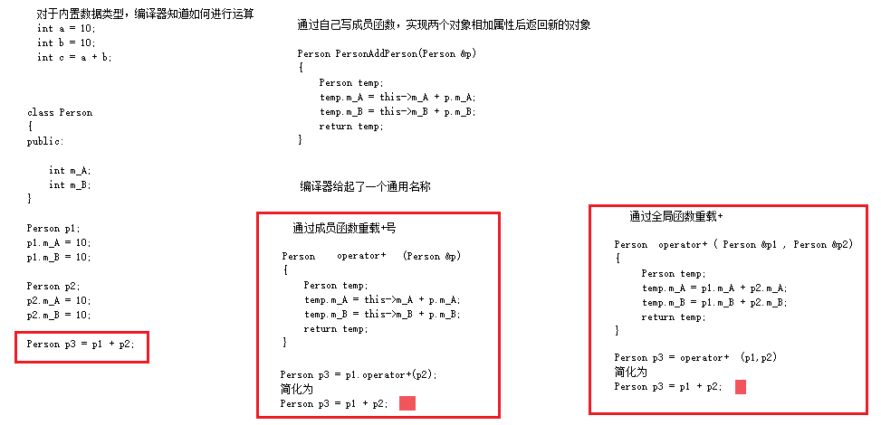

### 4.5 运算符重载

运算符重载概念：对已有的运算符重新进行定义，赋予其另一种功能，以适应不同的数据类型


#### 4.5.1 加号运算符重载

作用：实现两个**自定义数据类型**相加的运算



```C++
#include<iostream>
using namespace std;

// 加号运算符重载：
// 1. 成员函数重载+号
// 2. 全局函数实现重载+号
// 运算符重载，可以发生函数重载

class Person {
public:
    Person() {};
    Person(int a, int b)
    {
        this->m_A = a;
        this->m_B = b;
    }
    //1. 成员函数实现 + 号运算符重载
    Person operator+(const Person& p) {
        Person temp;
        temp.m_A = this->m_A + p.m_A;
        temp.m_B = this->m_B + p.m_B;
        return temp;
    }


public:
    int m_A;
    int m_B;
};

// 2. 全局函数实现 + 号运算符重载
// Person operator+(const Person& p1, const Person& p2) {
// 	Person temp(0, 0);
// 	temp.m_A = p1.m_A + p2.m_A;
// 	temp.m_B = p1.m_B + p2.m_B;
// 	return temp;
// }

//运算符重载，可以发生函数重载 
Person operator+(const Person& p2, int val)  
{
    Person temp;
    temp.m_A = p2.m_A + val;
    temp.m_B = p2.m_B + val;
    return temp;
}

void test() {
    Person p1(10, 10);
    Person p2(20, 20);

    //成员函数方式
    Person p3 = p2 + p1;     //相当于 Person p3 = p2.operaor+(p1)
    cout << "mA:" << p3.m_A << " mB:" << p3.m_B << endl;

    Person p4 = p3 + 100;     //相当于 Person p4 = operator+(p3,10)
    cout << "mA:" << p4.m_A << " mB:" << p4.m_B << endl;

}

int main() {
    test();

    return 0;
}
/*
mA:30 mB:30
mA:130 mB:130
*/
```

(代码见: [01_加号运算符重载.cpp](./01_加号运算符重载.cpp))

> 总结1：对于**内置**的数据类型的表达式的的运算符是不可能改变的

> 总结2：不要滥用运算符重载


#### 4.5.2 左移运算符重载

作用：可以输出自定义数据类型


```C++
#include<iostream>
using namespace std;


class Person {
    // 友元让一个全局函数访问类中私有成员
    friend ostream& operator<<(ostream& out, Person& p);

public:

    Person(int a, int b)
    {
        this->m_A = a;
        this->m_B = b;
    }

    // 成员函数实现不了左移运算符重载,  p.operator<<(cout) 或者 p << cout 不是我们想要的效果
    // 通常不会利用成元函数重载<<，因为无法实现cout在左侧
    // void operator<<(Person& p){
    // }

private:
    int m_A;
    int m_B;
};

// 只能利用全局函数实现左移运算符重载
// cout是"ostream"类型，标准输出流
// ostream对象只能有一个
ostream& operator<<(ostream& out, Person& p) {
    out << "m_A = " << p.m_A << " m_B = " << p.m_B;
    return out;
}

void test() {

    Person p1(10, 20);
    // 对"cout << p1"，开始编译器无法实现，这里通过左移运算符重载实现了
    // 本质上是 "operator << (cout, p1)"
    cout << p1 << endl << "hello world" << endl;       //链式编程
}

int main() {
    test();

    return 0;
}
/*
m_A = 10 m_B = 20
hello world
*/
```

(代码见: [02_左移运算符重载.cpp](./02_左移运算符重载.cpp))

> 总结：重载左移运算符配合友元可以实现输出自定义数据类型


#### 4.5.3 递增运算符重载


作用： 通过重载递增运算符，实现自己的整型数据的递增运算


```C++
#include<iostream>
using namespace std;

// 重载递增运算符
// 作用： 通过重载递增运算符，实现自己的整型数据的递增运算

class MyInteger {

    friend ostream& operator<<(ostream& out, MyInteger myint);

public:
    MyInteger() {
        m_Num = 0;
    }
    //前置++，返回引用是为了一直对一个数据递增操作
    MyInteger& operator++() {
        //先++
        m_Num++;
        //再返回自身
        return *this;    // 这里返回的是引用
    }

    //后置++，int代表占位参数位，可以用于区分前置递增和后置底层
    MyInteger operator++(int) {
        // 先记录当前本身的值，然后让本身的值加1，但是返回的是以前的值，达到先返回后++
        MyInteger temp = *this; 
        // 后递增
        m_Num++;
        // 返回记录的结果
        return temp;    // 这里返回的是值
    }

private:
    int m_Num;
};

// 重载左移运算符，实现输出自定义数据类型，如"cout << myInt"
ostream& operator<<(ostream& out, MyInteger myint) {
    out << myint.m_Num;
    return out;
}


//前置++ 先++ 再返回
void test01() {
    MyInteger myInt;
    cout << ++myInt << endl;
    cout << myInt << endl;
}

//后置++ 先返回 再++
void test02() {

    MyInteger myInt;
    cout << myInt++ << endl;
    cout << myInt << endl;
}

int main() {
    // test01();
    test02();

    return 0;
}

/*
main()中调用test01()时运行结果：
1
1

main()中调用test01()时运行结果：
0
1
*/
```

(代码见: [03_递增运算符重载.cpp](./03_递增运算符重载.cpp))

> 总结： 前置递增返回引用，后置递增返回值


#### 4.5.4 赋值运算符重载

c++编译器至少给一个类添加4个函数

1. 默认构造函数(无参，函数体为空)
2. 默认析构函数(无参，函数体为空)
3. 默认拷贝构造函数，对属性进行值拷贝
4. **赋值运算符 operator=, 对属性进行值拷贝**


如果类中有属性指向堆区，做赋值操作时也会出现深浅拷贝问题


**示例：**

```C++
#include<iostream>
using namespace std;

class Person
{
public:

    Person(int age)
    {
        //将年龄数据开辟到堆区
        m_Age = new int(age);
    }

    //重载赋值运算符 
    Person& operator=(Person &p)
    {
        // 先判断是否有属性在堆区，如果有则先释放干净，然后再深拷贝
        if (m_Age != NULL)
        {
            delete m_Age;
            m_Age = NULL;
        }
        //编译器提供的代码是浅拷贝，发生重复释放堆区中m_Age的内存，程序崩溃
        //m_Age = p.m_Age;

        //提供深拷贝 解决浅拷贝的问题
        m_Age = new int(*p.m_Age);

        //返回自身
        return *this;
    }


    ~Person()
    {
        // 释放堆区内存，即前面new的m_Age的内存
        if (m_Age != NULL)
        {
            delete m_Age;
            m_Age = NULL;
        }
    }

    //年龄的指针
    int *m_Age;
};


void test01()
{
    Person p1(18);

    Person p2(20);

    Person p3(30);

    p3 = p2 = p1; //赋值操作，可以实现连续赋值，则要求赋值运算符"="的返回值不能是void，而是*this

    cout << "p1的年龄为：" << *p1.m_Age << "  p1.m_Age的地址是："<< p1.m_Age<< endl;

    cout << "p2的年龄为：" << *p2.m_Age << "  p2.m_Age的地址是："<< p2.m_Age<< endl;

    cout << "p3的年龄为：" << *p3.m_Age << "  p3.m_Age的地址是："<< p3.m_Age<< endl;
}

int main() {
    test01();

    //int a = 10;
    //int b = 20;
    //int c = 30;

    //c = b = a;    // 可以实现连续赋值，则要求赋值运算符"="的返回值不应该是空
    //cout << "a = " << a << endl;    // 10
    //cout << "b = " << b << endl;    // 10
    //cout << "c = " << c << endl;    // 10


    return 0;
}
/*
p1的年龄为：18  p1.m_Age的地址是：0xaccc20
p2的年龄为：18  p2.m_Age的地址是：0xaccc40
p3的年龄为：18  p3.m_Age的地址是：0xaccc60
*/
```

(代码见: [04_赋值运算符重载.cpp](./04_赋值运算符重载.cpp))


#### 4.5.5 关系运算符重载

**作用：**重载关系运算符(== , !=)，可以让两个自定义类型对象进行对比操作


**示例：**

```C++
#include<iostream>
using namespace std;

// 重载关系运算符 == , !=

class Person
{
public:
    Person(string name, int age)
    {
        this->m_Name = name;
        this->m_Age = age;
    };
    
    // 重载 ==
    bool operator==(Person & p)
    {
        if (this->m_Name == p.m_Name && this->m_Age == p.m_Age)
        {
            return true;
        }
        else
        {
            return false;
        }
    }

    // 重载 !=
    bool operator!=(Person & p)
    {
        if (this->m_Name == p.m_Name && this->m_Age == p.m_Age)
        {
            return false;
        }
        else
        {
            return true;
        }
    }

    string m_Name;
    int m_Age;
};

void test01()
{
    Person a("孙悟空", 18);
    Person b("孙悟空", 18);

    if (a == b){
        cout << "a和b相等" << endl;
    }
    else{
        cout << "a和b不相等" << endl;
    }

    if (a != b){
        cout << "a和b不相等" << endl;
    }
    else{
        cout << "a和b相等" << endl;
    }
}


int main() {
    test01();

    return 0;
}
/*
a和b相等
a和b相等
*/
```

(代码见: [05_关系运算符重载.cpp](./05_关系运算符重载.cpp))


#### 4.5.6 函数调用运算符重载

* 函数调用运算符 ()  也可以重载
* 由于重载后使用的方式非常像函数的调用，因此称为**仿函数**
* 仿函数没有固定写法，非常灵活


**示例：**

```C++
#include<iostream>
#include<string>
using namespace std;

// 函数调用重载(仿函数)

// 打印输出类
class MyPrint
{
public:
    void operator()(string text)
    {
        cout << text << endl;
    }

};

void test01()
{
    //重载的（）操作符,使用起来非常类似于函数调用，也称为仿函数
    MyPrint myFunc;
    myFunc("hello world");
}

// 仿函数非常灵活，没有固定写法
class MyAdd
{
public:
    int operator()(int v1, int v2)
    {
        return v1 + v2;
    }
};

void test02()
{
    MyAdd add;
    int ret = add(10, 10);
    cout << "ret = " << ret << endl;

    //匿名对象调用，"Myadd()"表示创建匿名对象  
    cout << "MyAdd()(100,100) = " << MyAdd()(100, 100) << endl;
}

int main() {
    test01();
    test02();

    return 0;
}
/*
hello world
ret = 20
MyAdd()(100,100) = 200
*/
```

(代码见: [06_函数调用运算符重载.cpp](./06_函数调用运算符重载.cpp))

