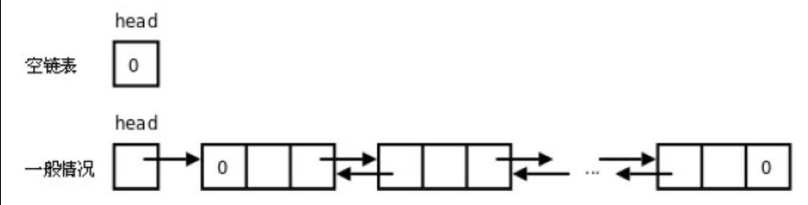
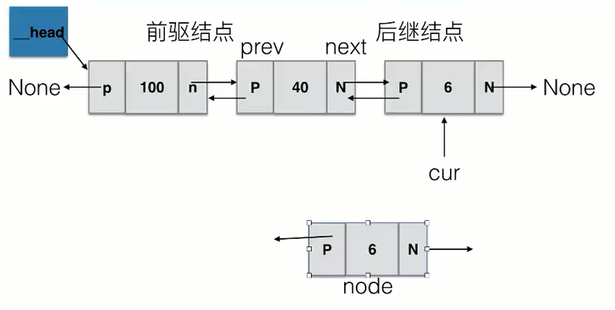

# 3.链表

[TOC]

**为什么需要链表**

顺序表的构建需要预先知道数据大小来申请连续的存储空间，而在进行扩充时又需要进行数据的搬迁，所以使用起来并不是很灵活。

链表结构可以充分利用计算机内存空间，实现灵活的内存动态管理。

**链表的定义**

**链表（Linked list）**是一种常见的基础数据结构，是一种线性表，但是不像顺序表一样连续存储数据，而是<u>在每一个节点（数据存储单元）里存放下一个节点的**位置信息（即地址）**</u>。

下面是一个链表结构的演示实例：


## 3.0 Python 中变量标识的本质

先看下面一段python代码：

```python
a = 10
b = 20
a, b = b, a   #交换变量a,b的值（此方法只在python中可以实现）
print ("a = "+ str(a))    # a = 20
print ("b = "+ str(b))    # b = 10
```


在python中，变量的赋值是保存的不是变量名，而是**保存对象的地址**。如定义“ a = 10"，就是将10所在的地址指向a。而对其他语言，需要定义变量类型，如在C语言中，需要定义为"int a =10"。


## 3.1   单向链表

单向链表也叫单链表，是链表中最简单的一种形式，它的每个节点包含两个域，一个信息域（元素域）和一个链接域。这个链接指向链表中的下一个节点，而最后一个节点的链接域则指向一个空值。


- 表元素域elem用来存放具体的数据。
- 链接域next用来存放下一个节点的位置（python中的标识）
- 变量p指向链表的头节点（首节点）的位置，从p出发能找到表中的任意节点。

### 3.1.1 节点实现

```python
class SingleNode(object):
    """单链表的结点"""
    def __init__(self,item):
        # _item存放数据元素
        self.item = item
        # _next是下一个节点的标识
        self.next = None
```

### 3.1.2 单链表的操作

- is_empty() 链表是否为空
- length() 链表长度
- travel() 遍历整个链表
- add(item) 链表头部添加元素
- append(item) 链表尾部添加元素
- insert(pos, item) 指定位置添加元素
- remove(item) 删除节点
- search(item) 查找节点是否存在

### 3.1.3 单链表的实现

- **判断链表是否为空、链表长度、遍历链表**

  ```python
  class SingleLinkList(object):
      """单链表"""
      def __init__(self):
          self.__head = None
  
      def is_empty(self):
          """判断链表是否为空"""
          return self.__head == None  # __head指向为空(None)，则列表为空
      
      def length(self):
          """链表长度"""
          # cur初始时指向头节点(cur表示一个指针、游标，用来移动遍历节点)
          cur = self.__head
          count = 0           # count记录数量，初始化为0
          # 尾节点指向None，当未到达尾部时
          while cur != None:
              count += 1
              # 将cur后移一个节点
              cur = cur.next
          return count
      
      def travel(self):
          """遍历链表"""
          cur = self.__head
          while cur != None:
              print (cur.item, end=" ")   # 用end=" "让遍历元素直接空一格打印而不是换行打印
              cur = cur.next
          print ("")
  
  ```

- **尾部添加元素**

  ```python
     def append(self, item):
          """尾部添加元素，尾插法"""
          
          # 先构造节点
          # 函数里的形参item只是一个数，还不是一个节点，所以要先构造为一个节点
          node = SingleNode(item)
          
          # 判断链表是否为空，若是空链表，则将__head指向新节点
          if self.is_empty():
              self.__head = node
          # 若不为空，则找到尾部，将尾节点的next指向新节点
          else:
              cur = self.__head
              while cur.next != None:
                  cur = cur.next
              cur.next = node
  ```

  在这里，我们可以测试一下**append()、is_empty()、length()、travel()**函数，结果如下：

  ```python
  # 测试append()、is_empty()、length()、travel() 是否成功
  if __name__ == "__main__":
      link_1 = SingleLinkList()   # 创建空链表link_1
      print(link_1.is_empty())    # 判断link_1是否为空
      print(link_1.length())      # 打印link_1长度
      
      link_1.append(1)            # 往link_1尾端添加元素1
      print(link_1.is_empty())
      print(link_1.length())   
      
      link_1.append(2)            # 往link_1尾端添加元素2
      link_1.append(3)            # 往link_1尾端添加元素3
      link_1.travel()             # 遍历link_1
  
  '''
  0
  False
  1
  1 2 3 
  ''' 
  ```


- **头部添加元素**

  

  ```python
      def add(self, item):
          """头部添加元素，头插法"""
          # 先创建一个保存item值的节点
          node = SingleNode(item)
          # 将新节点的链接域next指向头节点，即__head指向的位置
          node.next = self.__head
          # 将链表的头__head指向新节点
          self.__head = node
  ```

  

- **指定位置添加元素**

  

  ```python
      def insert(self, pos, item):
          """
                      指定位置添加元素：参数pos从0开始
                      如 insert(2,100)表示在2位置添加节点100            
          """
          # 若指定位置pos为第一个元素之前，则执行头部插入
          if pos <= 0:
              self.add(item)
          # 若指定位置超过链表尾部，则执行尾部插入
          elif pos > (self.length()-1):
              self.append(item)
          # 找到指定位置
          else:
              node = SingleNode(item)
              count = 0
              # pre用来指向指定位置pos的前一个位置pos-1，初始从头节点开始移动到指定位置
              pre = self.__head       # pre先指向头结点
              while count < (pos-1):
                  count += 1
                  pre = pre.next      # 往后移动pre直到pos-1位置
              # 先将新节点node的next指向插入位置的节点
              node.next = pre.next
              # 将插入位置的前一个节点的next指向新节点
              pre.next = node 
  ```

  

- **查找节点是否存在**

  ```python
      def search(self,item):
          """链表查找节点是否存在，并返回True或者False"""
          cur = self.__head
          while cur != None:
              if cur.item == item:
                  return True
              cur = cur.next
          return False
  ```

  

- **删除节点**

  

  ```python
      def remove(self,item):
          """删除节点"""
          cur = self.__head   # 指针cur指向当前节点，初始时指向头节点__head
          pre = None          # 指针pre指向前一个节点，初始时为None
          while cur != None:
              # 找到了指定元素
              if cur.item == item:
                  # 如果第一个就是删除的节点
                  # 先判断此节点是否是头结点
                  if not pre:            # 也可以直接写成 "if cur == self.__head" 来判断是不是头结点   
                      # 将头指针指向头节点的后一个节点
                      self.__head = cur.next
                  # 第一个就是删除的节点,但是此节点(cur)不是头结点
                  else:
                      # 将删除位置前一个节点的next指向删除位置的后一个节点
                      pre.next = cur.next
                  break   # 删除完节点需要退出循环
              else:
                  # 继续按链表后移节点
                  pre = cur
                  cur = cur.next
  ```

  

关于单链表个操作的完整代码见：[03_single_link_list.py](03_single_link_list.py)


### 3.1.4 链表与顺序表的对比

链表失去了顺序表随机读取的优点，同时链表由于增加了结点的指针域，空间开销比较大，但**对存储空间的使用**要相对灵活（<u>链表存储数据多占内存，但是内存可以分散，当存储大数据时，没有足够大的连续内存空间，可以用链表使用分散空间存储</u>）。

链表与顺序表的各种操作复杂度如下所示：

| 操作            | 链表 | 顺序表 |
| --------------- | :--: | ------ |
| 访问元素        | O(n) | O(1)   |
| 在头部插入/删除 | O(1) | O(n)   |
| 在尾部插入/删除 | O(n) | O(1)   |
| 在中间插入/删除 | O(n) | O(n)   |

注意虽然表面看起来复杂度都是 O(n)，但是链表和顺序表在插入和删除时进行的是完全不同的操作。链表的主要耗时操作是遍历查找，删除和插入操作本身的复杂度是O(1)。顺序表查找很快，主要耗时的操作是拷贝覆盖。因为除了目标元素在尾部的特殊情况，顺序表进行插入和删除时需要对操作点之后的所有元素进行前后移位操作，只能通过拷贝和覆盖的方法进行。

## 3.2双向链表

### 3.2.1 双向链表的定义

一种更复杂的链表是“双向链表”或“双面链表”。每个节点有两个链接：一个指向前一个节点，当此节点为第一个节点时，指向空值；而另一个指向下一个节点，当此节点为最后一个节点时，指向空值。



下面是一个双向链表的示例：


后继节点：指当前节点的下一个节点

前驱节点：指当前节点的前一个节点

### 3.2.2  双向链表的操作

- is_empty() 链表是否为空
- length() 链表长度
- travel() 遍历链表
- add(item) 链表头部添加
- append(item) 链表尾部添加
- insert(pos, item) 指定位置添加
- remove(item) 删除节点
- search(item) 查找节点是否存在

### 3.2.2  双向链表的实现

- **判断链表是否为空、返回链表的长度、遍历链表**（与单链表的实现一样）

  ```python
  class Node(object):
      """双向链表节点"""
      def __init__(self, item):
          self.item = item
          self.next = None
          self.prev = None
  
  class DoubleLinkList(object):
      """双向链表"""
      def __init__(self):
          self.__head = None
  
      def is_empty(self):
          """判断链表是否为空"""
          return self.__head == None
  
      def length(self):
          """返回链表的长度"""
          cur = self.__head
          count = 0
          while cur != None:
              count += 1
              cur = cur.next
          return count
  
      def travel(self):
          """遍历链表"""
          cur = self.__head
          while cur != None:
              print (cur.item, end=" ")
              cur = cur.next
          print ("")
  ```

- **头部插入元素**

  

  ```python
      def add(self, item):
          """头部插入元素"""
          node = Node(item)
          if self.is_empty():
              # 如果是空链表，将__head指向node
              self.__head = node
          else:
              # 将node的next指向__head的头节点
              node.next = self.__head
              # 将__head的头节点的prev指向node
              self.__head.prev = node
              # 将__head 指向node
              self.__head = node
  ```

  - **尾部插入元素**
  
    ```python
        def append(self, item):
            """尾部插入元素"""
            node = Node(item)
            if self.is_empty():
                # 如果是空链表，将__head指向node
                self.__head = node
            else:
                # 移动到链表尾部
                cur = self.__head
                while cur.next != None:
                    cur = cur.next
                # 将尾节点cur的next指向node
                cur.next = node
                # 将node的prev指向cur
                node.prev = cur
    ```
  
    

- **查找元素是否存在**

  ```python
      def search(self, item):
          """查找元素是否存在"""
          cur = self.__head
          while cur != None:
              if cur.item == item:
                  return True
              cur = cur.next
          return False
  
  ```

  

- **指定位置插入节点**

  假设要在下图所示cur指针指向节点前插入一个节点node

  

  实现方法一：

  

  实现方法二：

  方法是的第三部先做的是"cur.prev = node "，所以**cur**的前一个节点已经是**node**了，所以节点40的位置要以node定位

  

  用代码实现如下：

  ```python
      def insert(self, pos, item):
          """在指定位置添加节点"""
          if pos <= 0:
              self.add(item)
          elif pos > (self.length()-1):
              self.append(item)
          else:
              node = Node(item)
              cur = self.__head
              count = 0
              # 移动到指定位置的前一个位置
              while count < (pos-1):
                  count += 1
                  cur = cur.next
              # 将node的prev指向cur
              node.prev = cur
              # 将node的next指向cur的下一个节点
              node.next = cur.next
              # 将cur的下一个节点的prev指向node
              cur.next.prev = node
              # 将cur的next指向node
              cur.next = node 
  ```

- 删除元素

  

  要实现删除cur所在节点，只需要两步：

  - cur.prev.next = cur.next
  - cur.next.prwv = cur.prev

  ```python
      def remove(self, item):
          """删除元素"""
          if self.is_empty():
              return
          else:
              cur = self.__head
              if cur.item == item:
                  # 如果首节点的元素即是要删除的元素
                  if cur.next == None:
                      # 如果链表只有这一个节点
                      self.__head = None
                  else:
                      # 将第二个节点的prev设置为None
                      cur.next.prev = None
                      # 将__head指向第二个节点
                      self.__head = cur.next
                  return
              while cur != None:
                  if cur.item == item:
                      # 将cur的前一个节点的next指向cur的后一个节点
                      cur.prev.next = cur.next
                      # 将cur的后一个节点的prev指向cur的前一个节点
                      cur.next.prev = cur.prev
                      break
                  cur = cur.next
  ```


双向链表的实现完整代码见：[04_double_link_list.py](04_double_link_list.py)

## 3.3 单向循环链表

### 3.3.1 单向循环链表的定义

单链表的一个变形是单向循环链表，链表中最后一个节点的next域不再为None，而是指向链表的头节点。


### 3.3.2 单向循环链表的操作

- is_empty() 判断链表是否为空
- length() 返回链表的长度
- travel() 遍历
- add(item) 在头部添加一个节点
- append(item) 在尾部添加一个节点
- insert(pos, item) 在指定位置pos添加节点
- remove(item) 删除一个节点
- search(item) 查找节点是否存在

### 3.3.3  单向循环链表的实现

- **判断链表是否为空、返回链表的长度、遍历链表**

  ```python
  # coding:utf-8
  
  
  class Node(object):
      """单向循环链表的结点"""
      def __init__(self,item):
          # _item存放数据元素
          self.item = item
          # _next是下一个节点的标识
          self.next = None
  
  
  class SingCycleleLinkList(object):
      """单向循环链表"""
      def __init__(self,node=None):
          self.__head = node
          # 设置循环
          if node:
              node.next = node
  
      def is_empty(self):
          """判断链表是否为空"""
          return self.__head == None  # __head指向为空(None)，则列表为空
      
      def length(self):
          """链表长度"""
  
          # 如果链表为空，返回长度0
          if self.is_empty():
              return 0
          count = 1           # count记录数量，初始化为1 (与单链表不一样)
                  # cur初始时指向头节点(cur表示一个指针、游标，用来移动遍历节点)
          cur = self.__head
          # 当未到达尾部时
          while cur.next != self.__head:
              count += 1
              # 将cur后移一个节点
              cur = cur.next
          return count
      
      def travel(self):
          """遍历链表"""
          # 如果链表为空，直接返回
          if self.is_empty():
              return
          cur = self.__head
          while cur.next != self.__head:
              print (cur.item, end=" ")   # 用end=" "让遍历元素直接空一格打印而不是换行打印
              cur = cur.next
              # 退出此循环，cur指向尾结点，单尾结点不执行循环，尾结点未打印
          print (cur.item) #  单独打印循环中未执行的尾结点
  ```

- **头部添加元素**

  

  ```python
      def add(self, item):
          """头部添加元素，头插法"""
          node = Node(item)
          if self.is_empty():
              self.__head = node
              node.next = self.__head
          else:
              # (1) 添加的节点指向__head (这一步还不改变整个链表位置)
              node.next = self.__head
              # (2) 指针移到链表尾部，将尾部节点的next指向node
              cur = self.__head
              while cur.next != self.__head:
                  cur = cur.next
              cur.next = node
              # (3) __head指向添加node的
              self.__head = node
  ```

- **尾部添加节点**

  ```python
      def append(self, item):
          """尾部添加节点，尾插法"""
          node = Node(item)
          if self.is_empty():
              self.__head = node
              node.next = self.__head
          else:
              # 移到链表尾部
              cur = self.__head
              while cur.next != self.__head:
                  cur = cur.next
              # 将尾节点指向node
              cur.next = node
              # 将node指向头节点__head
              node.next = self.__head
  ```

- **在指定位置添加节点**

  在中间位置插入节点，不涉及尾节点，**过程与单链表一致**


- **删除一个节点**

  方法一：

  ```python
      def remove(self, item):
          """删除一个节点"""
          # 若链表为空，则直接返回
          if self.is_empty():
              return
          # 将cur指向头节点
          cur = self.__head
          pre = None
          # 若头节点的元素就是要查找的元素item
          if cur.item == item:
              # 如果链表不止一个节点
              if cur.next != self.__head:
                  # 先找到尾节点，将尾节点的next指向第二个节点
                  while cur.next != self.__head:
                      cur = cur.next
                  # cur指向了尾节点
                  cur.next = self.__head.next
                  self.__head = self.__head.next
              else:
                  # 链表只有一个节点
                  self.__head = None
          else:
              pre = self.__head
              # 第一个节点不是要删除的
              while cur.next != self.__head:
                  # 找到了要删除的元素
                  if cur.item == item:
                      # 删除
                      pre.next = cur.next
                      return
                  else:
                      pre = cur
                      cur = cur.next
              # cur 指向尾节点
              if cur.item == item:
                  # 尾部删除
                  pre.next = cur.next 
  ```

  方法二：

  ```python
      # remove函数的第二种方法
      def remove(self, item):
          """删除节点"""
          # 若链表为空，则直接返回
          if self.is_empty():
              return
  
          cur = self.__head
          pre = None
          
          while cur.next != self.__head:   #遍历链表，item在头部或中间
              if cur.item == item:
                  # 先判断此结点是否是头节点
                  if cur == self.__head:
                      # 1.头节点的情况
                      # 1.1先找尾节点
                      rear = self.__head
                      while rear.next != self.__head:
                          rear = rear.next
                      # 1.2 把head指向cur的下一个节点(即此时删除了头结点)
                      self.__head = cur.next
                      # 1.3 尾结点指向新的头结点
                      rear.next = self.__head
                  else:
                      # 2.中间节点
                      # 直接把把前一节点指向后一节点，就删除了cur这个节点了
                      pre.next = cur.next
                  return
              else:
                  pre = cur         #遍历链表操作
                  cur = cur.next    #遍历链表操作
          # 退出循环，cur指向尾节点, 还需额外判断尾结点是否等于item，即尾部节点删除
          # 3.尾部节点删除
          if cur.elem == item:
              if cur == self.__head:
                  # 3.1 链表只有一个节点
                  self.__head = None
              else:
                  # 3.1 链表有多个节点
                  # pre.next = cur.next
                  pre.next = self.__head
  ```

  

- **查找节点是否存在**

  ```python
      def search(self, item):
          """查找节点是否存在"""
        if self.is_empty():
              return False
          cur = self.__head  # 指向头结点
          while cur.next != self.__head:
              cur = cur.next
              if cur.item == item:
                  return True
          # 退出循环后，cur指向尾节点，这里还需额外判断尾结点是否等于item
          if cur.item == item:
              return True
          return False
  ```
  

单向循环链表的实现完整代码见：[05_single_cycle_link_list.py](05_single_cycle_link_list.py)