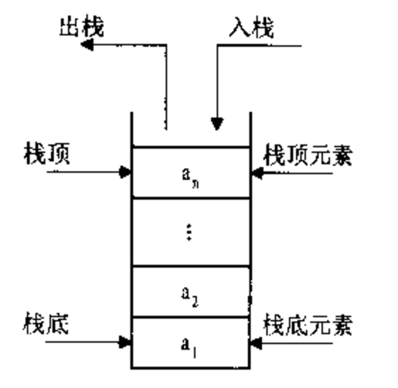
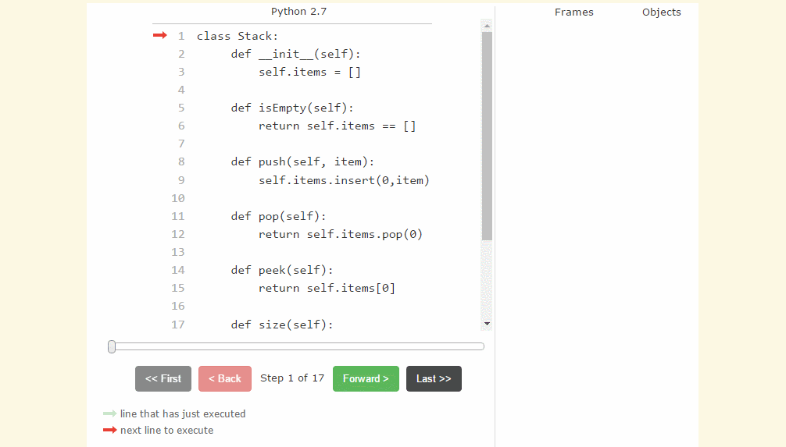

# 4.栈

[TOC]

## 4.1 栈的定义

栈（stack），有些地方称为堆栈，是一种**容器**，可存入数据元素、访问元素、删除元素，它的特点在于<u>只能允许在容器的一端（称为栈顶端指标，英语：top）进行加入数据（英语：push）和输出数据（英语：pop）的运算</u>。没有了位置概念，保证任何时候可以访问、删除的元素都是此前最后存入的那个元素，确定了一种默认的访问顺序。

由于栈数据结构只允许在一端进行操作，因而按照**后进先出**（LIFO, Last In First Out）的原理运作。



入栈(压栈，push)

出栈(pop)

栈底：

栈顶(top)：

## 4.2 栈的实现

栈可以用顺序表实现，也可以用链表实现。这里用列表实现举例。

### 栈的操作

- Stack() 创建一个新的空栈
- push(item) 添加一个新的元素item到栈顶
- pop() 弹出栈顶元素
- peek() 返回栈顶元素
- is_empty() 判断栈是否为空
- size() 返回栈的元素个数

### 操作的实现

```python
class Stack(object):
    """栈"""
    def __init__(self):
        self.__list = []      # 用列表来实现这个Stack(容器)，且封装成私有

    def push(self, item):
        """添加一个新的元素item到栈顶"""
        self.__list.append(item)  # 用列表的append()函数添加元素

    def pop(self):
        """弹出栈顶元素"""
        return self.__list.pop()    # 用列表的pop()函数添加元素

    def peek(self):
        """返回栈顶元素"""
        if self.__list:
            # 当列表不为空时
            return self.__list[-1]  # 直接返回列表的尾部元素
        else:
            # 列表为空时，返回None
            return None

    def is_empty(self):
        """判断栈是否为空"""
        return self.__list == []
        # return not self.__list

    def size(self):
        """返回栈的元素个数"""
        return len(self.__list)


if __name__ == "__main__":
    stack = Stack()
    stack.push("hello")
    stack.push("world")
    stack.push("itcast")
    print (stack.size())
    print (stack.peek())
    print (stack.pop())
    print (stack.pop())
    print (stack.pop())
'''
3
itcast
itcast
world
hello
'''
```

执行过程如下：

