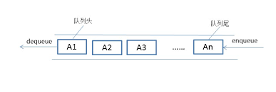
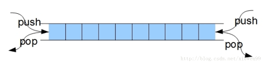

# 5.队列

[TOC]

## 5.1 队列的定义

队列（queue）是**只允许在一端进行插入操作，而在另一端进行删除操作的线性表**。

队列是一种**先进先出**的（First In First Out）的线性表，简称FIFO。允许插入的一端为队尾，允许删除的一端为队头。队列不允许在中间部位进行操作！假设队列是q=（a1，a2，……，an），那么a1就是队头元素，而an是队尾元素。这样我们就可以删除时，总是从a1开始，而插入时，总是在队列最后。这也比较符合我们通常生活中的习惯，排在第一个的优先出列，最后来的当然排在队伍最后。



## 5.2 队列的实现

同栈一样，队列也可以用顺序表或者链表实现。

### 操作

- Queue() 创建一个空的队列
- enqueue(item) 往队列中添加一个item元素
- dequeue() 从队列头部删除一个元素
- is_empty() 判断一个队列是否为空
- size() 返回队列的大小

### 实现

```python
class Queue(object):
    """队列"""
    def __init__(self):
        self.__list = []  # 空列表保存队列数据

    def enqueue(self, item):
        """往队列中添加一个item元素"""
        self.__list.append(item)  # 用列表的append()函数从末尾添加元素

    def dequeue(self):
        """从队列头部删除一个元素"""
        return self.__list.pop(0)   # 用列表的pop()函数从list的头部开始往外弹出元素

    def is_empty(self):
        """判断一个队列是否为空"""
        return self.__list == []

    def size(self):
        """返回队列的大小"""
        return len(self.__list)
```

完整代码见:[queue.py](queue.py)

## 5.3 双端队列

双端队列（deque，全名double-ended queue），是一种具有队列和栈的性质的数据结构。

双端队列中的元素可以从两端弹出，其限定插入和删除操作在表的两端进行。双端队列可以在队列任意一端入队和出队。



双端队列如果只考虑一端，则是一个栈，所以双端队列可以看成两个栈栈尾连接而成。

### 操作

- Deque() 创建一个空的双端队列
- add_front(item) 从队头加入一个item元素
- add_rear(item) 从队尾加入一个item元素
- remove_front() 从队头删除一个item元素
- remove_rear() 从队尾删除一个item元素
- is_empty() 判断双端队列是否为空
- size() 返回队列的大小

### 实现

```python
class Deque(object):
    """双端队列"""

    def __init__(self):
        self.__list = []

    def add_front(self, item):
        """往队列中添加一个item元素"""
        self.__list.insert(0, item)   # 头部添加

    def add_rear(self, item):
        """往队列中添加一个item元素"""
        self.__list.append(item)      # 尾部添加

    def pop_front(self):
        """从队列头部删除一个元素"""
        return self.__list.pop(0)

    def pop_rear(self):
        """从队列头部删除一个元素"""
        return self.__list.pop()

    def is_empty(self):
        """判断一个队列是否为空"""
        return self.__list == []

    def size(self):
        """返回队列的大小"""
        return len(self.__list)
```

完整代码见：[dequeue.py](dequeue.py)