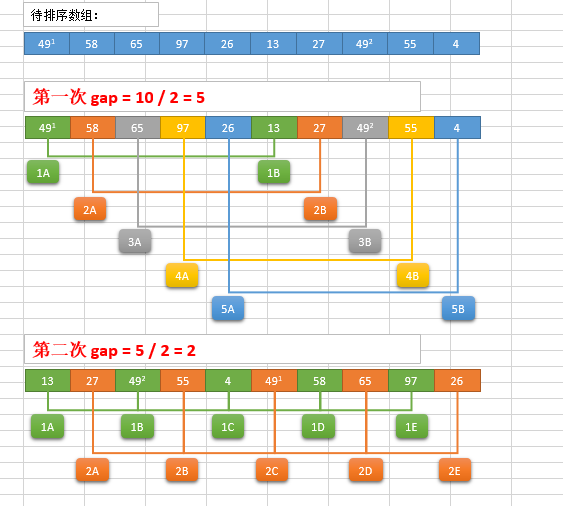

# 6.排序与搜索

[TOC]

## 6.0 排序算法的稳定性

排序算法（英语：Sorting algorithm）是一种能将一串数据依照特定顺序进行排列的一种算法。

**稳定性**：稳定排序算法会让原本有相等键值的纪录维持相对次序。也就是如果一个排序算法是稳定的，当有两个相等键值的纪录R和S，且在原本的列表中R出现在S之前，在排序过的列表中R也将会是在S之前。

当相等的元素是无法分辨的，比如像是整数，稳定性并不是一个问题。然而，假设以下的数对将要以他们的第一个数字来排序。

```
(4, 1)  (3, 1)  (3, 7)（5, 6）
```

在这个状况下，有可能产生两种不同的结果，一个是让相等键值的纪录维持相对的次序，而另外一个则没有：

```
(3, 1)  (3, 7)  (4, 1)  (5, 6)  （维持次序）
(3, 7)  (3, 1)  (4, 1)  (5, 6)  （次序被改变）
```

不稳定排序算法可能会在相等的键值中改变纪录的相对次序，但是稳定排序算法从来不会如此。不稳定排序算法可以被特别地实现为稳定。作这件事情的一个方式是人工扩充键值的比较，如此在其他方面相同键值的两个对象间之比较，（比如上面的比较中加入第二个标准：第二个键值的大小）就会被决定使用在原先数据次序中的条目，当作一个同分决赛。然而，要记住这种次序通常牵涉到额外的空间负担。


## 6.1 冒泡排序

**冒泡排序**（英语：Bubble Sort）是一种简单的排序算法。它重复地遍历要排序的数列，一次比较两个元素，如果他们的顺序错误就把他们交换过来。遍历数列的工作是重复地进行直到没有再需要交换，也就是说该数列已经排序完成。这个算法的名字由来是因为越小的元素会经由交换慢慢“浮”到数列的顶端。

冒泡排序算法的运作如下：

- 比较相邻的元素。如果第一个比第二个大（升序），就交换他们两个。
- 对每一对相邻元素作同样的工作，从开始第一对到结尾的最后一对。这步做完后，最后的元素会是最大的数。
- 针对所有的元素重复以上的步骤，除了最后一个。
- 持续每次对越来越少的元素重复上面的步骤，直到没有任何一对数字需要比较。

### 冒泡排序的分析

交换过程图示(第一次)：


那么我们需要进行n-1次冒泡过程，每次对应的比较次数如下图所示：


```python
def bubble_sort(alist):
    """冒泡排序--顺序表实现"""
    n = len(alist)
    # j表示每次遍历需要比较的次数，是逐渐增大的
    for j in range(n-1):
        count = 0   
        # 对应最优序列，如 [1,2,3,4,5,6]，已经是有序的了，只判断缺不需要执行交换，直接0==count,return,节约时间
        for i in range(0, n-1-j):
            # 班长从头走到尾
            if alist[i] > alist[i+1]:
                alist[i],alist[i+1] = alist[i+1], alist[i]
                count += 1
        if 0 == count:
            return
```

完整代码见:[01_bubble_sort.py](01_bubble_sort.py)

### 时间复杂度

- 最优时间复杂度：O(n) （表示遍历一次发现没有任何可以交换的元素，排序结束。）
- 最坏时间复杂度：$O(n^2)$
- 稳定性：稳定

### 冒泡排序的演示

效果：


## 6.2 选择排序

选择排序（Selection sort）是一种简单直观的排序算法。它的工作原理如下。首先在未排序序列中找到最小（大）元素，存放到排序序列的起始位置，然后，再从剩余未排序元素中继续寻找最小（大）元素，然后放到已排序序列的末尾。以此类推，直到所有元素均排序完毕。

选择排序的主要优点与数据移动有关。如果某个元素位于正确的最终位置上，则它不会被移动。选择排序每次交换一对元素，它们当中至少有一个将被移到其最终位置上，因此对n个元素的表进行排序总共进行至多n-1次交换。在所有的完全依靠交换去移动元素的排序方法中，选择排序属于非常好的一种。

### 选择排序分析

排序过程(选择最大元素)：


排序过程(选择最小元素，红色表示当前最小值，黄色表示已排序序列，蓝色表示当前位置)：


```python
def select_sort(alist):
    """选择排序"""
    n = len(alist)
    # 需要进行n-1次选择操作
    for j in range(n-1):    # j: 0 ~ n-2
        # 记录最小位置
        min_index = j
        # 从j+1位置到末尾选择出最小数据
        for i in range(j+1, n):
            if alist[min_index] > alist[i]:
                min_index = i      
        # 如果选择出的数据不在正确位置，进行交换
        if min_index != j:        
            alist[j], alist[min_index] = alist[min_index], alist[j]

if __name__ == "__main__":
    li = [54,226,93,17,77,31,44,55,20]
    print(li)    # [54, 226, 93, 17, 77, 31, 44, 55, 20]
    select_sort(li)
    print(li)    # [17, 20, 31, 44, 54, 55, 77, 93, 226]
```

完整代码见[02_select_sort.py](./02_select_sort.py)

### 时间复杂度

- 最优时间复杂度：O(n^2)$
- 最坏时间复杂度：$O(n^2)$
- 稳定性：**不稳定**（考虑升序每次选择最大的情况）

### 选择排序演示


## 6.3 插入排序

插入排序（英语：Insertion Sort）是一种简单直观的排序算法。它的工作原理是通过构建有序序列，对于未排序数据，在已排序序列中从后向前扫描，找到相应位置并插入。插入排序在实现上，在从后向前扫描过程中，需要反复把已排序元素逐步向后挪位，为最新元素提供插入空间。

### 插入排序分析


```python
def insert_sort(alist):
    """插入排序"""
    n = len(alist)
    # 从右边的无序序列中取出多少个元素执行这样的过程
    for j in range(1, n):
        # j = [1, 2, 3, n-1]
        # i 代表内层循环起始值
        i = j
        # 执行从右边的无序序列中取出第一个元素，即i位置的元素，然后将其插入到前面的正确位置中
        while i > 0:
            if alist[i] < alist[i-1]:
                alist[i], alist[i-1] = alist[i-1], alist[i]
                i -= 1
            else:
                break
```

完整代码见：[03_insert_sort.py](i/03_insert_sort.py)

### 时间复杂度

- 最优时间复杂度：O(n) （升序排列，序列已经处于升序状态）
- 最坏时间复杂度：$O(n^2)$
- 稳定性：**稳定**

### 插入排序演示


## 6.4 希尔排序

希尔排序(Shell Sort)是插入排序的一种。也称缩小增量排序，是直接插入排序算法的一种更高效的改进版本。希尔排序是非稳定排序算法。该方法因DL．Shell于1959年提出而得名。 希尔排序是把记录按下标的一定增量分组，对每组使用直接插入排序算法排序；随着增量逐渐减少，每组包含的关键词越来越多，当增量减至1时，整个文件恰被分成一组，算法便终止。

### 希尔排序过程

希尔排序的基本思想是：将数组列在一个表中并对**列**分别进行插入排序，重复这过程，不过每次用更长的列（步长更长了，列数更少了）来进行。最后整个表就只有一列了。将数组转换至表是为了更好地理解这算法，算法本身还是使用数组进行排序。

**例如，假设有这样一组数[ 13 14 94 33 82 25 59 94 65 23 45 27 73 25 39 10 ]，进行排序：**

**（1）步长为5开始进行排序**

- 我们可以通过将这列表放在有5列的表中来更好地描述算法，这样他们就应该看起来是这样(竖着的元素是步长组成)：

  ```
  13 14 94 33 82
  25 59 94 65 23
  45 27 73 25 39
  10
  ```

- 然后我们对**每列**进行排序：

  ```
  10 14 73 25 23
  13 27 94 33 39
  25 59 94 65 82
  45
  ```

- 将上述四行数字，依序接在一起时我们得到：[ 10 14 73 25 23 13 27 94 33 39 25 59 94 65 82 45 ]

**（2）然后再以3为步长进行排序**

- ```
  10 14 73
  25 23 13
  27 94 33
  39 25 59
  94 65 82
  45
  ```

- 排序之后变为：

  ```
  10 14 13
  25 23 33
  27 25 59
  39 65 73
  45 94 82
  94
  ```

**（3）最后以1步长进行排序（此时就是简单的插入排序了）**


### 希尔排序的分析

**例如，对列表[54, 26, 93, 17, 77, 31, 44,55, 20]进行排序：**

（1）以步长gap=4进行希尔排序


（2）以步长gap=2进行希尔排序


（3）以步长gap=2进行插入排序




```python
def shell_sort(alist):
    """希尔排序"""
    n = len(alist)
    # 初始步长
    gap = n // 2    #  //表示除且结果取整，如"9//2"等于4
    # gap变化到0之前，插入算法执行的次数
    while gap > 0:
        # 插入排序算法，与普通的插入算法的区别就是gap步长
        for j in range(gap, n):
            # j = [gap, gap+1, gap+2, gap+3, ..., n-1]
            i = j
            # 插入排序
            while i > 0:
                if alist[i] < alist[i-gap]:
                    alist[i], alist[i-gap] = alist[i-gap], alist[i]
                    i -= gap
                else:
                    break
        # 缩短gap步长
        gap //= 2
```

完整代码见:[04_shell_sort.py](./04_shell_sort.py)

### 时间复杂度

- 最优时间复杂度：根据步长序列的不同而不同
- 最坏时间复杂度：$O(n^2)$
- 稳定想：不稳定

### 希尔排序演示


## 6.5 快速排序

快速排序（英语：Quicksort），又称划分交换排序（partition-exchange sort），通过一趟排序将要排序的数据分割成独立的两部分，其中一部分的所有数据都比另外一部分的所有数据都要小，然后再按此方法对这两部分数据分别进行快速排序，整个排序过程可以递归进行，以此达到整个数据变成有序序列。

步骤为：

1. 从数列中挑出一个元素，称为"基准"（pivot），
2. 重新排序数列，所有元素比基准值小的摆放在基准前面，所有元素比基准值大的摆在基准的后面（相同的数可以到任一边）。在这个分区结束之后，该基准就处于数列的中间位置。这个称为分区（partition）操作。
3. 递归地（recursive）把小于基准值元素的子数列和大于基准值元素的子数列排序。

递归的最底部情形，是数列的大小是零或一，也就是永远都已经被排序好了。虽然一直递归下去，但是这个算法总会结束，因为在每次的迭代（iteration）中，它至少会把一个元素摆到它最后的位置去。

### 快速排序的分析


```python
def quick_sort(alist, first, last):
    """快速排序"""
    
    # 递归的退出条件
    if first >= last:
        return
    mid_value = alist[first]    # 设定起始元素为要寻找位置的基准元素
    low = first                 # low为序列左边的由左向右移动的游标
    high = last                 # high为序列右边的由右向左移动的游标
    while low < high:
        # 如果low与high未重合，high指向的元素不比基准元素小，则high向左移动
        while low < high and alist[high] >= mid_value:
            high -= 1
        # 将high指向的元素放到low的位置上
        alist[low] = alist[high]
        
        # 如果low与high未重合，low指向的元素比基准元素小，则low向右移动
        while low <high and alist[low] < mid_value:
            low += 1
        # 将low指向的元素放到high的位置上
        alist[high] = alist[low]
    
    # 退出循环后，low与high重合，此时所指位置为基准元素的正确位置
    # 将基准元素放到该位置
    alist[low] = mid_value

    # 递归
    # 对low左边的列表执行快速排序
    quick_sort(alist, first, low-1)

    # 对low右边的列表排序
    quick_sort(alist, low+1, last)
```

完整代码见[05_quick_sort.py](./05_quick_sort.py)

### 时间复杂度

- 最优时间复杂度：$O(n \log_2 n)$
- 最坏时间复杂度：$O(n^2)$
- 稳定性：不稳定

从一开始快速排序平均需要花费$O(n \log_2 n)$时间的描述并不明显。但是不难观察到的是分区运算，数组的元素都会在每次循环中走访过一次，使用O(n)的时间。在使用结合（concatenation）的版本中，这项运算也是O(n)。

在最好的情况，每次我们运行一次分区，我们会把一个数列分为两个几近相等的片段。这个意思就是每次递归调用处理一半大小的数列。因此，在到达大小为一的数列前，我们只要作log n次嵌套的调用。这个意思就是调用树的深度是O(log n)。但是在同一层次结构的两个程序调用中，不会处理到原来数列的相同部分；因此，程序调用的每一层次结构总共全部仅需要O(n)的时间（每个调用有某些共同的额外耗费，但是因为在每一层次结构仅仅只有O(n)个调用，这些被归纳在O(n)系数中）。结果是这个算法仅需使用$O(n \log_2 n)$时间。

### 快速排序演示


## 6.6 归并排序

归并排序是采用分治法的一个非常典型的应用。归并排序的思想就是先递归分解数组，再合并数组。

将数组分解最小之后，然后合并两个有序数组，基本思路是比较两个数组的最前面的数，谁小就先取谁，取了后相应的指针就往后移一位。然后再比较，直至一个数组为空，最后把另一个数组的剩余部分复制过来即可。

### 归并排序的分析


```python
def merge_sort(alist):
    """归并排序"""
    n = len(alist)
    if n <= 1:
        return alist
    
    mid = n//2
    # left 采用归并排序后形成的有序的新的列表(递归调用merge_sort)
    left_li = merge_sort(alist[:mid])

    # right 采用归并排序后形成的有序的新的列表
    right_li = merge_sort(alist[mid:])

    # 将两个有序的子序列合并为一个新的整体
    # merge(left, right)
    left_pointer, right_pointer = 0, 0  # 左右两个指针初始都是指向第一个元素
    result = []

    # 循环控制左右两个指针走遍整个左右两个分列表
    while left_pointer < len(left_li) and right_pointer < len(right_li):  
        # 当左边列表的元素小时，拿出此时左边列表所指向的元素，添加到左边的列表，同时左边指针向后一位
        if left_li[left_pointer] <=  right_li[right_pointer]:
            result.append(left_li[left_pointer])
            left_pointer += 1
        # 当右边列表的元素小或相等时，拿出此时右边列表所指向的元素，添加到右边的列表，同时右边指针向后一位
        else:
            result.append(right_li[right_pointer])
            right_pointer += 1

    result += left_li[left_pointer:]
    result += right_li[right_pointer:]
    return result

'''
merge_sort执行流程：
sorted_li = merge_sort([54, 26, 93, 17, 77, 31, 44, 55, 20])   
    left_li = merge_sort [54, 26, 93, 17]
    
        left_li = merge_sort [54, 26]
        
                 left_li = meige_sort[54]  # n=1,直接返回[54]
                 right_li = meige_sort[26]
                 result = [26, 54] # 合并
                 return result
        left_li = [26, 54]
    
        right_li = merge_sort([93, 17])
    
                left_li = merge_sort([93])    # n=1,直接返回[93]
                            return [93]
                left_li =[93]
    
                right_li = merge_sort([17])    
                            return [17]
                right_li = [17]
    
                result = [17, 93]  # 合并
    
                return result
    
        right_li = [17, 93]
    
        result = [17, 26, 54, 93]
    
        return result
    
    left_li = [17, 26, 54, 93]
    
    right_li = merge_sort([77, 31, 44, 55, 20])
        result = [20, 31, 44, 55, 77]
        return result
    right_li = [20, 31, 44, 55, 77]
    
    
    result = [...]
    return result
'''
```

完整代码见:[06_merge_sort.py](./06_merge_sort.py)

### 时间复杂度

- 最优时间复杂度：$O(n log_2n)$
- 最坏时间复杂度：$O(n log_2n)$
- 稳定性：稳定
- 归并算法需要额外的同等大小内存来保存新的排序好的列表，所以内存使用大

## 6.7 常见排序算法效率比较


## 6.8 搜索

搜索是在一个项目集合中找到一个特定项目的算法过程。搜索通常的答案是真的或假的，因为该项目是否存在。 搜索的几种常见方法：顺序查找、二分法查找、二叉树查找、哈希查找。

搜索详细内容见[Searching.md](./Searching.md)