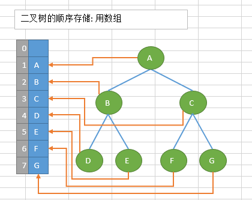
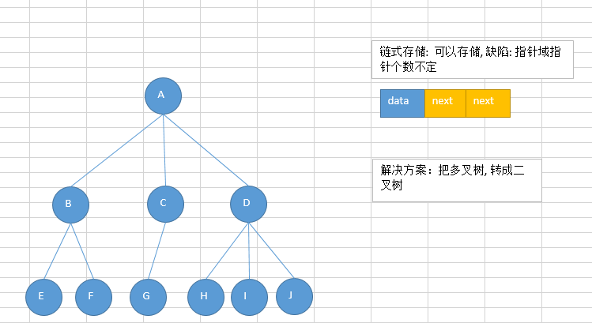

# 第七章 树与树算法

## 7.0 基本概念

### **树的概念**

树（英语：tree）是一种抽象数据类型（ADT）或是实作这种抽象数据类型的数据结构，用来模拟具有树状结构性质的数据集合。它是由n（n>=1）个有限节点组成一个具有层次关系的集合。把它叫做“树”是因为它看起来像一棵倒挂的树，也就是说它是根朝上，而叶朝下的。它具有以下的特点：

- 每个节点有零个或多个子节点；
- 没有父节点的节点称为**根节点**；
- <u>每一个非根节点有且只有一个父节点</u>；
- 除了根节点外，每个子节点可以分为多个不相交的子树；

### 术语

- **节点的度**：一个节点含有的子树的个数称为该节点的度；
- **树的度**：一棵树中，最大的节点的度称为树的度；
- **叶节点**或**终端节点**：度为零的节点；
- **父亲节点**或**父节点**：若一个节点含有子节点，则这个节点称为其子节点的父节点；
- **孩子节点或子节点**：一个节点含有的子树的根节点称为该节点的子节点；
- **兄弟节点**：具有相同父节点的节点互称为兄弟节点；
- 节点的**层次**：从根开始定义起，根为第1层，根的子节点为第2层，以此类推；
- 树的**高度**或**深度**：树中节点的最大层次；
- **堂兄弟节点**：父节点在同一层的节点互为堂兄弟；
- **节点的祖先**：从根到该节点所经分支上的所有节点；
- **子孙**：以某节点为根的子树中任一节点都称为该节点的子孙。
- **森林**：由m（m>=0）棵互不相交的树的集合称为森林；

### 种类

- **无序树**：树中任意节点的子节点之间没有顺序关系，这种树称为无序树，也称为自由树（无序树没有研究意义）；

- **有序树**

  ：树中任意节点的子节点之间有顺序关系，这种树称为有序树；

  - 二叉树

    ：每个节点最多含有两个子树的树称为二叉树；

    - **完全二叉树**：对于一颗二叉树，假设其深度为d(d>1)。除了第d层外，其它各层的节点数目均已达最大值，且第d层所有节点从左向右连续地紧密排列，这样的二叉树被称为完全二叉树，其中**满二叉树**的定义是所有叶节点都在最底层的完全二叉树;
    - **平衡二叉树**（AVL树）：当且仅当任何节点的两棵子树的高度差不大于1的二叉树；
    - **排序二叉树**（二叉查找树（英语：Binary Search Tree），也称二叉搜索树、有序二叉树）；

  - **霍夫曼树**（用于信息编码）：带权路径最短的二叉树称为哈夫曼树或最优二叉树；

  - **B树**：一种对读写操作进行优化的自平衡的二叉查找树，能够保持数据有序，拥有多余两个子树。

### 树的存储与表示

**顺序存储：**将数据结构存储在固定的数组中，然在遍历速度上有一定的优势，但因所占空间比较大，是**非主流**二叉树。二叉树通常以链式存储。

**链式存储：**

由于对节点的个数无法掌握，常见树的存储表示都转换成二叉树进行处理，子节点个数最多为2

### 常见的一些树的应用场景

1. xml，html等，那么编写这些东西的解析器的时候，不可避免用到树
2. 路由协议就是使用了树的算法
3. mysql数据库索引
4. 文件系统的目录结构
5. 很多经典的AI算法其实都是树搜索，此外机器学习中的decision tree也是树结构

##  7.1二叉树

