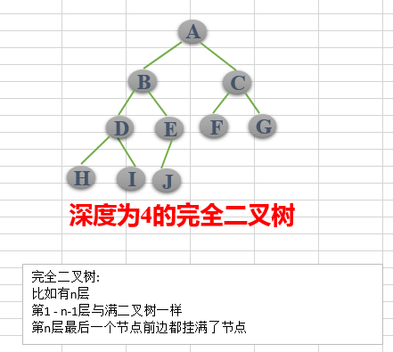
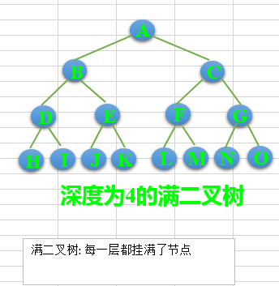
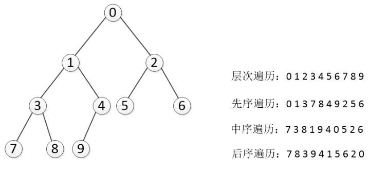
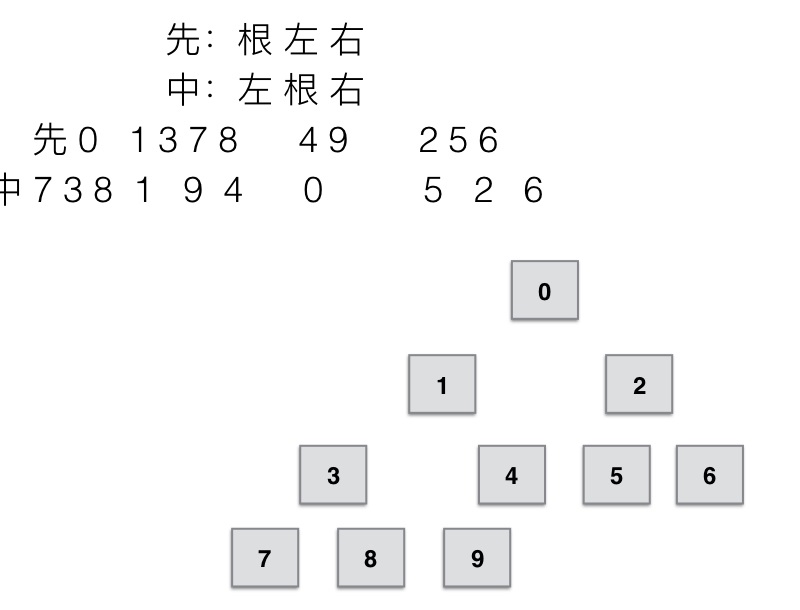
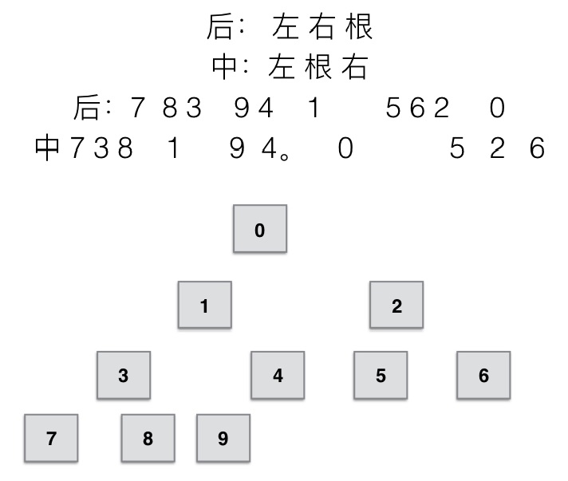

#  二叉树

## 01 二叉树的基本概念

二叉树是**每个节点最多有两个子树的树结构**。通常子树被称作“左子树”（left subtree）和“右子树”（right subtree）

## 02 二叉树的性质(特性)

**性质1:** 在二叉树的第i层上至多有2^(i-1)个结点（i>0）
**性质2:** 深度为k的二叉树至多有2^k - 1个结点（k>0）
**性质3:** 对于任意一棵二叉树，如果其叶结点数为N0，而度数为2的结点总数为N2，则N0=N2+1;
**性质4:**具有n个结点的完全二叉树的深度必为 log2(n+1)
**性质5:**对完全二叉树，若从上至下、从左至右编号，则编号为i 的结点，其左孩子编号必为2i，其右孩子编号必为2i＋1；其双亲的编号必为i/2（i＝1 时为根,除外）

(1) **完全二叉树**——若设二叉树的高度为h，除第 h 层外，其它各层 (1～h-1) 的结点数都达到最大个数，第h层有叶子结点，并且叶子结点都是从左到右依次排布，这就是完全二叉树。



(2) **满二叉树**——除了叶结点外每一个结点都有左右子叶且叶子结点都处在最底层的二叉树。




## 03 二叉树的节点表示以及树的创建与节点添加

通过使用Node类中定义三个属性，分别为elem本身的值，还有lchild左孩子和rchild右孩子。

```python
class Node(object):
    """树的节点类"""
    def __init__(self, item):
        self.elem = item
        self.lchild = None
        self.rchild = None
```

树的创建,创建一个树的类，并给一个root根节点，一开始为空，随后添加节点(**add()函数**)。

```python
class Tree(object):
    """二叉树"""
    def __init__(self):
        self.root = None

    def add(self, item):
        """为树添加节点"""
        
        node = Node(item)
        queue = []
        queue = [self.root]
        
        # 如果树是空的，则对根节点赋值
        if self.root is None:
            self.root = node
            return
        
        # 对已有的节点进行层次遍历
        while queue:
            # 弹出队列的第一个元素
            cur_node = queue.pop(0)
            
            # 先判断左子树是否为空，如果是，则元素直接添加进去
            # 再判断右子树是否为空，如果是，则元素添加进去
            # 如果左右子树都不为空，左右子树加入队列继续判断
            if cur_node.lchild is None:
                cur_node.lchild = node
                return
            elif cur_node.rchild is None:
                cur_node.rchild = node
                return
            else:
                queue.append(cur_node.lchild)
                queue.append(cur_node.rchild)
```


## 04 二叉树的遍历

树的遍历是树的一种重要的运算。所谓遍历是指对树中所有结点的信息的访问，即依次对树中每个结点访问一次且仅访问一次，我们把这种对所有节点的访问称为遍历（traversal）。那么树的两种重要的遍历模式是深度优先遍历和广度优先遍历,**深度优先一般用递归，广度优先一般用队列。一般情况下能用递归实现的算法大部分也能用堆栈来实现。**

### (1) 深度优先遍历

对于一颗二叉树，深度优先搜索(Depth First Search)是沿着树的深度遍历树的节点，**尽可能深的搜索树的分支**。
那么深度遍历有重要的三种方法。这三种方式常被用于访问树的节点，它们之间的不同在于访问每个节点的次序不同。这三种遍历分别叫做先序遍历（preorder），中序遍历（inorder）和后序遍历（postorder）。我们来给出它们的详细定义，然后举例看看它们的应用。

- **先序遍历** 在先序遍历中，我们先访问根节点，然后递归使用先序遍历访问左子树，再递归使用先序遍历访问右子树
  **根节点->左子树->右子树**

  ```python
      def preorder(self, node):
          """先序遍历，根节点->左子树->右子树，递归实现"""
          if node is None:
              return
          print(node.elem, end=" ")
          self.preorder(node.lchild)
          self.preorder(node.rchild)
  ```

- **中序遍历** 在中序遍历中，我们递归使用中序遍历访问左子树，然后访问根节点，最后再递归使用中序遍历访问右子树
  **左子树->根节点->右子树**

  ```python
      def inorder(self, node):
          """中序遍历，左子树->根节点->右子树，递归实现"""
          if node is None:
              return
          self.inorder(node.lchild)
          print(node.elem, end=" ")
          self.inorder(node.rchild)
  ```

  

- **后序遍历** 在后序遍历中，我们先递归使用后序遍历访问左子树和右子树，最后访问根节点
  **左子树->右子树->根节点**

  ```python
      def postorder(self, node):
          """后序遍历，左子树->右子树->根节点，递归实现"""
          if node is None:
              return
          self.postorder(node.lchild)
          self.postorder(node.rchild)
          print(node.elem, end=" ")
  ```

  

### (2) 广度优先遍历(层次遍历)

从树的root开始，**从上到下从从左到右遍历**整个树的节点。实现与节点添加add()函数类似。

```python
    def breadth_travel(self):
        """广度遍历(利用队列实现)"""
        if self.root is None:
            return
        queue = [self.root]
        while queue:
            cur_node = queue.pop(0)
            print(cur_node.elem, end=" ")
            if cur_node.lchild is not None:
                queue.append(cur_node.lchild)
            if cur_node.rchild is not None:
                queue.append(cur_node.rchild)
```

完整代码见[01_binary_tree.py](./01_binary_tree.py)

## 05 遍历结果确定二叉树

给定**"中序遍历"加"先序遍历或后序遍历其中一个"**，能够唯一的确定一颗树。

### (1) 中序遍历+先序遍历确定二叉树 



### (2) 中序遍历+后序遍历确定二叉树

