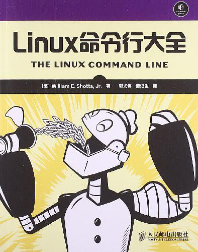

# Linux  命令行

此项目是学习<Linux命令行大全>练习笔记. 仅仅是个人学习记录.




## 第二章 导航--文件系统

**pwd**: 查看当前工作目录

**ls**: 列出目录

**cd**: 改变目录

绝对路径名: 从根目录开始,其后紧接着一个又一个树分支,直到到达目标目录或文件.

```
$ pwd
/home/terence
# 其中第一个"/"表示根目录/, "/home/terence"表示就是绝对路径,表示"根目录下的home文件夹下的terence"
```

绝对路径名:  从工作目录开始. 有一些特殊符号来表示文件系统树中的相对位置: 符号"."表示工作目录, 符号".."表示工作目录的父目录.

**Linux文件命名中不要嵌入空格,以免命令行出现错误**


## 第三章 Linux系统

**ls**: 列出目录

**file**: 确定文件类型

**less**: 参看文件内容

### 3.1 ls 命令列出目录

ls命令,可以查看当前目录中包含的一系列文件和子目录

```
$ ls
Git_Notes.md  Linux_command_line.md  pictures
```

ls命令还可以制定要显示的目录

```
$ ls /usr
bin  games  include  lib  local  locale  sbin  share  src
# ls /usr列出了主目录下usr目录的所有文件和目录
```

ls还可以制定多个目录

```
$ ls ~ /usr
/home/terence:
AI_programs  Desktop    Downloads         exercise01  Pictures  Templates
anaconda3    Documents  examples.desktop  Music       Public    Videos

/usr:
bin  games  include  lib  local  locale  sbin  share  src
# ~表示用户主目录
```

| 选项 | 长选项           | 描述                                                         |
| :--- | :--------------- | :----------------------------------------------------------- |
| -a   | --all            | 列出所有文件(包括隐藏文件)                                   |
| -h   | --human-readable | 当以长格式列出时，以人们可读的格式，而不是以字节数来显示文件的大小。 |
| -l   |                  | 以长格式显示结果--文件大小用字节表示                         |

```
$ ls -alh
total 32K
drwxrwxr-x 4 terence terence 4.0K Jun 14 03:50 .
drwxrwxr-x 6 terence terence 4.0K Jun 12 16:42 ..
drwxrwxr-x 8 terence terence 4.0K Jun 14 03:52 .git
-rw-rw-r-- 1 terence terence  12K Jun 12 16:30 Git_Notes.md
-rw-rw-r-- 1 terence terence  802 Jun 14 03:50 Linux_command_line.md
drwxrwxr-x 2 terence terence 4.0K Jun 14 03:47 pictures
```

### 3.2 file 命令确定文件类型

file 命令会打印出文件内容的简短说明.

```
$ file Git_Notes.md 
Git_Notes.md: UTF-8 Unicode text
```


### 3.3 less 命令参看文件内容

less filename查看文本文件,一旦文件运行,按'q'键退出less程序.


## 第十四章 软件包管理

主流软件包系统类

| 包管理系统           | 发行版 (部分列表)                                            |
| :------------------- | :----------------------------------------------------------- |
| Debian Style (.deb)  | Debian, **Ubuntu**, Xandros, Linspire                        |
| Red Hat Style (.rpm) | Fedora, CentOS, Red Hat Enterprise Linux, OpenSUSE, Mandriva, PCLinuxOS |

下面的命令全是针对Ubuntu系统 (即Debian系统)的.

(1) 在库里查找软件包

apt-get update

apt-cache search <search_string>

```
$ apt-get update
$ apt-cache search emacs		# 查找emacs文件编辑器
```

(2) 安装库中的软件包

apt-get update

apt-get install <package_name>

```
$ apt-get update
$ apt-get install <package_name>
```

(3)  安装软件部文件中的软件包

如果软件包文件并不是从库源中下载的,可以使用 dpkg --install <package_fiel> 命令

```
# 例如从网易云官网下载好了 netease-cloud-music_1.2.1_amd64_ubuntu_20190428.deb 文件
dpkg --install netease-cloud-music_1.2.1_amd64_ubuntu_20190428.deb
dpkg: error: requested operation requires superuser privilege

# 没有超级用户的权限是不能够安装的,于是我们需要使用临时的root权限来进行安装了.这时只要在原来的语句前加sudo就可以了
$ sudo dpkg --install netease-cloud-music_1.2.1_amd64_ubuntu_20190428.deb
```

(4)  删除软件包

apt-get remove <package_name>

(5) 更新库中的软件包

```
$ apt-get update; apt-get upgrade
```

(6) 列出已安装的软件包列表

```
$ dpkg --list
```

(8) 判断软件包是否安装

```
$ dpkg --status <package_name>
```

(9) 显示已安装软件包的相关信息

```
$ apt-cache show <package_name>
```


## 附录 常见文件及其解决方法

### 附录一 Ubuntu 遭遇 无法打开锁文件 /var/lib/dpkg/lock - open (13: 权限不够)解决方案

参考:https://blog.csdn.net/qq_27148893/article/details/81145101

一，在终端输入
sudo passwd root

然后输入两次密码

再输入 su

在输入一次密码，就完成个root提升

二，直接在终端输入  
sudo -s

输入一次密码     进入root模式

如果想回到先前用户状态：输入    exit

三.强制解锁

sudo rm /var/cache/apt/archives/lock

sudo rm /var/lib/dpkg/lock

