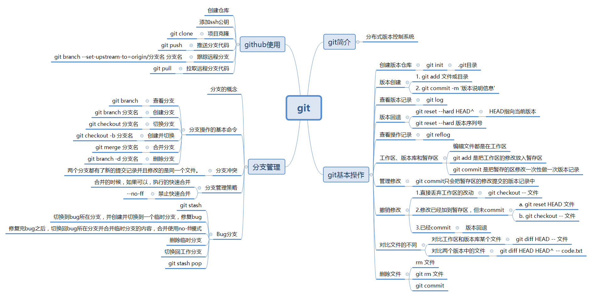

# 一些杂的学习记录和文件

这是在自学计算机和NLP过程中一些杂的学习记录和文件,仅仅是个人学习的记录.

1. **Git和Github**: [Git_Notes.md](./Git_Notes.md)

   常用Git命令:

   

2. **Linux命令行**: [Linux_command_line.md](./Linux_command_line.md)

3. **Python数据结构与算法**:[Data_Structures&Algorithms_in_Python](./Data_Structures&Algorithms_in_Python)

4. Markdown

   Markdown中公式编辑教程: 参考博客[markdown中公式编辑教程](https://www.jianshu.com/p/25f0139637b7)
   
5. [C语言设计](./The_C_Programming_Language)

    主要学习的是中国大学MOOC翁恺老师的《C语言设计》课程的笔记，为后续学习《数据结构与算法》建立基础。在学习过程中，指针、数组、链表还学习了edX的C Programming课程，帮助理解。

    - [01_计算机&程序&C语言](./The_C_Programming_Language/01_计算机&程序&C语言)
    - [02_变量和表达式](./The_C_Programming_Language/02_变量和表达式)
    - [03_判断_分支结构](./The_C_Programming_Language/03_判断_分支结构)
    - [04_循环](./The_C_Programming_Language/04_循环)
    - [05_for循环和循环控制](./The_C_Programming_Language/05_for循环和循环控制)
    - [06_数据类型和处理](./The_C_Programming_Language/06_数据类型和处理)
    - [07_函数](./The_C_Programming_Language/07_函数)
    - [08_数组](./The_C_Programming_Language/08_数组)
    - [09_指针](./The_C_Programming_Language/09_指针)
    - [010_字符串](./The_C_Programming_Language/010_字符串)
    - [011_结构类型](./The_C_Programming_Language/011_结构类型)
    - [012_可变数组&链表](./The_C_Programming_Language/012_可变数组&链表)
    - [013_程序结构](./The_C_Programming_Language/013_程序结构)
    - [014_文件&位运算](./The_C_Programming_Language/014_文件&位运算)

6. [Python学习](./Python)

    - [类](./Python/类)

----

## 参考

