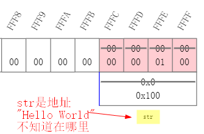
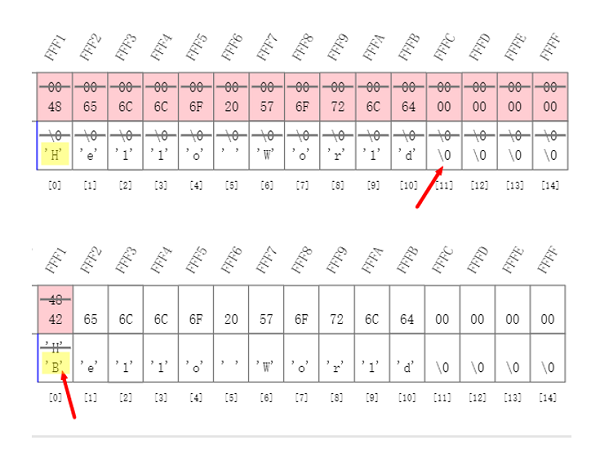
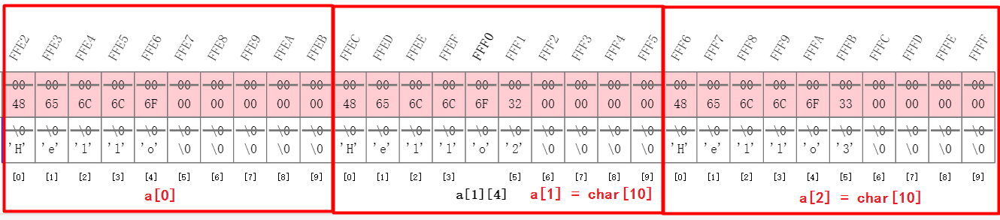
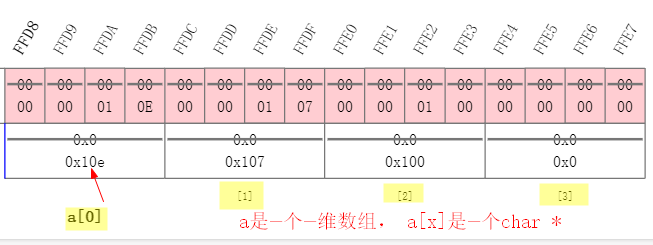
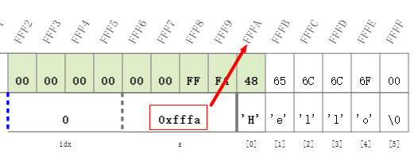
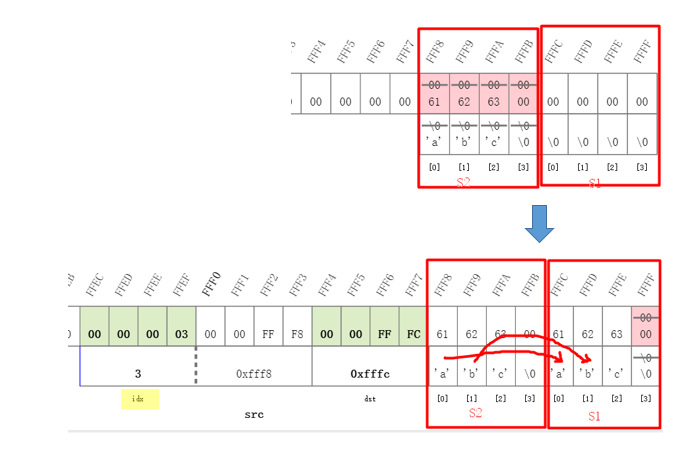

# 10 字符串

## 10.1 字符数组和字符串

- 字符数组

  ```c
  char word[] = {'H', 'e', 'l', 'l', 'o', '!'};
  /*
  word[0] = 'H';
  word[1] = 'e';
  word[2] = 'l';
  word[3] = 'l';
  word[4] = 'l';
  word[5] = '!';
  */
  ```

  

- **字符串**

  ```c
  //! showMemory(start=65520)
  char word[] = {'H', 'e', 'l', 'l', 'o', '!','\0'};
  /*
  word[0] = 'H';
  word[1] = 'e';
  word[2] = 'l';
  word[3] = 'l';
  word[4] = 'l';
  word[5] = '!';
  word[5] = '\0';
  */
  ```

  
  - 字符串是以0 (整数0)结尾的一串字符。(0和'\0'是一样的，但是和'0'不同)；
  - 0标志字符串的结束，但它不是字符串的一部分，**计算字符串长度的时候不包括这个0**；
  - 字符串以数组的形式存在，以数组或指针的形式访问(更多的是以指针的形式)；
  - string.h 里有很多处理字符串的函数。


- 字符串变量

  ```c
  char *str = "Hello";
  char word[] = "Hello";
  char line[10] = "Hello";
  ```


## 10.1 字符串常量

- **字符串常量**：在一个双引号""内的字符序列或者转义字符序列称为字符串常量

  如`"Hello"`
  
  ″Hello″ 会被编译器变成**⼀个字符数组**放在某处，**这个数组的⻓度是6，结尾还有表⽰结束的0** ；
  
  两个相邻的字符串常量会被⾃动连接起来 ；
  
  一行写不下或者为了美观，可以在⾏末的加上 \ 表⽰下⼀⾏还是这个字符串常量 。
  
  ```c
  	printf("字符串1" "字符串2");
  	// 字符串1字符串2
  
  	printf("第一行-----\
  接第一行----\n");
  	// 第一行-----接第一行----
	```

  

- C语言的字符串是以字符数组的形态存在的，**不能⽤运算符对字符串做运算** ，通过数组的⽅式可以遍历字符串 

- 唯⼀特殊的地⽅是字符串字⾯量可以⽤来初始化字符数组 ，以及标准库提供了⼀系列字符串函数 


## 10.2 字符串变量

- **如果要构造一个字符串，用数组形式**
- **如果要处理一个字符串，用指针形式**

### 10.2.1 用指针形式

- **用指针形式定义这个字符串，<u>字符串不知道在哪  (地址位于程序代码端，是只读的)</u>**

  可以用于：处理参数，动态分配空间

```c
	//! showMemory(start=65520)
	// 上面showMemory语句是为了使用edX中C语言课程提供Codecast sandbox展示地址 
	char *str = "Hello World"; 
	str[0] = 'B';  
	// 尝试把上面字符串第一位换成'B' ;
	// 编译后发现程序运行错误 
	printf("Here! s[0]=%c\n",str[0]);
```

(详细代码见: [01_string_pointer.c](./01_string_pointer.c))

对` char  *str = "Hello World";`。"str"是一个指针，初始化为指向一个字符串常量，实际上"str"是"const char *str"，编译器接受不带const的写法，但是试图对s所指的字符串做读写入会导致严重后果。

使用showMemory展示指针形式定义字符串的地址如下，可以看到"str"是一个指针变量，表示的是地址0x100，而字符串"Hello World"是不知道存在哪里的。




### 10.2.2 用数组形式

- **用数组形式，字符串地址就在这里，作为本地变量地址空间自动被回收**

```c
	//! showMemory(start=65520)
	// 上面语句是为了使用edX中C语言课程提供Codecast sandbox展示地址 
	char s[15] = "Hello World"; 
	s[0] = 'B';  

	printf("Here! s[0]=%c\n",s[0]);
	// Here! s[0]=B
```

(详细代码见: [02_string_array.c](./02_string_array.c))

使用showMemory展示数组形式定义字符串的地址如下，可以看到字符串是以字符类型一个个存在地址中的。




### 10.2.3 char*一定是字符串？

- 字符串可以表达为`char*`的形式，但是`char*`不一定是字符串。
  1. `char *`本意是指向字符的指针，可能指向的是字符的数组(就像`int *`一样)。
  2. 只有它所指的字符数组有结尾的0，才能说它所指的是字符串。


## 10.3 字符串输入输出

### 10.3.1 字符串赋值

```c
char *t = "title";
char *s;
s = t;
```

上述代码并没有产生新的字符串，只是让指针s指向了t所在的字符串，对s的任何操作就是对t做的。


### 10.3.2 字符串输入输出

- scanf读⼊⼀个单词（到空格、 tab或回⻋为⽌） 
- %s

```c
	// 不安全的scanf,因为不知道要读⼊的内容的⻓度
	char string[8];  // 长度为8的数组字符串，加上最后的0，剩下7个可读入位置
	scanf("%s", string);
	printf("%s", string);
	/* 
	12345678
	12345678
	*/
```


- 在%和s之间的数字表⽰最多允许读⼊的字符的数量，这个数字应该⽐数组的⼤⼩⼩⼀ 

```c
	char string[8];
	scanf("%7s", string);   // 限定最多只能读入7个字符
	printf("%s", string);
	/*
	12345678
	1234567
	*/
```


- **常见错误**：

  ```c
  char *string;     
  // 用指针形式定义字符串，字符串不知道在哪
  //而这里 没有对string进行初始化，每次运行都会出错
  scanf("%s", string);
  ```

  

- 空字符串：`char buffer[100]="";`是一个空的字符串，buffer[0] == '\0'
- `char buffer[] = ""`， 这个数组的长度只有1，

## 10.4 字符串数组

如何想写一个数组表达很多字符串？

有下面两个方法：

1. `char a[][10] = {"Hello", "Hello2","Hello3"};`

   表示 a是⼀个⼆维数组， a[x]是⼀个char[10]  。`a[0] = char[10] = "Hello"`

   

2. `char *a[10] = {"Hello", "Hello2","Hello3"};`

   a是⼀个⼀维数组， a[x]是⼀个`char *`
   
   


- **关于main()函数**

  `int main (int argc, char const *argv[])`

  main函数参数有两个，

  ```c
  // main函数参数有两个:
  // 1个是int argc，告诉后面字符串到底有多少个字符串
  // 1个是char const *argv[]，一个字符串数组
  int main( int argc, char const *argv[])
  {
  	int i;
      // 尝试打印字符串数组char const *argv[]中所有的字符串
  	for (i=0; i<argc; i++){
  		printf("%d: %s\n", i, argv[i]);
  		// 0: C:\Users\yong\Desktop\The_C_Programming_Language\010_字符串\04_main.exe
  	}
  } 
  ```

  (详细代码见: [04_main.c](./04_main.c))

## 10.5 单个字符输入输出

### 10.5.1 putchar

```c
	char a;
	a = 'Z';
	putchar(a);
	// Z
```

- int putchar(int c);
  向标准输出写一个字符
  返回写了几个字符，EOF（-1）（End Of File）表示写失败

### 10.5.2 getchar

- int getchar(void);
  从标准输入读入一个字符
  返回类型是int是为了返回EOF（-1）表示输入结束
  windows --> ctrl+c
  unix --> ctrl+d

```c
#  include<stdio.h>

 // 输入什么字符，就输入什么字符，直到输入Ctrl+c导致EOF退出 
int main(int argc, char const *argv[]){
	int ch;
	while((ch = getchar())!=EOF){
		putchar(ch);
	}
	printf("EOF");
	return 0;
}
/*
123
123

35567
35567

最后Ctrl+c退出 
*/

```

(详细代码见: [05_putchar&geychar.c](./05_putchar&geychar.c))

## 10.6 标准库中的字符串函数

标准库 (string.h) 中的字符串函数: strlen(), strcmp(), strcpy(), strcat(), strchr(), strstr()

### 10.6.1 strlen 字符串长度

**strlen(const char *s)** : 返回s的字符串⻓度（不包括结尾的0） 

```c
#include<stdio.h>
#include<string.h>

int mylen(const char *s);
int main(int argc, char const *argv[])
{
	//! showMemory(start=65520)
    char line[] = "Hello";
	printf("strlen = %lu\n", strlen(line));
	printf("sizeof = %lu\n", sizeof(line));
	printf("mylen = %lu\n", mylen(line));
	/*
	strlen = 5
	sizeof = 6
	mylen = 5
	*/
}

// 自己写一个计算字符串长度的函数 
int mylen(const char *s)
{
	int idx = 0;   // 计数器
	while ( s[idx] != '\0'){
		idx ++;
	}
	return idx;
} 
```

(详细代码见:  [06_strlen.c](./06_strlen.c))



### 10.6.2 strcmp 字符串比较

`int strcmp(const char *s1, const char *s2); `⽐较两个字符串，返回： 

1. 0:  s1==s2 
2. 大于0:  s1>s2 
3. 小于0:  s1<s2 

```c
#include<stdio.h>
#include<string.h>

int mycmp1 (const char* s1, const char* s2);
int mycmp2 (const char* s1, const char* s2);

int main(int argc, char const *argv[])
{
	//! showMemory(start=65520)
    char s1[4] = "abc";
	char s2[4] = "abc";
	char s3[4] = "bbc";
	char s4[4] = "ABc";
	printf("%d\n", strcmp(s1, s2));  // 0
	printf("%d\n", strcmp(s1, s3));  // -1
	printf("%d\n", strcmp(s1, s4));  // 32
	printf("%d\n", mycmp1(s1, s4));  // 32
	printf("%d\n", mycmp2(s1, s4));  // 32
	
} 

// 用数组形式实现strcmp 
int mycmp1 (const char* s1, const char* s2)
{
	int idx = 0;
	while(s1[idx] == s2[idx] && s1[idx] != '\0'){
		idx ++;
	}
	return s1[idx] - s2[idx];
}

// 用指针形式实现strcmp 
int mycmp2 (const char* s1, const char* s2)
{
	while(*s1 == *s2 && *s1 != '\0'){
		s1++;
		s2++;
	}
	return *s1 - *s2;
}


```

(详细代码见: [07_strcmp.c](./07_strcmp.c))

### 10.6.3 strcpy 字符串拷贝

`char* strcpy(char* restrict dst, const char* restrict src);`：

1. 把src的字符串拷贝到dst，restrict表示src和dst不重叠(C99)
2. 返回dst

```c
#include<stdio.h>

int mycpy1 (char* dst, const char* src);
int mycpy2 (char* dst, const char* src);

int main()
{
	//! showMemory(start=65520)
	char s1[4] = "";
	char s2[4] = "abc";
	printf("%s\n", mycpy1(s1, s2));  
	return 0;
	/*
	abc
	222
	*/	
} 

// 用数组形式实现strcpy 
int mycpy1 (char* dst, const char* src)
{
	int idx = 0;
	while(src[idx] != '\0'){
		dst[idx] = src[idx];
		idx ++;
	}
	dst[idx] = '\0';   //保存一下src最后的'\0' 
	
	return dst;
}

// 用指针形式实现strcpy 
int mycpy2 (char* dst, const char* src)
{
	char *ret = dst;
	while(*src != '\0'){
		*dst++ = *src++;
	}
	*dst = '\0';   
	
	return ret;
}

```

(详细代码见: [08_strcpy.c](./08_strcpy.c))




### 10.6.4 strcat 字符串连接

`char *strcat (char *restrict s1, const char *restrict s2)`：

1. 把s2拷贝到s1的后面，接成一个长的字符串
2. 返回s1
3. s1必须有足够的空间

```c
#include<stdio.h>
#include<string.h>

char * mycat(char *dst,const char* src); 
int main()
{
    //! showMemory(start=65520)
	char s1[10]="123";
    char s2[5]="-456";   
    printf("%s\n",mycat(s1,s2));
    return 0;
}

// 把src拷贝到dst的后面，接成一个长的字符串
char * mycat(char *dst, const char* src)
{
    while(dst[strlen(dst)]=*src++); 
    // *p++：先取出p所指的那个数据来，之后把p移到下一个位置。
    return dst;
}

/*
123-456
*/
```

(详细代码见: [09_strcat.c](./09_strcat.c))


- strcpy和strcat都可能出现目的地没有足够空间的安全问题，安全的字符串函数是：
  - `char *strncpy(char *restrict dst, const char *restrict src, size_t n);`
  - `char *strncat(char *restrict dst, const char *restrict src, size_t n);`
  - `char *strncmp(const char *s1, const char *s2, size_t n);`


### 10.6.5 strchr & strrchr字符寻找

- `char *strchr(const char *s, int c);` 正向寻找字符c在字符串s中第一次出现的位置

- `char *strrchr(const char *s, int c);`逆向寻找字符c在字符串s中第一次出现的位置

- 返回NULL表示没有找到

  ```c
  #include<stdio.h>
  #include<string.h>
  
  int main()
  {
  	char s[] = "Hello";
  	// 找第一个l的位置
  	char *p = strchr(s, 'l');
  	printf("p = %s\n", p);      // p = llo
  	
  //	// 找第二个l的位置 
  //	p = strchr(p+1, 'l');
  //	printf("p = %s\n", p);    // p = lo
  	
  	
  	// 上面只是找到了第一个l的位置，假如我们需要把l后的字符串复制出来
  	char *t = (char*)malloc(strlen(p)+1);
  	strcpy(t,p);
  	printf("t = %s\n",t);
  	free(t);   // t = llo
  	
  	// 找到了第一个l的位置后，假如我们需要把l前的字符串复制出来	 
  	char c = *p;
  	*p = '\0';
  	char *q = (char*)malloc(strlen(s)+1);
  	strcpy(q,s);
  	printf("q = %s\n",q);
  	free(q);   // q = He
  } 
  ```

  (详细代码见: [010_strchr.c](./010_strchr.c))


### 10.6.6 strstr & strcasestr 字符串寻找

- `char *strstr(const char *s1, const char *s2);` 正向寻找字符串s2是否在字符串s1中

- `char *strcasestr(const char *s1, const char *s1);`逆向寻找字符串s2是否在字符串s1中
- 返回NULL表示没有找到


----

## 参考资料

1. 翁恺讲义：[字符串.pdf](./字符串.pdf)
2. 翁恺讲义：[字符串函数.pdf](./字符串函数.pdf)

 

