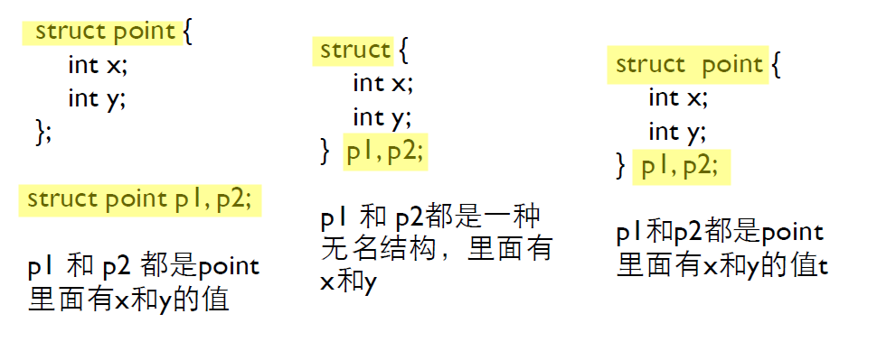
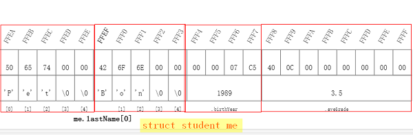
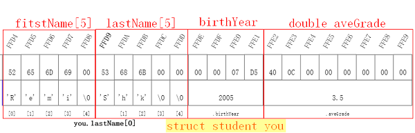
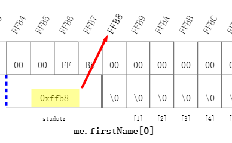
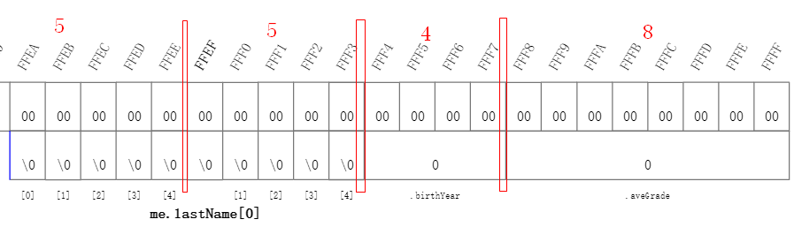
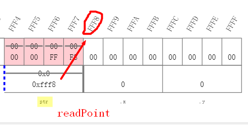
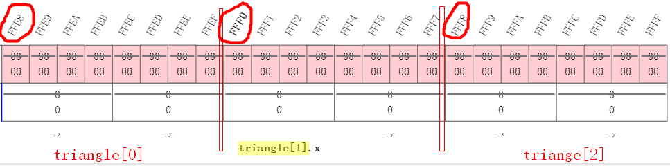
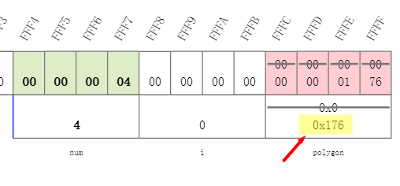
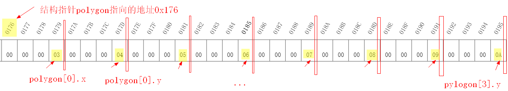

# 11 结构类型

[TOC]


## 11.1 枚举 enum

- 常量符号化：用符号而不是具体的数字来表示程序中的数字，增加程序的可读性。

  ```c
  #include <stdio.h>
  // 此代码error 
  const int red = 0;
  const int yellow = 1;
  const int green = 2;
   
  int main(int argc,char const *argv[]){
  	int colour = -1;
      char *colourName = NULL;
   
      printf("Please input your favorite colour code:\n");
      printf("(red 0, yellow 1, green 2)");
      scanf("%d", &colour);
      switch(colour){
          case red: colourName = "red"; break;
          case yellow: colourName = "yellow";break;
          case green: colourName = "green";break;
          default: colourName = "unknown";break;
      }
      printf("Your favorite colour is: %s\n",colourName);
      return 0;
  }
    
  ```

  (详细代码见: [01_const.c](./01_const.c))


- **枚举**：用枚举而不是定义独立的const int变量，而是可以定义一些排列起来的常量值

  枚举是一种用户定义的数据类型，它用关键字enum以如下语法来申明：

  **enmu 枚举类型名字 {名字0, 名字1,...,名字n};**

  枚举类型名字通常并不真的使用，要用的是在大括号里的名字，这些名字就是字符常量，它们的类型是int，值从0到n。

  如：`enmu colours{red, yellow, green};`：创建了三个常量，red的值是0，yellow是1，green是2

  ```c
  #include <stdio.h>
  
  enum COLOURS {RED, YELLOW, GREEN}; 
   
  int main(int argc,char const *argv[])
  {
  	int colour = -1;
      char *colourName = NULL;
   
      printf("Please input your favorite colour code:");
      printf("(red 0, yellow 1, green 2) ");
      scanf("%d", &colour);
      switch(colour)
  	{
          case RED: colourName = "red"; break;
          case YELLOW: colourName = "yellow";break;
          case GREEN: colourName = "green";break;
          default: colourName = "unknown";break;
      }
      printf("Your favorite colour is: %s\n",colourName);
      return 0;
  }
  /*
  Please input your favorite colour code:(red 0, yellow 1, green 2) 1
  Your favorite colour is: yellow
  */
  ```

  (详细代码见: [02_enum_colours.c](./02_enum_colours.c))


- 枚举量可以作为值，枚举类型可以跟上enum作为类型，但是在实际上**以整数来做内部计算和外部输入输出**。

  ```c
  #include<stdio.h>
  
  enum colour {red, yellow, green};
  
  void fun(enum colour c); 
  int main(void)
  {
  	enum colour t = red;
  	scanf("%d", &t);
  	fun(t);
  	return 0;
  }
  
  void fun(enum colour c)
  {
  	printf("%d\n", c);
  }
  ```

  (详细代码见: [03_enum_fun.c](./03_enum_fun.c))

  

- **自动计数的枚举**

  下面代码使用枚举实现计数， NumCOLOURS = 4，可以在后续遍历、数组下标时使用。

  ```c
  #include <stdio.h>
  
  enum COLOURS {RED, YELLOW, GREEN, NumCOLOURS};  // 使用枚举实现计数， NumCOLOURS = 4 
   
  int main(int argc,char const *argv[])
  {
  	int colour = -1;
  	char *ColourNames[NumCOLOURS] = {"red", "yellow", "green",};
      char *colourName = NULL;
   
      printf("Please input your favorite colour code:");
      printf("(red 0, yellow 1, green 2) ");
      scanf("%d", &colour);
      if (colour>=0 && colour<NumCOLOURS){
      	colourName = ColourNames[colour];
      }
      else {
      	colourName = "unknown";
      }
      printf("Your favorite colour is: %s\n",colourName);
      return 0;
  }
  /*
  Please input your favorite colour code:(red 0, yellow 1, green 2) 2
  Your favorite colour is: green
  */
    
  ```

  (详细代码见: [04_enum_circle.c](./04_enum_circle.c))


- **申明枚举量的时候可以指定值，未指定的就在前一个值的基础上+1**

  `enum COLOURS {RED=1, YELLOW, GREEN=5};`

  表示RED=1, YELLOW=2, GREEN=5

  

### 枚举总结

1. **枚举类型在实际上以int类型来做内部计算和外部输入输出，枚举是一个常量整型值的列表**
2. 枚举类型可以当做类型来使用，但是实际上不好用，很少使用
3. 枚举比宏(macro)好，因为枚举有int类型


## 11.2 结构

引例：

```c
#include<stdio.h>

int main()
{
    // 申明data结构
	struct date {
		int month;
		int day;
		int year;
	};
	
	struct date today;  // 结构变量
	today.month = 12;
	today.day = 8;        
	// 这些写"08"会error:invalid digit "8" in octal constant 表示如果以0开始就是8进制常量，08无效了 
	// 所以要打印 XXXX-0X-0X用这个程序实现不了 
	today.year = 2019;
	printf("Today's date is %i-%i-%i.\n", today.year, today.month, today.day);
	// Today's date is 2019-12-8. 
	
	return 0;
}
```

(详细代码见: [05_struct_date.c](./05_struct_date.c))

- 和本地变量一样，**在函数内部声明的结构类型只能在函数内部使用**，所以通常在函数外部声明结构类型，这样就可以被多个函数所使用

  

- **结构申明**三种方式：



对于第一和第三种形式，都声明了结构point。但是第二种形式没有声明point，只是定义了两个变量。


- **结构变量及其初始化**

```c
#include<stdio.h>

// 申明data结构
struct date {
	int month;
	int day;
	int year;
};

int main()
{	
    //! showMemory(start=65520)
    struct date today = {07,31,2014};  				 // 结构变量及初始化 
	struct date thisMonth = {.month=7, .year=2014};  // 结构变量及初始化     

	printf("Today's date is %i-%i-%i.\n", today.year, today.month, today.day);
    printf("Today's date is %i-%i-%i.\n", thisMonth.year, thisMonth.month, thisMonth.day);
	// Today's date is 2014-7-31.
	// Today's date is 2014-7-0. 
	
	return 0;
}
```

(详细信息见: [06_struct_init.c](./06_struct_init.c))


- 结构成员

  结构与数字有点像:

  1. 数字用"[]"运算符和下标访问其成员，如`a[0] =10`;
  2. 结构用"."运算符和名字访问其成员，如`today.day`, `pl.x`, `pl.y`


- 结构运算

  1. 要访问整个结构，直接用结构变量的名字，如`struct date today;`

  2. 对于整个结构，可以做赋值、取地址，也可以传递给函数参数

     ```c
     p1 = (struct point){5, 10} // 相当于 p1.x=5; p1.y=10
     p1 = p1;  // 相当于p1.x=p2.x; p1.y=p2.y
     // 数组无法直接做上面两种运算，数组元素是const
     ```

     

- 结构指针

  和数组不同，结构变量的名字并不是结构变量的地址，必须使用&运算符

  `struct date *pDate = &today;`

  ```c
  struct date today = {07,31,2014};  				 // 结构变量及初始化
  struct date *pDate = &today;
  printf("Adress of struct today is %p.\n", pDate);
  // Adress of struct today is 00000000009FFE30. 
  ```

  

## 11.3 结构与函数

注：这部分看的edX的C语言课程[C Programming: Advanced Data Types](<https://www.edx.org/course/c-programming-advanced-data-types>)

## 11.4 结构中的结果

注：这部分看的edX的C语言课程[C Programming: Advanced Data Types](<https://www.edx.org/course/c-programming-advanced-data-types>)


## 11.5 structures (edX C语言课程structures模块)

### 11.5.1   Define and use structures

```c
#include <stdio.h>

struct student{
    char firstName[5];
    char lastName[5];
    int birthYear;
    double aveGrade;
};

int main(void) {
	//! showMemory(start=65520)
    struct student me = {"Pet", "Bon", 1989, 3.5};
    struct student you = {"Remi", "Shk", 2005, 3.5};
    printf("Names: %s %s, %s %s\n", me.firstName, me.lastName, you.firstName, you.lastName);
    printf("Year of birth: %d\n", me.birthYear);
    printf("Average grade: %.2lf\n", me.aveGrade);
	return 0;
}

```

(详细代码见: [07_define&useStructures.c])

定义结构变量me和you后，地址变化：






### 11.5.2 Access and modify structure’s members with the dot operator

```c
struct student{
	char firstName[5];
	char lastName[5];
	int birthYear;
	double aveGrade;
};

int main(void) {
    struct student learner;
    printf("First name: ");
    // 结构用"."运算符和名字访问其成员,firstName本身是数组，所以不用&
    scanf("%s", learner.firstName);

    printf("Year of birth:");
    // 结构用"."运算符和名字访问其成员
    scanf("%d", &learner.birthYear);

    
    printf("Name: %s %s\n", learner.firstName, learner.lastName);
	printf("Year of birth: %d\n",learner.birthYear);
	printf("Average grade: %.2lf\n",learner.aveGrade);
    
	return 0;
}
/*
First name: Pet
Year of birth:1989
Name: Pet
Year of birth: 1989
Average grade: 0.00
由结果可知，结构变量的成员firstName[5],lastName[5], birthYear, aveGrade都初始化为0，可以用"."运算符访问其成员 
*/ 

```

(详细代码见: [08_dot_operator.c](./08_dot_operator.c))


### 11.5.3 Pass structures to functions 

#### 01  Pass structures to functions directly

上诉代码在main里打印结构变量student，我们可以使用函数来实现。

```c
void printStudent(struct student stud) {
    printf("Name: %s %s\n", stud.firstName, stud.lastName);
	printf("Year of birth: %d\n",stud.birthYear);
	printf("Average grade: %.2lf\n",stud.aveGrade);
}
```

通过函数内部结构变量stud来实现值的传递。


#### 02  Pass structures to functions with pointers

```c
#include <stdio.h>

struct student{
	char firstName[30];
	char lastName[30];
	int birthYear;
	double aveGrade;
};
void readStudent(struct student *studptr);
int main(void) {
   //! showMemory(start=65520)
    struct student me;
    readStudent(&me);
	return 0;
}

// 使用结构变量指针实现读入，这样才能传递到外部
void readStudent(struct student *studptr) {
    printf("\nEnter a new student record: \n");
    printf("First name: ");
    scanf("%s", (*studptr).firstName);   // 注意这里写法: (*studptr).firstName
    printf("Last name: ");
    scanf("%s", (*studptr).lastName);
    printf("Birth year: ");
    scanf("%d", &(*studptr).birthYear);    // 注意这里写法:  &(*studptr).birthYear
    printf("Average grade: ");
    scanf("%lf", &(*studptr).aveGrade);
}
```

(详细代码见: [09_func_pointer.c](./09_func_pointer.c) )




### 11.5.4 Work with structures 

#### 01 *Access and modify structure’s members with the arrow operator

上面代码通过指针访问结构变量元素使用的是：

`scanf("%s", (*studptr).firstName);`

``scanf("%d", &(*studptr).birthYear);`

C语言中可以用"->"符号表示指针所指的结果变量的成员，所以可以写成：

`scanf("%s", studptr->firstName);`

`scanf("%d", &studptr->birthYear);` ("->"运算符等级比&高)

修改后的完整代码见：

```c
#include <stdio.h>

struct student{
	char firstName[30];
	char lastName[30];
	int birthYear;
	double aveGrade;
};
void printStudent(struct student);
void readStudent(struct student *studptr);
int main(void) {
   //! showMemory(start=65520)
    struct student me;
    readStudent(&me);
    printStudent(me);
	return 0;
}

void readStudent(struct student *studptr) {
    printf("\nEnter a new student record: \n");
    printf("First name: ");
    scanf("%s", studptr->firstName);
    printf("Last name: ");
    scanf("%s", studptr->lastName);
    printf("Birth year: ");
    scanf("%d", &studptr->birthYear);
    printf("Average grade: ");
    scanf("%lf", &studptr->aveGrade);
}

void printStudent(struct student stud) {
    printf("Name: %s %s\n", stud.firstName, stud.lastName);
	printf("Year of birth: %d\n",stud.birthYear);
	printf("Average grade: %.2lf\n",stud.aveGrade);
}
```


#### 02 Get the size of a structure in memory


```c
#include <stdio.h>

struct student{
	char firstName[5];
	char lastName[5];
	int birthYear;
	double aveGrade;
};

int main(void) {
    //! showMemory(start=65520)
	struct student me;
    printf("Size of struct student is %zu.\n", sizeof(struct student));
    printf("Size of firstName is %zu.\n", sizeof(me.firstName));
    printf("Size of lastName is %zu.\n", sizeof(me.lastName));
    printf("Size of birthYear is %zu.\n", sizeof(me.birthYear));
    printf("Size of aveGrade is %zu.\n", sizeof(me.aveGrade));

	return 0;
}
/*
edX 的Codecase sandbox运行结果：
Size of struct student is 22.                                                   
Size of firstName is 5.                                                         
Size of lastName is 5.                                                          
Size of birthYear is 4.                                                         
Size of aveGrade is 8. 
 
32为GCC编译器结果： 
Size of struct student is 24.
Size of firstName is 5.
Size of lastName is 5.
Size of birthYear is 4.
Size of aveGrade is 8.
*/
```

(详细代码见: [10_sizeof_struct.c](./10_sizeof_struct.c))




## 11.6 structures and pointers

### 11.6.1 Create a structure to store the coordinates of a point

#### 01 Create structures from user input

通过结构变量指针读入点的x,y坐标：

```c
#include <stdio.h>
struct point{
    int x;
    int y;
};
void printPoint(struct point pt);
void readPoint(struct point * ptr);
int main(void) {
    //! showMemory(start=65520)
    struct point z;
    readPoint(&z);
    printPoint(z);
	return 0;
}

/* 通过结构变量指针读入点的x,y坐标*/
void readPoint(struct point * ptr) {
    printf("\nEnter a new point: \n");
    printf("x-coordinate: ");
    scanf("%d", &ptr->x);
    printf("y-coordinate: ");
    scanf("%d", &ptr->y);
}

void printPoint(struct point pt){
    printf("(%d, %d)\n", pt.x, pt.y);
}
/*
Enter a new point:                                                              
x-coordinate: 3                                                                 
y-coordinate: 4                                                                 
(3, 4) 
*/
```




#### 02 Use an array of structures

```c
#include <stdio.h>
struct point{
    int x;
    int y;
};
void printPoint(struct point pt);
void readPoint(struct point * ptr);
void printTriangle(struct point *ptr);
int main(void) {
    //! showMemory(start=65520)
    /*要创建一个三角形，需要三个点,所以用结构数组形式实现*/
    struct point triangle[3];
    int i;
    for (i=0; i<3; i++){
        readPoint(&triangle[i]);
    }
    printTriangle(triangle);
	return 0;
}

void readPoint(struct point * ptr) {
    printf("\nEnter a new point: \n");
    printf("x-coordinate: ");
    scanf("%d", &ptr->x);
    printf("y-coordinate: ");
    scanf("%d", &ptr->y);
}

void printTriangle(struct point *ptr) {
    int i;
    for (i=0; i<3; i++) {
        printPoint(ptr[i]);
    }
}

void printPoint(struct point pt){
    printf("(%d, %d)\n", pt.x, pt.y);
}
/*
Enter a new point:                                                              
3 4 5 6 7 8                                                                     
x-coordinate: y-coordinate:                                                     
Enter a new point:                                                              
x-coordinate: y-coordinate:                                                     
Enter a new point:                                                              
x-coordinate: y-coordinate: (3, 4)                                              
(5, 6)                                                                          
(7, 8)
*/
```

结构数组struct point triangle[3]的地址如下图所示，程序运行时：

1. 执行`readPoint(&triangle[i]);`操作，ptr依次指向0xffe8, 0xfff0, 0xfff8来实现对结构数组元素的读入；
2. 执行`printPoint(ptr[i]);`操作，依次读取printPoint(ptr[0]), printPoint(ptr[1]), printPoint(ptr[2])的存储的x坐标和y坐标值并打印。




### 11.6.2 Allocate memory for structures

由用户输入一个数字num，然后构建具有num个顶点(vertex)的多边形(polygon)。先向内存malloc(num * sizeof(struct point)大小的空间才存储这个结果指针，代码如下：

```c
#include <stdio.h>
#include <stdlib.h>
struct point{
    int x;
    int y;
};
void printPoint(struct point pt);
void readPoint(struct point * ptr);
void printPoly(struct point *ptr, int vertices);

/*由用户输入一个数字num，然后构建具有num个顶点(vertex)的多边形(polygon)*/
int main(void) {
    //! showMemory(start=65520)
    struct point * polygon;
    int i, num;
    printf("How many vertices does your polygon have? ");
    scanf("%d", &num);
    polygon = (struct point *) malloc(num * sizeof(struct point));
    for (i=0; i<num; i++){
        readPoint(&polygon[i]);
    }
    printPoly(polygon, num);
    free(polygon);
	return 0;
}

void readPoint(struct point * ptr) {
    printf("\nEnter a new point: \n");
    printf("x-coordinate: ");
    scanf("%d", &ptr->x);
    printf("y-coordinate: ");
    scanf("%d", &ptr->y);
}

void printPoly(struct point *ptr, int vertices) {
    int i;
    for (i=0; i<vertices; i++) {
        printPoint(ptr[i]);
    }
}

void printPoint(struct point pt){
    printf("(%d, %d)\n", pt.x, pt.y);
}
```

(详细代码见: [11_struct_pointer_memory.c](./11_struct_pointer_memory.c))

在edX课程提供的Codecast运行上述代码，我们输入多边形顶点个数num为4，结果指针polygon的地址为0x176。



循环执行readPoint(&polygon[i])函数，依次输入polygon[i].x, polygon[i].y的值，内存中存储过程如下：



上述代码完整的运行结果如下：

```c
How many vertices does your polygon have? 4

Enter a new point:
x-coordinate: 3
y-coordinate: 4

Enter a new point:
x-coordinate: 5
y-coordinate: 6

Enter a new point:
x-coordinate: 7
y-coordinate: 8

Enter a new point:
x-coordinate: 9
y-coordinate: 10
(3, 4)
(5, 6)
(7, 8)
(9, 10)
```


### 11.6.3 Get to know the concept of a linked list

此部分在下一章链表单独做笔记，见: [edX_C_Programming_Linked_List](../012_可变数组和链表/edX_C_Programming_Linked_List)


## 11.9 自定义数据类型 typedef

**使用typedef功能来申明一个已有数据类型的新名字。**

```c
typedef int Length;    /* 使得Length成为int类型的别名*/
Length a, b;		  /* Length就可以代替int出现在变量定义和参数申明中*/
Length number[10];
```


- typedef申明的新的名字是某种类型的别名，改善了程序的可读性

  ```c
  typedef long int64_t;   /*long申明为新名字int64_t，含义更清晰，具有可移植性*/
  type struct ADate{
      int month;
      int day;
      int year;
  }Date;				/*将结构类型struct Adate指定申明为Date,简化了复杂的名字*/
  
  typedef *char[10] Strings10; /*Strings10是10个字符串的数组的类型*/
  ```


## 11.10 联合类型 union

联合是可以(在不同时刻) 保证不同类型和长度的对象的变量。

如下面代码定义了union变量elt2，变量的成员是一个int i和一个char c， **这两个成员占据了同一个空间004053D4**。

对于联合union，有：

1. 所有的成员共享一个空间
2. 同一时间只有一个成员是有效的
3. union的大小是其最大的成员，如sizeof(elt2) = max(sizeof(int), sizeof(char)) =4
4. 初始化时对第一个成员做初始化即可
5. 可以赋值union变量中任何一种结构给联合变量，但是随后的表达式，必须保证一致(读取的类型必须是最近一次存入的类型)
6. **访问联合中的成员**
   - `联合名.成员`
   - 或`联合指针->成员`


```c
#include <stdio.h>
union AnElt{
    int i;
    char c;
}elt1,elt2;

int main(){
    //! showMemory(start=65520)
    elt2.c='a';
    elt2.i=0xDEADBEEF;
    printf("The adress of elt1 is   %p\n",&elt1);
    printf("The adress of elt1.i is %p\n",&elt1.i);
    printf("The adress of elt1.c is %p\n",&elt1.c);
    printf("The adress of elt2 is   %p\n",&elt2);
    printf("The adress of elt2.i is %p\n",&elt2.i);
    printf("The adress of elt2.c is %p\n",&elt2.c);
    printf("The sizeof of elt2 is %d\n",sizeof(elt2));
    
	return 0;
} 
/*
The adress of elt1 is   004053D0
The adress of elt1.i is 004053D0
The adress of elt1.c is 004053D0
The adress of elt2 is   004053D4
The adress of elt2.i is 004053D4
The adress of elt2.c is 004053D4
The sizeof of elt2 is 4
*/ 
```

(详细代码见: [12_union_memory.c](./12_union_memory.c))


联合应用实例：

```c
#include <stdio.h>
typedef union{
	int i;
	char ch[sizeof(int)];
}CHI;

int main(){
	CHI chi;
	int i;
	chi.i=1234;    /*10进制的1234对应16进制是 0x04D2，下面遍历打印一下存储的字符形式的chi*/
	for (i=0;i<sizeof(int);i++)
		printf("%02hhX",chi.ch[i]);   /*%02hhX是格式符，表示16进制，不到10就补充0 */ 
		/*
		打印结果是： 
		FFD2040000
		结果表示 chi.ch[0]=D2,chi.ch[1]=04,chi.ch[2]=00,chi.ch[3]=00
		*/
		
	printf("\n");
	return 0;
} 
```

(详细代码见: [13_union_example.c](./13_union_example.c))


------

## 参考资料

1. 翁恺讲义：[枚举.pdf](./枚举.pdf)
2. 翁恺讲义：[结构.pdf](./结构.pdf)
3. 翁恺讲义：[联合.pdf](./联合.pdf)
4. [edX-C Programming: Advanced Data Types](<https://www.edx.org/course/c-programming-advanced-data-types>)
5. [B站视频 edX-C Programming: Advanced Data Type](<https://www.bilibili.com/video/av78845925>)

