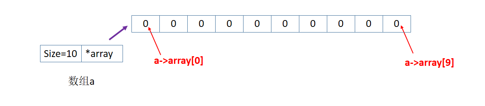
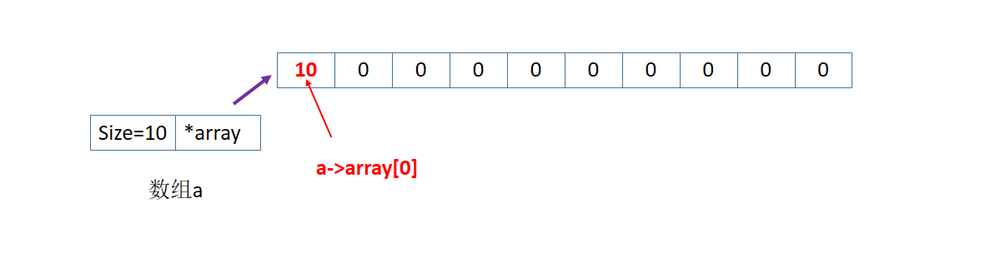
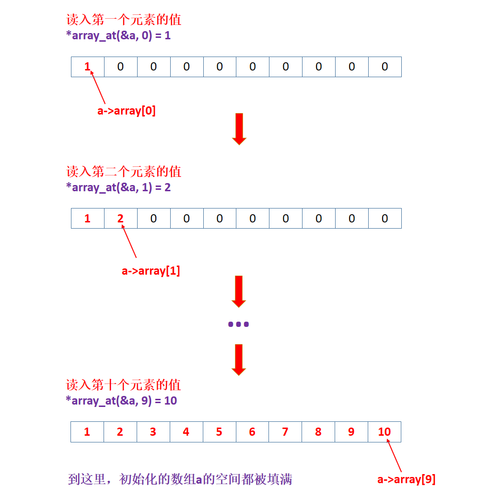
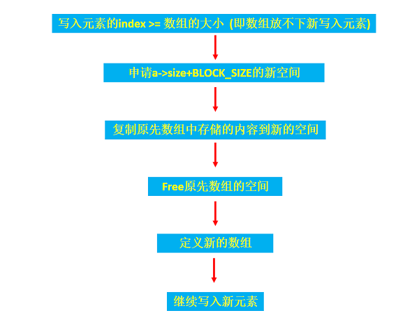
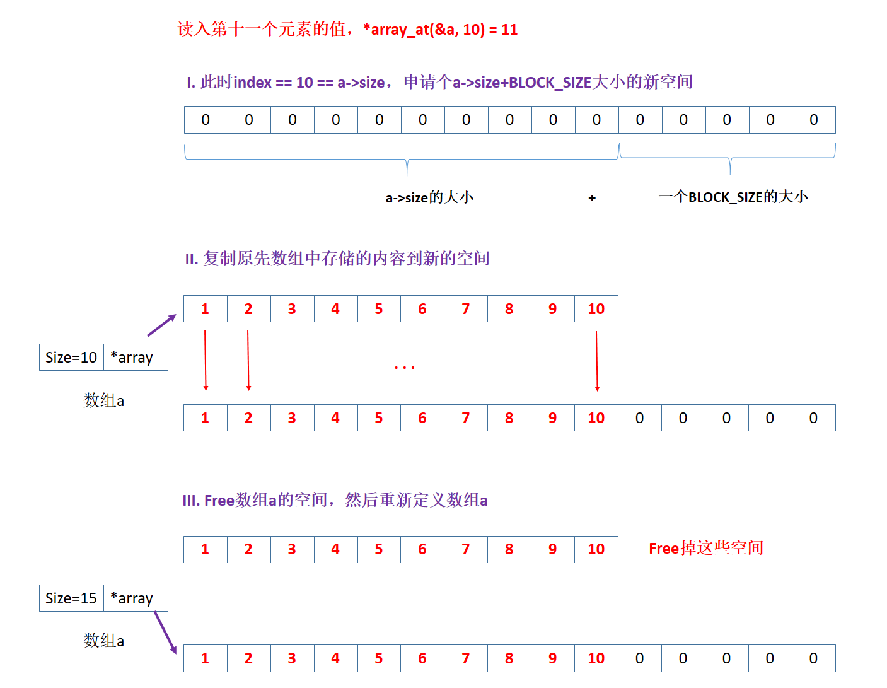
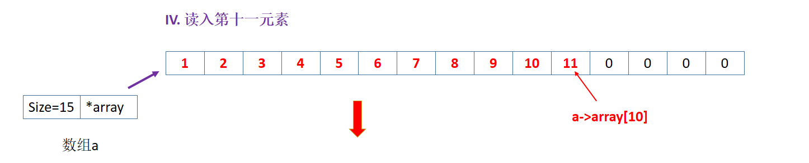
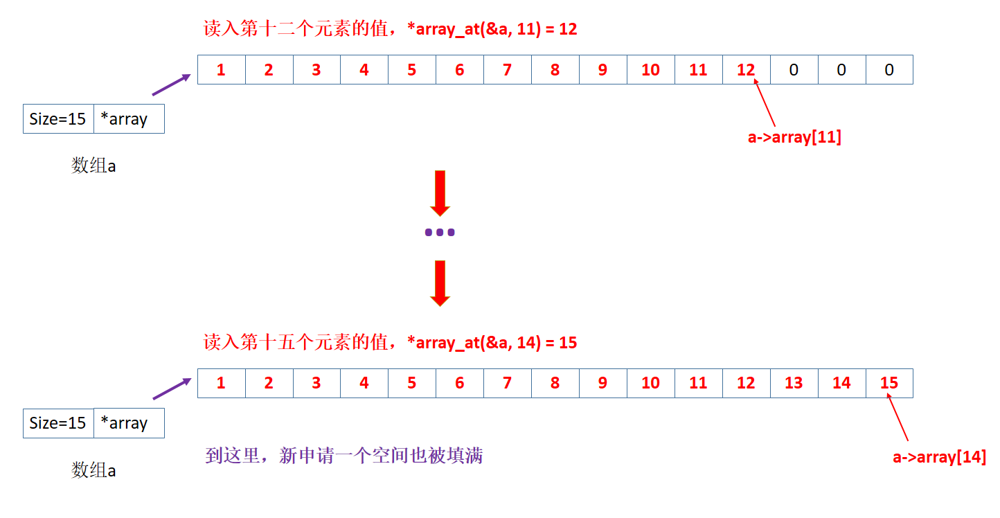
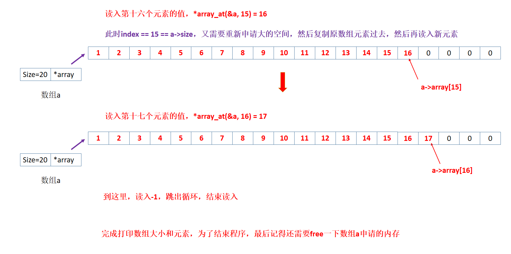

# 12 可变数组和链表

## 12.1 可变数组

在[第九章指针--9.7 动态内存分配](../09_指针/README.md)时，我们知道C99以前，传统数组大小必须事先制定，数组的长度一旦定义，其长度不能再更改，数组的长度不能在函数运行过程中扩充或缩小，在实际使用中很多限制。因此，这节学习如果定义可变数组。

### 12.1.1 可变数组定义、写入、增长完整程序

定义可变数组的完整程序如下：

```c
#include<stdio.h>
#include<stdlib.h>
#define BLOCK_SIZE 5

typedef struct {
    int *array;
    int size;
}Array;

Array array_creat(int init_size);                   
void array_free(Array *a);                          
int  array_size(const Array *a);                         
int*array_at(Array*a, int index);                   
void array_inflate(Array*a, int more_size);        

int main(int argc, char const *argv[])
{
    // 创建初始大小为10的数组
    Array a = array_creat(10);
    // 打印可变数组的大小
    printf("数组初始大小：%d\n", array_size(&a));    // 10
    printf("每次增加的BLOCK_SIZE = %d\n",BLOCK_SIZE);

    // 将可变数组的第0个位置写入10
    *array_at(&a, 0) = 10;
    printf("在a[0]位置写入10，打印写入后a[0]：%d\n", *array_at(&a, 0));   // 10
    
    // 读入不为-1的number，然后将number写入可变数组中，让数组长大
    // 只有当输入的number为-1时，跳出循环，数组停止写入
    int number=0;
    int cnt = 0;
    printf("请输入需要添加到数组的元素：(输入-1表示终止)\n");
    while(number!= -1){
        scanf("%d", &number);
        if(number != -1){
            *array_at(&a, cnt++) = number;
        }
    } 
    // 打印数组增长后，数组的大小
    printf("数组增长后，数组的大小：%d\n", array_size(&a));
    // 打印当前数组的所有元素
    int i;
    for (i=0; i<array_size(&a);i++){
        printf("%d  ",a.array[i]);
    }

    printf("\n");


    // free掉数组a申请的内存空间
    array_free(&a);

    return 0;
}

/*
数组初始大小：10
每次增加的BLOCK_SIZE = 5
在a[0]位置写入10，打印写入后a[0]：10
请输入需要添加到数组的元素：(输入-1表示终止)
1 2 3 4 5 6 7 8 9 10 11 12 13 14 15 16 17 -1
数组增长后，数组的大小：20
1  2  3  4  5  6  7  8  9  10  11  12  13  14  15  16  17  0  0  0
*/


/*可变数组各函数定义:*/
/*创建可变数组，传入开始设置的数组大小init_size */
Array array_creat(int init_size)
{
    Array a;
    a.size = init_size;
    a.array = (int*)malloc(sizeof(int)*a.size);
    return a;
}

/* 数组Array a在创建的时候用malloc申请了存放*array的内存，需要free */
void array_free(Array *a)
{
    free(a->array);
    a->array = NULL;  // 保险起见,每次释放后让a->array = 0(NULL)
    a->size = 0;      // 保险起见,每次释放后让a->size = 0
}

/* 数组Array a的大小，封装 */
int array_size(const Array *a)
{
    return a->size;
}

/* 访问数组当中index位置的元素，可以读取也可以写入 */
int *array_at(Array *a, int index)
{
    // 当index越界情况, 调用数组增大函数array_inflate，每次多申请一个BLOCK_SIZE大小的新空间，
    // 然后复制原先数组的所有元素过去，重新定义数组用于存放新添加的元素
    if(index >= a->size){
        array_inflate(a, (index/BLOCK_SIZE+1)*BLOCK_SIZE - a -> size);
    }
    return &(a->array[index]);
}

/* 数组自动长大: 在原先数组a->size大小的基础上，用malloc申请”a->size + more_size“的空间 */
void array_inflate(Array*a, int more_size)
{
    int *p = (int*)malloc(sizeof(int) * (a->size + more_size));   // 申请增大的数组所需新空间
    // 有空间后，还需要把原先的数组内容用循环遍历一个个复制到新的空间
    int i;
    for(i=0; i<a->size; i++){
        p[i] = a->array[i];
    }
    // 复制完后free原先老数组的空间，然后重新定义新数组的array和size
    free (a->array);  
    a->array = p;
    a->size += more_size;
}

```

(详细代码见: [array_test.c](./array_test.c). ，其实这个代码有点长，可以将各数组相关函数保存在[array_funs.c](./array_funs.c)，然后建立头文件[array.h](./array.h)链接，在[array_main.c](./array_main.c)中实现调用array_funs.c中的函数，关于头文件、声明、大程序文件的内容见后面章节: [013_程序结构](../013_程序结构/README.md))


### 12.1.2 创建可变数组

创建初始长度为10的数组：

```c
typedef struct {
    int *array;
    int size;
}Array;

Array array_creat(int init_size);                        

int main(int argc, char const *argv[])
{
    // 创建初始大小为10的数组
    Array a = array_creat(10);

}
/*创建可变数组，传入开始设置的数组大小init_size */
Array array_creat(int init_size)
{
    Array a;
    a.size = init_size;
    a.array = (int*)malloc(sizeof(int)*a.size);
    return a;
}
```

执行上述代码，将创建一个长度大小为10的数组a:




### 12.1.3  特定元素写入

将上面的可变数组的第0个位置写入10

```c
int main()
{
    // 将可变数组的第0个位置写入10
    *array_at(&a, 0) = 10;  
}


/* 访问数组当中index位置的元素，可以读取也可以写入 */
int *array_at(Array *a, int index)
{
    // 当index越界情况, 调用数组增大函数array_inflate，每次多申请一个BLOCK_SIZE大小的新空间，
    // 然后复制原先数组的所有元素过去，重新定义数组用于存放新添加的元素
    if(index >= a->size){
        array_inflate(a, (index/BLOCK_SIZE+1)*BLOCK_SIZE - a -> size);
    }
    return &(a->array[index]);
}
```

执行上述代码，将可变数组的第0个位置写入10：




### 12.1.4  数组的连续读入、增长

对上面的数组进行连续的写入操作：

```c
int main(int argc, char const *argv[])
{
    // 读入不为-1的number，然后将number写入可变数组中，让数组长大
    // 只有当输入的number为-1时，跳出循环，数组停止写入
    int number=0;
    int cnt = 0;
    printf("请输入需要添加到数组的元素：(输入-1表示终止)\n");
    while(number!= -1){
        scanf("%d", &number);
        if(number != -1){
            *array_at(&a, cnt++) = number;
        }
    } 
}

/* 
请输入需要添加到数组的元素：(输入-1表示终止)
1 2 3 4 5 6 7 8 9 10 11 12 13 14 15 16 17 -1
*/
```


1. 如果读入的数组元素小于或等于10个，则直接往数组a中写入元素；

    ```c
    /* 写入前10个元素，index<10 */
    int *array_at(Array *a, int index)
    {
        if(index >= a->size){...}
        
        return &(a->array[index]);
    }
    ```

    写入前10个元素：

    

    

2. 当写入元素个数超过数组a的长度10时，再写入没有空间，调用数组增大函数array_inflate，每次多申请一个BLOCK_SIZE大小的新空间，然后复制原先数组的所有元素过去，重新定义数组用于存放新添加的元素，流程如下：

    

    ```c
    /* 访问数组当中index位置的元素，可以读取也可以写入 */
    int *array_at(Array *a, int index)
    {
        // 当index越界情况, 调用数组增大函数array_inflate，每次多申请一个BLOCK_SIZE大小的新空间，
        // 然后复制原先数组的所有元素过去，重新定义数组用于存放新添加的元素
        if(index >= a->size){
            array_inflate(a, (index/BLOCK_SIZE+1)*BLOCK_SIZE - a -> size);
        }
        return &(a->array[index]);
    }
    
    /* 数组自动长大: 在原先数组a->size大小的基础上，用malloc申请”a->size + more_size“的空间 */
    void array_inflate(Array*a, int more_size)
    {
        int *p = (int*)malloc(sizeof(int) * (a->size + more_size));   // 申请增大的数组所需新空间
        // 有空间后，还需要把原先的数组内容用循环遍历一个个复制到新的空间
        int i;
        for(i=0; i<a->size; i++){
            p[i] = a->array[i];
        }
        // 复制完后free原先老数组的空间，然后重新定义新数组的array和size
        free (a->array);  
        a->array = p;
        a->size += more_size;
    }
    ```

    

    **写入第十一个元素：`*array_(&a,10)=11;`**

    

    

    

    **写入第十二到十五个元素：**

    

    

    **写入第十六到十七个元素：(需要重新申请空间)**

    

    


## 12.2 链表

### 12.2.1 可变数组的缺陷

- Allocate new memory each time it inflates is an easy and clean way. But

    - It takeks time to copy,
    - It may fail in memory restricted situation.

    


- 所以用 linked blocks，不用复制而是直接把它们链起来

    


链表其他部分我学习的是edX C Programming Linked List和《C和指针》这本书，见下面笔记。


## 12.3 edX C Programming Linked List

在学习链表的过程中，由于翁凯老师关于链表的模块讲得特别快，对于链表我并没有很好理解，所以在edX完整学习了[C Programming: Advanced Data Types](https://www.edx.org/course/c-programming-advanced-data-types)课程，笔记见: [edX_C_Programming_Linked_List](../edX_C_Programming_Linked_List/README.md)


## 12.4  《C和指针》单链表

《C和指针》中第12章“使用结构和指针”主要介绍了单链表和双链表内容。


## 12.5 《C和指针》双链表

《C和指针》中第12章“使用结构和指针”主要介绍了单链表和双链表内容。


----

## 参考资料

1. 翁恺讲义：[可变数组.pdf](./可变数组.pdf)
2. 翁恺讲义：[链表.pdf](./链表.pdf)
3. [edX-C Programming: Advanced Data Types](https://www.edx.org/course/c-programming-advanced-data-types)
4. [B站视频 edX-C Programming: Advanced Data Type](https://www.bilibili.com/video/av78845925)]
5. Kenneth A. Reek著《C和指针》：[第12章 使用结构和指针](./第十二章_使用结果和指针_C和指针.pdf)

