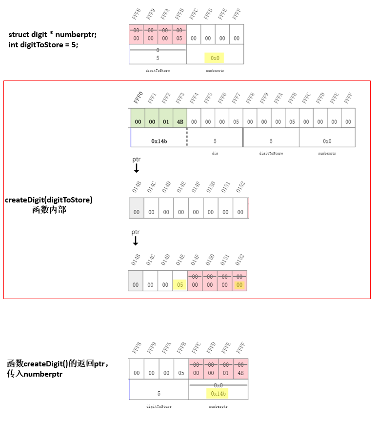

# edX C Programming Linked List

## 5.2 Structures and Pointers

### 5.2.3 Get to know the concept of a linked list

#### 5.2.3.1 Link structures together in a linked list

将结构用指针连起来构建成一个链表：

```c
#include <stdio.h>

struct point{
    int x;
    int y;
    struct point * next;
};

int main(void) {
    //! showMemory(start=65520)
    struct point pt1 = {1, 2, NULL};
    struct point pt2 = {-2, 3, NULL};
    struct point pt3 = {5, -4, NULL};
    struct point * start, * ptr;
    
    start = &pt1;
    pt1.next = &pt2;
    pt2.next = &pt3;
    
    ptr = start;
    while (ptr!=NULL) {
        printf("(%d, %d)\n", ptr->x, ptr->y);
        ptr = ptr->next;
    }
	return 0;
}
/*
(1, 2)                                                                          
(-2, 3)                                                                         
(5, -4) 
*/

```

下面是构建过程中地址的变化：


#### 5.2.3.2 Print a linked list

改造5.2.3.1的代码，用一个函数实现main函数中的while循环，打印所有点的坐标。

```c
#include <stdio.h>

struct point{
    int x;
    int y;
    struct point * next;
};
void printPoints(struct point *start);
int main(void) {
    //! showMemory(start=65520)
    struct point pt1 = {1, 2, NULL};
    struct point pt2 = {-2, 3, NULL};
    struct point pt3 = {5, -4, NULL};
    struct point * start;       
    
    start = &pt1;
    pt1.next = &pt2;
    pt2.next = &pt3;
    
    printPoints(start);
	return 0;
}

void printPoints(struct point *start) {
    //! showMemory(start = 65520, cursors=[ptr])
    struct point * ptr;    // ptr是一个游动的指针，用来实现遍历
    ptr = start;
    while (ptr!=NULL) {
        printf("(%d, %d)\n", ptr->x, ptr->y);
        ptr = ptr->next;
    }
}
/*
(1, 2)                                                                          
(-2, 3)                                                                         
(5, -4) 
*/
```

此时，在printPoints()函数中，指针ptr的变化状态是：


#### 5.2.3.3 Append new nodes to a linked list

上面代码通过语句 `start = &pt1;pt1.next = &pt2; pt2.next = &pt3;`来实现结构节点间的链接，现在尝试用函数来实现：

```c
#include <stdio.h>

struct point{
    int x;
    int y;
    struct point * next;
};
void printPoints(struct point *start);
struct point * append (struct point * end, struct point * newpt);
int main(void) {
    //! showMemory(start=65520)
    struct point pt1 = {1, 2, NULL};
    struct point pt2 = {-2, 3, NULL};
    struct point pt3 = {5, -4, NULL};
    
	/*创建start指针来存储链表起始位置
	  创建end指针作为节点尾部，每次更新end指针实现连接*/
    struct point * start, * end;      
    start = end = &pt1;
    end = append(end, &pt2);
    end = append(end, &pt3);
    
    printPoints(start);
    
	return 0;
}

void printPoints(struct point *start) {
    //! showMemory(start = 65520, cursors=[ptr])
    struct point * ptr;
    ptr = start;
    while (ptr!=NULL) {
        printf("(%d, %d)\n", ptr->x, ptr->y);
        ptr = ptr->next;
    }
}
/* 
将指针newpt所指的结构变量添加到指针end所指的结构变量后面，并返回新列表的end 
pass the current end of a list and the adress of a new point,
the new point will be appened to the list, ant it returns a new end of the list
*/
struct point * append (struct point * end, struct point * newpt) {
    end->next = newpt;
    return(end->next);
} 
```


#### 5.2.3.4 Delete a linked list

输入num个点，然后将他们连接成链表。由于num的数不定，所以不能直接用数组实现，需要用指针，同时需要malloc申请内存空间，完整代码如下：

```c
#include <stdio.h>
#include <stdlib.h>
struct point{
    int x;
    int y;
    struct point * next;
};
void printPoints(struct point *start);
struct point * createPoint(int x, int y) ;
struct point * append (struct point * end, struct point * newpt);
void freePoints(struct point * start);
int main(void) {
    //! showMemory(start=65520)
    struct point * start, * end, * newpt;
    int num, i;
    int x, y;
    
    printf("How many points? ");
    scanf("%d", &num);
    
    /* 循环输入num个点的坐标,并添加到链表的节点*/
    for (i=0; i<num; i++) {
        printf("x = ");
        scanf("%d", &x);
        printf("y = ");
        scanf("%d", &y);
        newpt = createPoint(x,y);
        if (i==0) {
            start = end = newpt;
        } else {
            end = append(end,newpt);
        }
    }
    printf("You entered: ");
    printPoints(start);
    freePoints(start);        /*释放creatPoint()函数申请的内存*/
	return 0;
}

/*从头开始，遍历打印所有的点的坐标*/
void printPoints(struct point *start) {
    //! showMemory(start = 65520, cursors=[ptr])
    struct point * ptr;
    ptr = start;
    while (ptr!=NULL) {
        printf("(%d, %d)\n", ptr->x, ptr->y);
        ptr = ptr->next;
    }
}

/*将指针newpt所指的结构变量添加到指针end所指的结构变量后面，并返回新列表的end*/
struct point * append (struct point * end, struct point * newpt) {
    end->next = newpt;
    return(end->next);
} 

/*传入点的x坐标和y坐标，将值传入相应节点point，并返回该节点point的地址*/
struct point * createPoint(int x, int y) {
    struct point *ptr;
    ptr = (struct point *)malloc(sizeof(struct point));
    ptr->x = x;
    ptr->y = y;
    ptr->next = NULL;
    return(ptr);
}

/*
释放creatPoint()函数申请的内存
由于如果直接free掉start的内存，就会不知道下一个元素保存在哪里，所以先用一个ptr来保存一下当前start地址
*/
void freePoints(struct point * start) {
    struct point * ptr = start;
    while (ptr!=NULL) {
        start = ptr;
        ptr = ptr->next;
        free(start);
    }
}

/*
How many points? 2                                                              
x = 3                                                                           
y = 4                                                                           
x = 5                                                                                               y = 6                                                                           
You entered: (3, 4)                                                             
(5, 6) 
*/
```

运行creatPoint()函数过程的流程图及内存变化：


## 5.3 Linked list

### 5.3.1 Create a node of a linked list

创建节点函数：传入一个数字，返回数字存储的结构指针。

```c
#include <stdio.h>
#include <stdlib.h>

/*一个结构，结构中有一个数字num(0,1,2...9)和指向下一个数字的结构指针next*/
struct digit {
    int num;
    struct digit * next;
};
struct digit * createDigit(int dig);
int main(void) {
    //! stack=showMemory(start=65520, showcursor[numberptr])
    struct digit * numberptr;
    int digitToStore = 5;
    numberptr = createDigit(digitToStore);
    printf("We are storing the digit %d and the pointer %p at memory location %p.\n", numberptr->num, numberptr->next, numberptr);
    free(numberptr);
    return 0;
}

/*创建节点函数：传入一个数字，返回数字存储的结构指针*/
struct digit * createDigit(int dig) {
    //! heap=showMemory(start=330, cursors=[ptr])
    struct digit *ptr;
    ptr = (struct digit *) malloc(sizeof(struct digit));
    ptr->num = dig;
    ptr->next = NULL;
    return ptr;
}
/*
We are storing the digit 5 and the pointer 0 at memory location 14b.
*/
```




### 5.3.2 Append a node to a linked list

创建节点后，需要把节点一个个连接起来，创建添加节点的append()函数：

```c
#include <stdio.h>
#include <stdlib.h>

/*一个结构，结构中有一个数字num(0,1,2...9)和指向下一个数字的结构指针next*/
struct digit {
    int num;
    struct digit * next;
};
struct digit * createDigit(int dig);
struct digit * append(struct digit * end, struct digit * newDigitptr);
int main(void) {
    //! stack=showMemory(start=65520,cursors=[start,newDigitptr,end,tmp])
    struct digit *start, *newDigitptr, *end, *tmp;
    int first = 5;
    int second = 3;
    int third = 7;
    
    // 用createDigit()创建三个节点，并用append()函数把三个节点连接起来
    start = createDigit(first);
    end = start;
    newDigitptr = createDigit(second);
    end = append(end, newDigitptr);
    newDigitptr = createDigit(third);
    end = append(end, newDigitptr);
    
    // free memory
    tmp = start->next;
    free(start);
    start = tmp;
    tmp = start->next;
    free(start);
    free(tmp);
    return 0;
}
/* 将指针newDigitptr所指的结构变量添加到指针end所指的结构变量后面，并返回新列表的end */
struct digit * append(struct digit * end, struct digit * newDigitptr) {
    //! heap=showMemory(start=260, cursors=[end,newDigitptr])
    end->next = newDigitptr;
    end = newDigitptr;
    return(end);
}

/*创建节点函数：传入一个数字，返回数字存储的结构指针*/
struct digit * createDigit(int dig) {
    //! heap=showMemory(start=260, cursors=[ptr])
    struct digit *ptr;
    ptr = (struct digit *) malloc(sizeof(struct digit));
    ptr->num = dig;
    ptr->next = NULL;
    return ptr;
}
```

执行程序，创建第一个节点、第二个节点、连接这两个节点的过程如下：


### 5.3.3 Print a linked list

建立链表后，创建遍历打印节点上存储数字的函数printNumber()：

```c
#include <stdio.h>
#include <stdlib.h>

/*一个结构，结构中有一个数字num(0,1,2...9)和指向下一个数字的结构指针next*/
struct digit {
    int num;
    struct digit *next;
};

struct digit * createDigit(int);
struct digit * append(struct digit * end, struct digit * newDigptr);
void printNumber(struct digit *start);

int main(void) {
    //! stackk = showMemory(start=65520)
    struct digit *start, *newDigptr, *end, *tmp;
    int first = 5;
    int second = 3;
    int third = 7;
    
    // 用createDigit()创建三个节点，并用append()函数把三个节点连接起来
    start = createDigit(first);
    end = start;
    newDigptr = createDigit(second);
    end = append(end, newDigptr);
    newDigptr = createDigit(third);
    end = append(end, newDigptr);
    
    // 遍历打印节点
    printNumber(start);
    
    // free memory
    tmp = start->next;
    free(start);
    start = tmp;
    tmp = start->next;
    free(start);
    free(tmp);
    return 0;
}

/*创建节点函数：传入一个数字，返回数字存储的结构指针*/
struct digit *createDigit(int dig) {
    struct digit *ptr;
    ptr = (struct digit *) malloc(sizeof(struct digit));
    ptr->num = dig;
    ptr->next = NULL;
    return ptr;
}
/* 添加节点：将指针newDigitptr所指的结构变量添加到指针end所指的结构变量后面，并返回新列表的end */
struct digit * append(struct digit * end, struct digit * newDigptr) {
    end->next = newDigptr;
    return(end->next);
}

// 遍历打印节点
void printNumber(struct digit *start){
    //! heap=showMemory(start=277, cursors=[ptr,start])
    struct digit * ptr = start;
    while (ptr!=NULL) {
        printf("%d", ptr->num);
        ptr = ptr->next;
    }
    printf("\n");
}
/*
537
*/
```


### 5.3.4 Free all space allocated for a linked list

使用函数释放createDigit()函数申请的内存，由于如果直接free掉start的内存，就会不知道下一个元素保存在哪里，所以先用一个tem来保存一下当前地址：

```c
#include <stdio.h>
#include <stdlib.h>

/*一个结构，结构中有一个数字num(0,1,2...9)和指向下一个数字的结构指针next*/
struct digit {
    int num;
    struct digit *next;
};

struct digit * createDigit(int);
struct digit * append(struct digit * end, struct digit * newDigptr);
void printNumber(struct digit *start);
void freeNumber(struct digit *start);

int main(void) {
    //! stackk = showMemory(start=65520)
    struct digit *start, *newDigptr, *end, *tmp;
    int first = 5;
    int second = 3;
    int third = 7;
    
    // 用createDigit()创建三个节点，并用append()函数把三个节点连接起来
    start = createDigit(first);
    end = start;
    newDigptr = createDigit(second);
    end = append(end, newDigptr);
    newDigptr = createDigit(third);
    end = append(end, newDigptr);
    
    // 遍历打印节点
    printNumber(start);
    
    // free memory
    freeNumber(start);
    return 0;
}

/*创建节点函数：传入一个数字，返回数字存储的结构指针*/
struct digit *createDigit(int dig) {
    struct digit *ptr;
    ptr = (struct digit *) malloc(sizeof(struct digit));
    ptr->num = dig;
    ptr->next = NULL;
    return ptr;
}
/* 添加节点：将指针newDigitptr所指的结构变量添加到指针end所指的结构变量后面，并返回新列表的end */
struct digit * append(struct digit * end, struct digit * newDigptr) {
    end->next = newDigptr;
    return(end->next);
}

/*遍历打印节点*/ 
void printNumber(struct digit *start){
    //! heap=showMemory(start=277, cursors=[ptr,start])
    struct digit * ptr = start;
    while (ptr!=NULL) {
        printf("%d", ptr->num);
        ptr = ptr->next;
    }
    printf("\n");
}

/*释放createDigit()函数申请的内存*/ 
void freeNumber(struct digit *start) {
    //! heap=showMemory(start=277, cursors=[ptr,start,tmp])
    struct digit * ptr = start;
    struct digit * tmp;
    while (ptr!=NULL) {
        tmp = ptr->next;
        free(ptr);
        ptr = tmp;
    }
}

/*
537
*/
```


### 5.3.5 Create a linked list of digits from user input

问题：由用户输入数字，然后把这些数字一个个存入一个链表中。

分析：在输入数字的时候，有两种方法实现：

   1. 一个方法是用循环，然后一个个用%d输入；

   2. 另一个方法是，直接输入一串数字，然后一个个读入内存，并存入链表。

      如直接输入一串数字"735"，要分别读入"7"、"3"、"5"，这里如果用%d输入，就会变成"735"一个数。

      可以考虑用%c实现 ，用`scanf("%c", &c);`，输入数字字符，数字字符可以用c-48转成数字。如输入字符数字"7"，7在C语言中存储的ASCII码是55，设置另一个整形变量等于55-48，就可以表达数字7实现转换。

      

```c
#include <stdio.h>
#include <stdlib.h>

/*一个结构，结构中有一个数字num(0,1,2...9)和指向下一个数字的结构指针next*/
struct digit {
    int num;
    struct digit *next;
};

struct digit * createDigit(int);
struct digit * append(struct digit * end, struct digit * newDigptr);
void printNumber(struct digit *);
void freeNumber(struct digit *start);
struct digit * readNumber();

int main(void) {
    //! stack = showMemory(start=65520)
    struct digit *start;
    printf("Please enter a number: ");
    start = readNumber();
    printNumber(start);
    freeNumber(start);
    return 0;
}

/*创建节点函数：传入一个数字，返回数字存储的结构指针*/
struct digit *createDigit(int dig) {
    struct digit *ptr;
    ptr = (struct digit *) malloc(sizeof(struct digit));
    ptr->num = dig;
    ptr->next = NULL;
    return ptr;
}

/* 添加节点：将指针newDigitptr所指的结构变量添加到指针end所指的结构变量后面，并返回新列表的end */
struct digit * append(struct digit * end, struct digit * newDigptr) {
    end->next = newDigptr;
    return(end->next);
}

/*遍历打印节点*/ 
void printNumber(struct digit *start) {
    struct digit * ptr = start;
    while (ptr!=NULL) {
        printf("%d", ptr->num);
        ptr = ptr->next;
    }
    printf("\n");
}

/*释放createDigit()函数申请的内存*/ 
void freeNumber(struct digit *start) {
    struct digit * ptr = start;
    struct digit * tmp;
    while (ptr!=NULL) {
        tmp = ptr->next;
        free(ptr);
        ptr = tmp;
    }
}

/*读入一串数字，创建链表*/ 
struct digit * readNumber() {
    //! heap=showMemory(start=309, cursors=[start, end, newptr])
    char c;
    int d;
    struct digit *start, *end, *newptr;
    start = NULL;
    scanf("%c", &c);
    while (c!='\n') {
        d = c - 48;
        newptr = createDigit(d);
        if (start==NULL) {
            start = newptr;
            end = start;
        } else {
            end = append(end, newptr);
        }
        scanf("%c", &c);
    }
    return start;
}
/*
Please enter a number: 735                                                      
735
*/
```


### 3.5.6 Search for a node in a linked list

查找数字链表中是否含有某特定数字，如找到并打印其地址。

```c
#include <stdio.h>
#include <stdlib.h>

/*一个结构，结构中有一个数字num(0,1,2...9)和指向下一个数字的结构指针next*/
struct digit {
    int num;
    struct digit *next;
};

struct digit * createDigit(int);
struct digit * append(struct digit * end, struct digit * newDigptr);
void printNumber(struct digit *);
void freeNumber(struct digit *start);
struct digit * readNumber();
struct digit * searchNumber(struct digit * start, int number);

int main(void) {
    //! stack = showMemory(start=65520)
    struct digit *start, *ptr;
    int searchNum = 5;
    printf("Please enter a number: ");
    start = readNumber();
    printNumber(start);
    ptr = searchNumber(start, searchNum);
    if (ptr!=NULL) {
        printf("Found digit %d at location %p.\n", searchNum, ptr);
    } else {
        printf("Digit %d not found.\n", searchNum);
    }
    freeNumber(start);
    return 0;
}

/*创建节点函数：传入一个数字，返回数字存储的结构指针*/
struct digit *createDigit(int dig) {
    struct digit *ptr;
    ptr = (struct digit *) malloc(sizeof(struct digit));
    ptr->num = dig;
    ptr->next = NULL;
    return ptr;
}

/* 添加节点：将指针newDigitptr所指的结构变量添加到指针end所指的结构变量后面，并返回新列表的end */
struct digit * append(struct digit * end, struct digit * newDigptr) {
    end->next = newDigptr;
    return(end->next);
}

/*遍历打印节点*/ 
void printNumber(struct digit *start) {
    struct digit * ptr = start;
    while (ptr!=NULL) {
        printf("%d", ptr->num);
        ptr = ptr->next;
    }
    printf("\n");
}

/*释放createDigit()函数申请的内存*/ 
void freeNumber(struct digit *start) {
    struct digit * ptr = start;
    struct digit * tmp;
    while (ptr!=NULL) {
        tmp = ptr->next;
        free(ptr);
        ptr = tmp;
    }
}

/*读入一串数字，创建链表*/ 
struct digit * readNumber() {
    //! heap=showMemory(start=309, cursors=[start, end, newptr])
    char c;
    int d;
    struct digit *start, *end, *newptr;
    start = NULL;
    scanf("%c", &c);
    while (c!='\n') {
        d = c - 48;
        newptr = createDigit(d);
        if (start==NULL) {
            start = newptr;
            end = start;
        } else {
            end = append(end, newptr);
        }
        scanf("%c", &c);
    }
    return start;
}
/*查找数字链表中是否含有某特定数字，找到返回找到数字地址，返回0表示没有找到*/ 
struct digit * searchNumber(struct digit * start, int number) {
//! heap=showMemory(start=348, cursors=[ptr,start])
    struct digit * ptr = start;
    while ((ptr!=NULL) && (ptr->num!=number)) {
        ptr = ptr->next;
    }
    return(ptr);
}

/*
Please enter a number: 356                                                      
356                                                                             
Found digit 5 at location 168. 
*/
```


### 3.5.7 Sorting a linked list using Insertion Sort

#### 3.5.7.1 Insert a new node at the start of a linked list

问题：翻转已有数字链表并打印结果，如输入"536"，则先构建"5->3->6"的链表，然后构建翻转链表"6->3->5"并打印结果。

分析：可以根据已有链表start，构建另一个链表backwards，链表backwards构建时先一个个取出start存储的元素，然后backwards在一个个存储取出来的元素时，采取"**往前插入新元素**"的方法，反着把这些数字存储为新的链表，即为所求。实现代码如下：(详细过程见程序执行内存变化)

```c
#include <stdio.h>
#include <stdlib.h>

/*一个结构，结构中有一个数字num(0,1,2...9)和指向下一个数字的结构指针next*/
struct digit {
    int num;
    struct digit *next;
};

struct digit * createDigit(int);
struct digit * append(struct digit * end, struct digit * newDigptr);
void printNumber(struct digit *);
void freeNumber(struct digit *start);
struct digit * readNumber();
struct digit * searchNumber(struct digit * start, int number);
struct digit * reverseNumber(struct digit * start);
struct digit * insertAtFront(struct digit * start, struct digit * newptr); 

int main(void) {
    //! stack = showMemory(start=65520)
    struct digit *start, *ptr, *backwards;
    printf("Please enter a number: ");
    start = readNumber();
    printNumber(start);
    backwards = reverseNumber(start);
    printNumber(backwards);
    freeNumber(start);
    freeNumber(backwards);    //这里还是free一下backwards时申请的空间
    return 0;
}

/*创建节点函数：传入一个数字，返回数字存储的结构指针*/
struct digit *createDigit(int dig) {
    struct digit *ptr;
    ptr = (struct digit *) malloc(sizeof(struct digit));
    ptr->num = dig;
    ptr->next = NULL;
    return ptr;
}

/* 添加节点：将指针newDigitptr所指的结构变量添加到指针end所指的结构变量后面，并返回新列表的end */
struct digit * append(struct digit * end, struct digit * newDigptr) {
    end->next = newDigptr;
    return(end->next);
}

/*遍历打印节点*/ 
void printNumber(struct digit *start) {
    struct digit * ptr = start;
    while (ptr!=NULL) {
        printf("%d", ptr->num);
        ptr = ptr->next;
    }
    printf("\n");
}

/*释放createDigit()函数申请的内存*/
void freeNumber(struct digit *start) {
    struct digit * ptr = start;
    struct digit * tmp;
    while (ptr!=NULL) {
        tmp = ptr->next;
        free(ptr);
        ptr = tmp;
    }
}

/*读入一串数字，创建链表*/ 
struct digit * readNumber() {
    char c;
    int d;
    struct digit *start, *end, *newptr;
    start = NULL;
    scanf("%c", &c);
    while (c!='\n') {
        d = c - 48;
        newptr = createDigit(d);
        if (start==NULL) {
            start = newptr;
            end = start;
        } else {
            end = append(end, newptr);
        }
        scanf("%c", &c);
    }
    return start;
}

/*查找数字链表中是否含有某特定数字，找到返回找到数字地址，返回0表示没有找到*/ 
struct digit * searchNumber(struct digit * start, int number) {
    //! heap=showMemory(start=348, cursors=[ptr,start])
    struct digit * ptr = start;
    while ((ptr!=NULL) && (ptr->num!=number)) {
        ptr = ptr->next;
    }
    return(ptr);
}

/*在节点前添加新的节点*/
struct digit * insertAtFront(struct digit * start, struct digit * newptr) {
    //! heap=showMemory(start=348, cursors=[newptr,start])
    newptr->next = start;
    return(newptr);
}

/*创建翻转链表*/
struct digit * reverseNumber(struct digit * start) {
    //! heap=showMemory(start=336, cursors=[ptr,start,bstart,newdigit])
    struct digit *ptr = start;
    struct digit *bstart = NULL;
    struct digit *newdigit;
    
    if (start!=NULL) {
        bstart = createDigit(start->num);
        ptr = ptr->next;
    }
    while (ptr != NULL) {
        newdigit = createDigit(ptr->num);
        bstart = insertAtFront(bstart, newdigit);
        ptr = ptr->next;
    }
    return(bstart);
}
/*
Please enter a number: 536                                                      
536                                                                             
635
*/
```

程序执行，翻转节点的过程如下：


#### 3.5.7.2 Create a sorted copy of a linked list

排序

```c
#include <stdio.h>
#include <stdlib.h>

struct digit {
    int num;
    struct digit *next;
};

struct digit * createDigit(int);
struct digit * append(struct digit * end, struct digit * newDigptr);
void printNumber(struct digit *);
void freeNumber(struct digit *);
struct digit * readNumber(void); 
struct digit * searchNumber(struct digit * start, int number);
struct digit * insertAtFront(struct digit * start, struct digit * newptr);
struct digit * reverseNumber(struct digit * start);
struct digit * sortedCopy(struct digit * start);
struct digit * insertIntoSorted(struct digit *start, struct digit *newDig);

int main(void) {
    //! showMemory(start=65520)
    struct digit *start, *backwards, *sorted;
    printf("Please enter a number: ");
    start = readNumber();
    printf("You entered: ");
    printNumber(start);
    printf("Backwards: ");
    backwards = reverseNumber(start);
    printNumber(backwards);
    printf("Sorted by digit:");
    sorted = sortedCopy(start);
    printNumber(sorted);
    freeNumber(start);
    freeNumber(backwards);
    freeNumber(sorted);
    return 0;
}

struct digit *createDigit(int dig) {
    struct digit *ptr;
    ptr = (struct digit *) malloc(sizeof(struct digit));
    ptr->num = dig;
    ptr->next = NULL;
    return ptr;
}

struct digit * append(struct digit * end, struct digit * newDigptr) {
    end->next = newDigptr;
    return(end->next);
}

void printNumber(struct digit *start) {
    struct digit * ptr = start;
    while (ptr!=NULL) {
        printf("%d", ptr->num);
        ptr = ptr->next;
    }
    printf("\n");
}

void freeNumber(struct digit *start) {
    struct digit * ptr = start;
    struct digit * tmp;
    while (ptr!=NULL) {
        tmp = ptr->next;
        free(ptr);
        ptr = tmp;
    }
}

struct digit * readNumber(void) {
    char c;
    int d;
    struct digit *start, *end, *newptr;
    start = NULL;
    scanf("%c", &c);
    while (c != '\n') {
        d = c-48;
        newptr = createDigit(d);
        if (start == NULL) {
            start = newptr;
            end = start;
        } else {
            end = append(end, newptr);
        }
        scanf("%c", &c);
    }
    return(start);
}

struct digit * searchNumber(struct digit * start, int number) {
    struct digit * ptr = start;
    while ((ptr!=NULL) && (ptr->num!=number)) {
        ptr = ptr->next;
    }
    return(ptr);
}

struct digit * insertAtFront(struct digit * start, struct digit * newptr) {
    newptr->next = start;
    return(newptr);
}

struct digit * reverseNumber(struct digit * start) {
    struct digit *ptr = start;
    struct digit *bstart = start;
    struct digit *newdigit;
    
    if (start!=NULL) {
        bstart = createDigit(start->num);
        ptr = ptr->next;
    }
    while (ptr != NULL) {
        newdigit = createDigit(ptr->num);
        bstart = insertAtFront(bstart, newdigit);
        ptr = ptr->next;
    }
    return(bstart);
}

struct digit * insertIntoSorted(struct digit *start, struct digit *newDig) {
    struct digit *ptr = start;
    struct digit *prev = NULL;
    while ((ptr!=NULL) && (ptr->num < newDig->num)) {
        prev = ptr;
        ptr = ptr->next;
    }
    if (prev == NULL) {
        start = insertAtFront(start, newDig);
    } else {
        prev->next = newDig;
        newDig->next = ptr;
    }
    return(start);
}

struct digit * sortedCopy(struct digit * start) {
    //! heap1=showMemory(start=348, cursors=[start, ptr, sortedStart, newDigit])
    //! heap2=showMemory(start=519, cursors=[start, newDigit, ptr, prev])
    struct digit *ptr = start;
    struct digit *sortedStart = NULL;
    struct digit *newDigit;
    
    if (start!=NULL) {
        sortedStart = createDigit(start->num);
        ptr = ptr->next;
    }
    while (ptr!=NULL) {
        newDigit = createDigit(ptr->num);
        sortedStart = insertIntoSorted(sortedStart, newDigit);
        ptr = ptr->next;
    }
    return(sortedStart);
}

/*
Please enter a number: 764258947                                                
You entered: 764258947                                                          
Backwards: 749852467                                                            
Sorted by digit:244567789
*/
```


----

## 参考资料

1. [edX-C Programming: Advanced Data Types](https://www.edx.org/course/c-programming-advanced-data-types)
2. [B站视频 edX-C Programming: Advanced Data Type](https://www.bilibili.com/video/av78845925)]