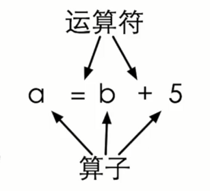
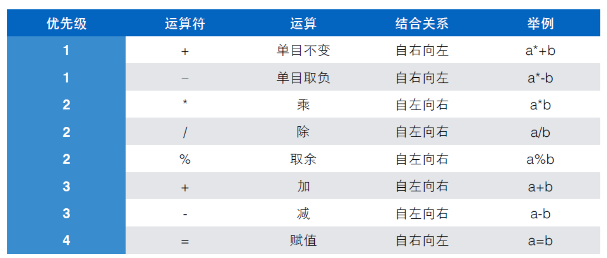
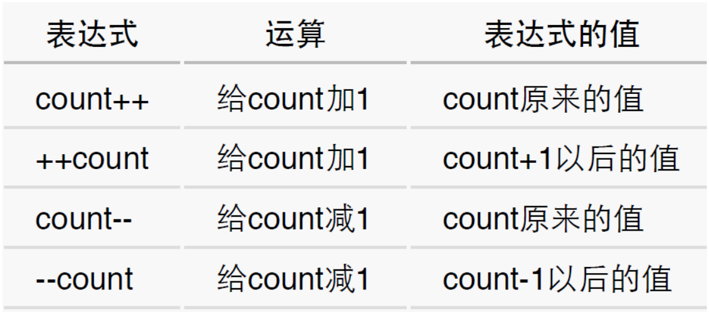

# 02 变量和表达式

## 2.1 变量

示例程序：

```c
# include <stdio.h>  // 包含标准库（输入库和输出库）的信息 

int main()
{
	int price = 0;               // 定义price变量，并初始化为0
	printf("请输入金额（元）:");
	scanf("%d", &price);
	int change = 100 - price;
	printf("找您%d元\n",change); 
    
	return 0;
}
/*
请输入金额（元）:30
找您70元

*/
```

完整程序见.[change.c](./change.c)

### 2.1.1 变量的定义

- 变量用于存储计算过程中的值。

- 变量定义的一般形式：

  **<类型名称><变量名称>**

  例： `int price`

  ​		`int amount`

  ​		`int price, amount`

- **变量名称**：是一种“标识符”。（标识符的构造规则：只能由字母、数字和下划线组成，且数字不能出现在第一个位置上，C语言的关键字也不能用做标识符）。

- **变量类型**：变量的数据类型（如int，float等），数据类型表示变量中可以存放什么样的数据，所有的变量必须有确定的数据类型。

### 2.1.2变量赋值与初始化

- `int price = 0`：定义一个变量，变量的名字是`price`，类型是`int`，初始值是0

- "**=**"是一个**赋值**运算符号，表示将右边的值赋给左边的变量。有运算符的式子就叫**表达式**。

  例 `price = 0`和`change = 100 - price`就是两个表达式

  

- **初始化**：所有的变量在第一次使用之前应该给赋值一次

  **<类型名称><变量名称> = <初始值>**

  例： `int amount  = 100`

  ​		`int price = 0, amount = 100`

### 2.1.3 变量输入

- `scanf("%d", &price);`：要求scanf函数读入下一个**整数**，读取结果赋值给price
- 输入在终端窗口中实现，以行为单位进行，行的结束标志就是你按下了回车键。

```c
# include <stdio.h>

main()
{
	int a;
	int b;
	
	printf("请输入两个整数：");
	scanf("%d %d", &a, &b);                 // 输入多个变量，中间用空格隔开输入即可 
	printf("%d + %d = %d\n", a, b, a+b);
	
	return 0;
} 

/*
请输入两个整数：22 33
22 + 33 = 55

*/ 
```

完整程序见：[plus.c](./plus.c)

### 2.1.4 常量VS变量

**常量**指固定不变的数，直接写在程序中的常量，称为直接量(literal)，如示例程序中`int change = 100 - price`中的`100`就是直接量。

更好的方式是定义一个常量：

​	`const int AMOUNT = 100`

​	`const`是一个修饰符，加载`int`的前面，用来给这个变量加上一个const（不变的属性）。这个const的属性一旦初始化，就不能再次修改。

### 2.1.5 浮点数

**浮点数**表示带小数点的数值。

C语言中`double`表示双精度浮点数，`float`表示单精度浮点数

```c
#include <stdio.h>
int main()
{
	printf("请分别输入身高的英尺和英寸，"
		"如输入\"5 7\"表示5英尺7英寸：");
	double foot;
	double inch;
	scanf("%lf %lf", &foot, &inch);   // %lf 表示输入浮点数 

	printf("身高是%f米。\n",          // %f 表示按照浮点数打印 
		((foot + inch / 12) * 0.3048));

	return 0;
}
/*
请分别输入身高的英尺和英寸，如输入"5 7"表示5英尺7英寸：5 7
身高是1.701800米。

*/ 
```

完整代码见：[height.c](./height.c)

## 2.2 表达式

### 2.2.1 表达式

一个**表达式**是一系列运算符和算子的组合，用来计算一个值。

- **运算符(operator)**：指进行运算的动作，如"+","-"
- **算子(operand)**：指参与运算的值，这个值可能是常数、变量、方法的返回值。



| 四则运算 | C 符号 | 意    义 |
| :------: | :----: | :------: |
|    +     |   +    |    加    |
|    -     |   -    |    减    |
|    x     |   *    |    乘    |
|    ÷     |   /    |    除    |
|          |   %    |   取余   |
|    ()    |   ()   |   括号   |


示例：

（1）计算时间差

输入两个时间，每个时间分别输入小时和分钟的值，然后输出两个时间之间的差，也以几小时几分表示。

分析：如果直接分别减小时和分钟，会出现错位情况，如1点40分和2点10分的差直接减，会出现负数。所以我们把时间都转换成分钟为单位，然后再计算。

```c
#include <stdio.h>

int main()
{
	int hour1, minute1;
	int hour2, minute2;

	scanf("%d %d", &hour1, &minute1);
	scanf("%d %d", &hour2, &minute2);

	int t1 = hour1 * 60 + minute1;
	int t2 = hour2 * 60 + minute2;

	int t = t2-t1;

	printf("时间差是%d小时%d分。", t/60, t%60);
	
	return 0;
}
/*
1 40
2 10
时间差是0小时30分。
*/
```

完整代码见：[interval.c](./interval.c)

### 2.2.2 运算符优先级

对表达式 `double c = (a+b)/2.0;`，其中加法的优先级比除法低，所以加入了括号。

运算符的优先级：



- 赋值运算符也是运算，也有结果

  如 a = b = 6  ------即 a = (b =6)

  一般不要嵌入式赋值，不利于阅读，也容易产生错误。

### 2.2.3 交换变量

问题：

```c
int a = 6;
int b = 5;
```

​			如何交换a、b两个变量的值？

分析：

​		程序表达的是顺序执行的动作，而不是关系，如果直接使用下面的代码：

```c
a = b;
b = a;
```

​	结果将是a和b都得到b原来的值，正确的做法是再引入一个变量t，来保存a的值

```c
int t = a;
a = b;
b = t;
```

完整实现代码：[swap.c](./swap.c)

```c
int main()
{
	// 交换a、b两个变量的值
	int a = 5;
	int b = 6;
	printf("a = %d, b = %d\n", a, b);
	int t;
	t = a;
	a = b;
	b = t;
	printf("a = %d, b = %d", a, b);
}
/*
a = 5, b = 6
a = 6, b = 5
*/
```

### 2.2.4 复合赋值

5个算术运算符("+-*/%")可以和赋值运算符("=")结合起来，形成复合赋值运算符："+=", "-=", "**=", "/=", "%="

如：

​	`total +=5;  //等价于 total = total + 5`

​	`total *= sum +12;  //等价于 total = total * (sum +12)`

注意两个运算符中间不要有空格。

**递增递减运算符**：`++`, `--` (可以放变量前面，叫做前缀形式；也可以放变量后面，叫后缀形式)




----

## 参考资料

1. 翁恺讲义：[变量.pdf](./变量.pdf)
2. 翁恺讲义：[表达式.pdf](./表达式.pdf)

