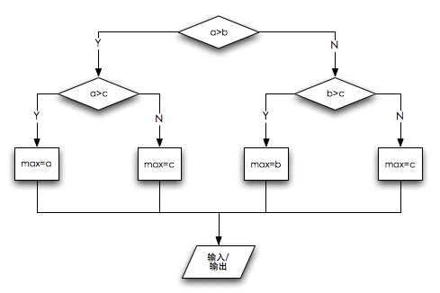
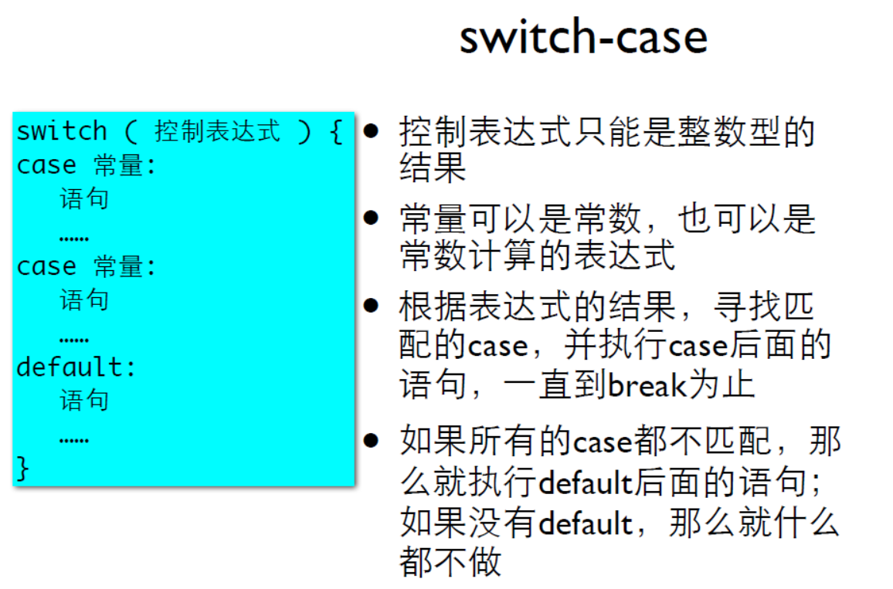
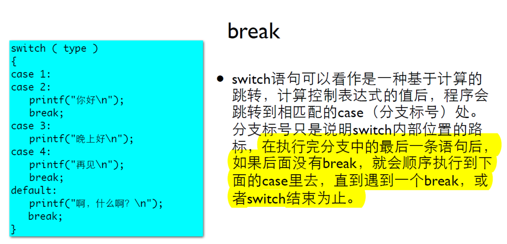

# 03 判断和分支结构

## 3.1 判断

### 3.1.1 做判断

`if (条件成立) {...}`

```c
int main()
{
	int hour1, minute1;
	int hour2, minute2;
	scanf("%d %d", &hour1, &minute1);
	scanf("%d %d", &hour2, &minute2);
	int ih = hour2 - hour1;
	int im = minute2 - minute1;
    
	if ( im <0 ) 		// 判断如果(im小于0)，那么... 
	{				
		im = 60 + im;
		ih --;
	}	
	printf("时间差是%d小时%d分。\n", ih, im);
	
	return 0;
}
/*
10 40
11 20
时间差是0小时40分。

*/
```

完整代码见：[interval2.c](./interval2.c)

### 3.1.2  判断的条件

计算两个值之间的关系，叫做**关系运算**。

| 运算符 |    意义    |
| :----: | :--------: |
|   ==   |    相等    |
|   !=   |   不相等   |
|   >    |    大于    |
|   >=   | 大于或等于 |
|   <    |    小于    |
|   <=   | 小于或等于 |

当两个值的关系符符合关系运算符的预期时，关系运算的结果为整数1，不符合时为整数0

**优先级**：**算术运算符 > 关系运算符 > 赋值运算**

​			   **判断是否相等的"=="和"!="比其他关系运算符优先级低**

​			   **连续的关系运算符是从左到右进行的**

所以，对 "7>=3+4"，"+"的优先级高于">="，先做加法，然后判断，结果为1.

```c
int main()
{
	int a = 5;
	int r;
	printf("7>=3+4:  %d\n", 7>=3+4);
	printf("r=a>0:  %d\n",r=a>0);
	printf("5>3==6>4:  %d\n", 5>3==6>4);
	printf("6>5>4:  %d\n", 6>5>4);
	
	return 0;
} 
/*
7>=3+4:  1
r=a>0:  1
5>3==6>4:  1
6>5>4:  0

*/ 
```

完整代码见:[test_03.c](./test_03.c)

### 3.1.3 否则else

- `if (条件成立) {...}  else (条件不成立) {...}`

```c
int main()
{
	//	初始化
	int price = 0;
	int bill = 0;
	//	读入金额和票面
	printf("请输入金额：");
	scanf("%d", &price);
	printf("请输入票面：");
	scanf("%d", &bill);
	//	计算找零
	if ( bill >= price ) 
    {
		printf("应该找您：%d\n", bill - price);
	} 
    else 
    {
		printf("你的钱不够\n");
	}

	return 0;
}
/*
请输入金额：56
请输入票面：70
应该找您：14

*/
```

完整代码见：[change5.c](./change5.c)

**C语言中的注释方法**：

- 单行注释：  `//注释内容`
- 多行注释：  `/*多行注释内容*/`

## 3.2 分支

### 3.2.1 嵌套的if-else

问题：要求输入三个整数，输出其中最大的那个。

分析：解决流程如下



```c
int main()
{
	int a,b,c;
	scanf("%d %d %d", &a, &b, &c);

	int max = 0;

	if ( a>b ) {
		if ( a>c ) {
			max = a;
		} else {
			max = c;
		}
	} else
	 {
		if ( b>c ) {
			max = b;
		} else {
			max = c;
		}
	}
	printf("The max is %d\n", max);
}

/*
3 4 5
The max is 5

*/
```

完整代码见:[max3.c](./max3.c)

**嵌套的if语句**：当if的条件满足或不满足的时候要执行的语句也可以是一条if或if-else语句。

```c
if 条件
	{
	if 条件2      // 嵌套的if语句
		{...}
	else
    	{...}
	}
else 
	{
	if 条件3     // 嵌套的if语句
		{...}
	else
    	{...}
	}
```

**Tips:在if或else后总是使用{}，以防if-else配对出错，即便执行语句就一句也加上{}**

### 3.2.2 联级的if-else if

```c
// 联级的if-else if
if (exp1)
    st1;
else if (exp2)
    st2;
else
    st3;
```

问题：实现分段函数f(x) 的计算:
$$
f(x)
\begin{cases}
-1  & x<0       \\
0   & x==0      \\
2*x  & 0<x<5	\\
3*x  & x>5
\end{cases}
$$


```c
	int x;

	scanf("%d", &x);

	int f=0;
	if ( x < 0 ) {
		f = -1;
	} else if ( x == 0 ) {
		f = 0;
	} else if ( x >5 ) {
		f = 2 * x;
	} else {
		f = 3*x;
	}

	printf("%d\n", f);
```

完整代码见：[func.c](./func.c)

### 3.2.3 if-else的常见错误

- 忘记大括号{}
- if后面的分号
- 错误使用==和=
- 使人困惑的else（为了避免使人困惑的else，在if和else后必须加上大括号形成语句块，大括号内的语句缩进一个tab的位置。）

### 3.2.4  多路分支(switch-case)





```c
int main()
{
	printf("输入成绩（0-100）");
	int grade;
	scanf("%d", &grade);
	grade /=10;
	switch ( grade ) {
	case 10:
	case 9:
		printf("A\n");
		break;
	case 8:
		printf("B\n");
		break;
	case 7:
		printf("C\n");
		break;
	case 6:
		printf("D\n");
		break;
	default:
		printf("F\n");
		break;
	}

	return 0;
}
/*
输入成绩（0-100）77
C

*/
```

完整代码见：[grade.c](./grade.c)

同时，还有一个完成输入月份数字就打印出英文月份单词的程序见；[month.c](./month.c)

----

### 参考资料

1. 翁恺讲义：[判断.pdf](./判断.pdf)
2. 翁恺讲义：[分支.pdf](./分支.pdf)