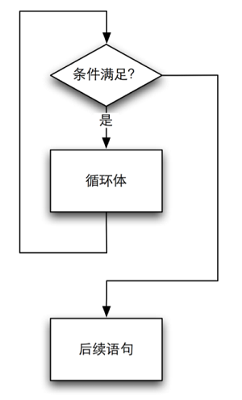
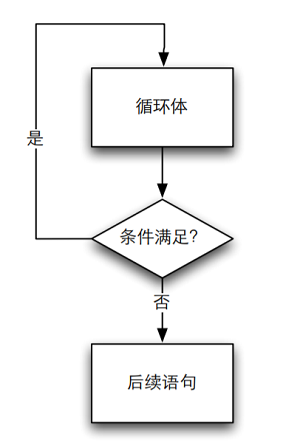
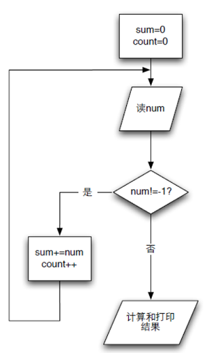

# 04 循环

问题：读入一个正整数，然后输出这个整数的位数。

思路：对输入的数，不断的除以10，去掉最右边的数，直到不能除位置，除的次数就是这个数的位数。

**方法一：不用循环写**

```c
int main()
{

	int x;
	int n=0;
	
	scanf("%d", &x);
	
	n++;
	x /= 10;
	if (x>0)
	{
		n++;
		x /= 10;
		if (x>0)
		{
			n++;
			x /= 10;
			if ...     // 持续进行除以10
		}         
	} 
	printf("%d\n",n);
}
```

完整代码见：[01_digit_capacity.c](./01_digit_capacity.c)

**方法二：用循环实现**

```c
int main()
{
	int x;
	int n=0;	
	scanf("%d", &x);	
	n++;
	x /= 10;
	while (x>0)
	{
		n++;
		x /= 10;
	}       
	
	printf("%d\n",n);
}
```

完整代码见：[02_digit_capacity.c](./02_digit_capacity.c)

## 4.1 while循环



- **循环体内要有改变条件的机会**，不然成死循环。
- 循环执行之前判断是否继续循环，所以**有可能循环一次也没有被执行**。
- 条件成立是循环继续的条件。

```c
while (x>0)
	{
		n++;
		x /= 10;
	}     
```

## 4.2 do-while循环



- 在进入循环的时候不做检查，而是**在执行完一轮循环体的代码之后**，再来检查循环的条件是否满足，因此， 无论如何，**do-while循环都会至少执行**。

```c
	int x;
	int n=0;
	scanf("%d", &x);
	n++;
	x /= 10;
	do 
	{
		n++;
		x /= 10;
	}while (x>0);    // 注意while后需要加分号，表示语句结束       
	
	printf("%d\n",n);
```

## 4.3 循环应用

### 4.3.1 log_2 x计算

```c
int main()
{
	int x;
	int ret = 0;

	scanf("%d", &x);
	int t = x;
	while ( x > 1 ) {
		x /= 2;
		ret ++;
	}
	printf("log2 of %d is %d.", t, ret);

	return 0;
}

/*
128
log2 of 128 is 7.
*/
```

完整代码见：[04_log2x.c](./04_log2x.c)

### 4.3.2 猜数游戏

让计算机随机取一个整数（100以内），然后让用户来猜，用户每输入一个数，就告诉用户大了还是小了，直到用户猜中为止，最后还要告诉用户它猜了多少次。

首先来实现**随机取一个100以内的整数**的程序：

```c
int main()
{
	srand(time(0));
	int a = rand();                  // 随机取一个数 
	printf("a = %d\n", a);
	printf("a%100 = %d\n", a%100);   // 取的随机数对100取余，获得100以内的整数 

	return 0;
}

/*
a = 18253
a = 53
*/
```

完整代码见：[05_rand.c](./05_rand.c)

**猜数游戏**代码：

```c
int main()
{
	int number = rand()%100+1;
	int count = 0;
	int a = 0;
	printf("我已经想好了一个1到100之间的数。");
	do {
		printf("请猜这个1到100之间数：");
		scanf("%d", &a);
		if ( a > number ) {
			printf("你猜的数大了。");
		} else if ( a < number ) {
			printf("你猜的数小了。");
		}
		count ++;
	} while (a != number);
	printf("太好了，你用了%d次就猜到了答案。\n", count);

	return 0;
}

/*
我已经想好了一个1到100之间的数。请猜这个1到100之间数：77
你猜的数大了。请猜这个1到100之间数：44
你猜的数大了。请猜这个1到100之间数：22
你猜的数小了。请猜这个1到100之间数：33
你猜的数小了。请猜这个1到100之间数：37
你猜的数小了。请猜这个1到100之间数：40
你猜的数小了。请猜这个1到100之间数：42
太好了，你用了7次就猜到了答案。
*/
```

### 4.3.3 算平均数

让用户输入一系列的正整数，最后输入"-1"表示输入结束，然后程序计算出这些数字的平均数，输出输入数字的个数和平均数。



```c
int main()
{
	int sum = 0;
	int count = 0;
	int number;

	scanf("%d", &number);
	while ( number != -1 ) {
		sum += number;
		count ++;
		scanf("%d", &number);
	}

	double dsum = sum;   // 设置double类型使计算结果保留小数 
	printf("The average is %f.\n", dsum / count);

	return 0;
}
/*
23 24 25 26 27 -1
The average is 25.000000.
*/

```

### 4.3.4 数的分解和逆序

输入一个正整数，输出逆序的数。

分析：整数的逆序涉及到整数的分解：

- (1) 对一个整数做%10的操作，就得到它的个位数；
- (2) 对一个整数做/10的操作，就去掉它的个位数；
- (3) 在对(2)的结果做%10，就得到原来数的十位数了；
- (4) 以此类推

```c
int main()
{
	int x;
	scanf("%d", &x);
	int digit;
	int ret = 0;

	while ( x> 0 ) {
		digit = x%10;
		ret = ret*10 + digit;
		// 打印各个循环的结果 
		printf("x=%d,digit=%d,ret=%d\n", x, digit, ret);  
		x /= 10;
	}
	printf("%d", ret);
	
	return 0;
}
/*
1234
x=1234,digit=4,ret=4
x=123,digit=3,ret=43
x=12,digit=2,ret=432
x=1,digit=1,ret=4321
4321
*/
```

完整代码见：[08_reverse.c](./08_reverse.c)


----

### 参考资料

1. 翁恺讲义：[循环.pdf](./循环.pdf)
2. 翁恺讲义：[循环应用.pdf](./循环应用.pdf)