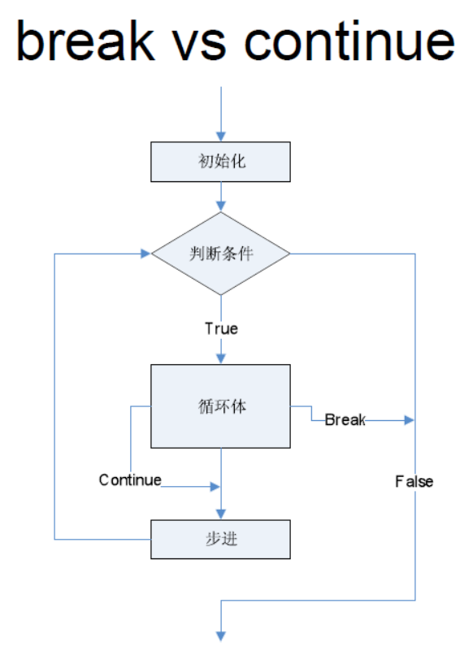
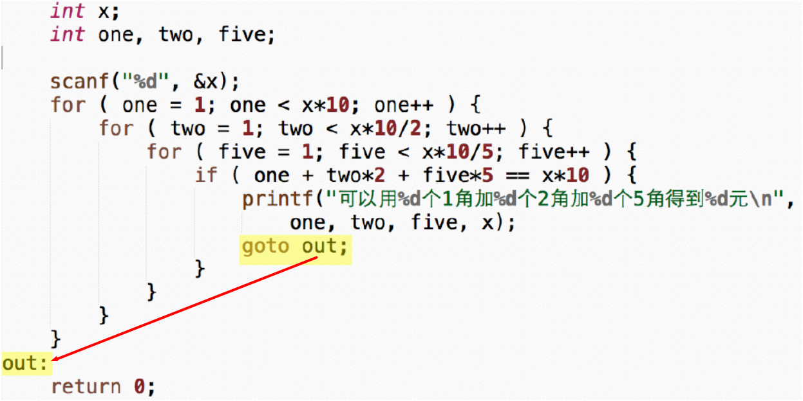
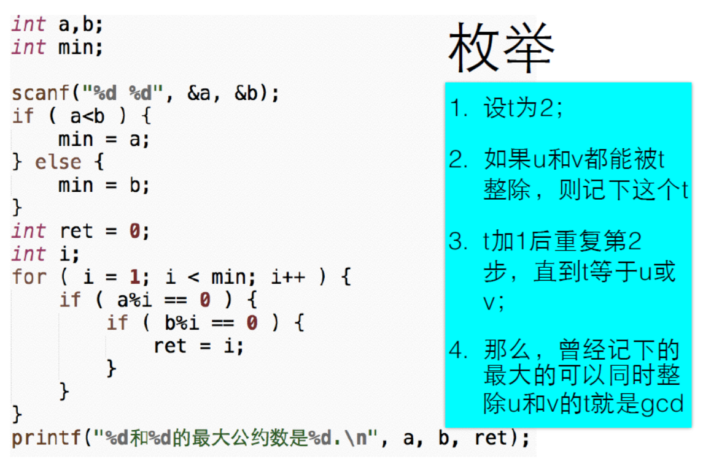

# 05 for循环和循环控制

## 5.1 for循环

**for(初始动作;条件;每轮的动作)  {循环体}**

for循环像一个计数循环：设定一个计数器，初始化它，然后在计数器到达某值之前，重复执行循环体，而每执行一轮循环，计数器值会以一定步进行调整（如加1或减1）。

如：`for(count=10;count>0;count--)`

上述代码可以读成：对于一开始的count=10，当count>0时，重复做循环体，每一轮循环在做完循环体内语句后，使得count--

问题：写一个程序，让用户输入n，然后计算输出n!

```c
int main()
{
	int n;
	scanf("%d",&n);
	int fact = 1;
	
	int i = 1;
	for (i=1; i<=n; i++){
		fact *=i;
	}
	printf("%d! = %d\n",n,fact);
}

/*
5
5! = 120
*/ 
```

完整代码见：[01_n!.c](./01_n!.c)

**三种循环的选择：while, do while, for**

- 如果有固定次数，用for
- 如果必须执行一次，用do while
- 其他情况用while

## 5.2 循环控制

### 5.2.1 for和continue

- **break**：跳出循环
- **continue**：跳过循环的这一轮剩下的语句进入下一轮



问题：输入一个正整数，判断它是否是素数（素数表示只能被1和自身整除的数）。

```c
int main()
{
	int x;
	scanf("%d", &x);
	
	int i;
	int isPrime = 1;  // isPrime=1,初始化为素数  
	for(i=2;i<x;i++){
		if (x%i == 0){
			isPrime = 0;  // 当x可以被i整除时，isPrime=0,表示不是素数 
			break;
		}
	}
	
	if (isPrime == 1){
		printf("%d是素数\n",x);
	} 
	else {
		printf("%d不是素数\n",x);
	}
	return 0; 
} 

/*
14
14不是素数
13
13是素数
*/
```

（代码详见：[02_prime_number.c](./02_prime_number.c)）

### 5.2.1 嵌套的循环

问题：写程序输出前50个素数

```c
// 打印输出前50个素数 
int main()
{
	int x =1;
	int cnt = 0;
	while (cnt < 50){
		int isPrime = 1;  // isPrime=1,初始化为素数
		int i;  
		for(i=2;i<x;i++){
			
			if (x%i == 0){
				isPrime = 0;  // 当x可以被i整除时，isPrime=0,表示不是素数 
				break;
			}
		}
		
		if (isPrime == 1){
			printf("%d\t",x);
			cnt ++;
					// 每五个换行
			if (cnt%5 == 0){
				printf("\n");
			}
		} 
		x++;		
	}
	return 0; 
} 
/*
1       2       3       5       7
11      13      17      19      23
29      31      37      41      43
47      53      59      61      67
71      73      79      83      89
97      101     103     107     109
113     127     131     137     139
149     151     157     163     167
173     179     181     191     193
197     199     211     223     227
*/
```

（详细代码见：[03_50_prime_number .c](,.03_50_prime_number .c)）

### 5.2.3 离开多重循环

- break和continue只能对它所在的那层循环实现功能
- goto 语句是一种无条件流程跳转语句，通常 goto 语句与 if 语句结合使用，当满足一定条件时，程序流程跳转到指定标号处，接着往下执行。（一般不使用goto语句）



## 5.3 循环应用实例

### 5.3.1 前n项求和

问题一：输入n，求前n项和：
$$
f(n)=1 + \frac 12 + \frac 13 + ... + \frac 1n
$$

```c
int main()
{
	int n;
	int i;
	double sum=0.0;

	scanf("%d", &n);
	for ( i=1; i<=n; i++ ) {
		sum += 1.0/i;
	}
	printf("f(%d) = %f\n", n, sum);

	return 0;
}
```

(项目代码见：[04_sum.c](./04_sum.c))

问题二：输入n，求前n项和：
$$
f(n)=1 - \frac 12 + \frac 13 - \frac 14+ ... + \frac 1n
$$

```c
int main()
{
	int n;
	int i;
	double sum=0.0;
	int sign = 1;

	scanf("%d", &n);
	for ( i=1; i<=n; i++ ) {
		sum += 1.0*sign/i;
		sign = -sign;
	}
	printf("f(%d) = %f\n", n, sum);

	return 0;
}

/*
10
f(10) = 0.645635
*/
```

(详细代码见：[05_sum&subtract.c](./05_sum&subtract.c))

### 5.3.2 整数分解

问题：输入一个正整数，正序输入它的每一位数字。如输入"12345"，输出"1 2 3 4 5"

```c
int main()
{
	int x;
	scanf("%d", &x);

	int mask = 1;
	int t = x;
	while ( t>9 ) {
		t /= 10;
		mask *=10;
	} 
	printf("x=%d, mask=%d\n", x, mask);
	do {
		int d = x / mask;
		printf("%d", d);
		// 用判断来实现除最后一位数外其他数字间加空格 
		if ( mask >9 ) {
			printf(" ");
		}
		x %= mask;
		mask /= 10;
	} while ( mask > 0 );
	printf("\n");

	return 0;
}
/*
12342
x=12342, mask=10000
1 2 3 4 2
*/
```

(详细代码见：[06_seperate.c](./06_seperate.c))

### 5.3.3 求最大公约数

问题：输入两个正整数a和b，输入它们的最大公约数

**方法一：枚举**



**方法二：辗转相除法**

1. 如果b等于0，计算结束，a就是最大公约数；
2. 否则，计算a除以b的余数，让a等于b，而b等于那个余数；
3. 回到第一步

| a             | b    | t(余数) |
| ------------- | ---- | ------- |
| 12            | 18   | 12      |
| 18            | 12   | 6       |
| 12            | 6    | 0       |
| 6(最大公约数) | 0    |         |

```c
int main()
{
	int a,b;
	int t;
	
	scanf("%d %d", &a, &b);
	int origa = a;
	int origb = b;
	while ( b != 0 ) {
		t = a%b;
		a = b;
		b = t;
		printf("a=%d, b=%d, t=%d\n", a, b, t);
	}
	printf("%d和%d的最大公约数是%d.\n", origa, origb, a);
	
	return 0;
}
/*
12
18
a=18, b=12, t=12
a=12, b=6, t=6
a=6, b=0, t=0
12和18的最大公约数是6.
*/
```

(详细代码见：[07_gcd.c](./07_gcd.c))

----

### 参考资料

1. 翁恺讲义：[第三种循环.pdf](./第三种循环.pdf)
2. 翁恺讲义：[循环控制.pdf](./翁恺讲义)
3. 翁恺讲义：[循环应用.pdf](./循环应用.pdf)