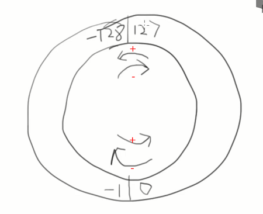
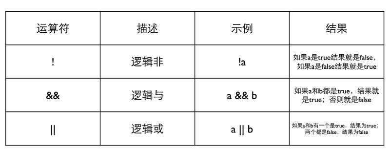
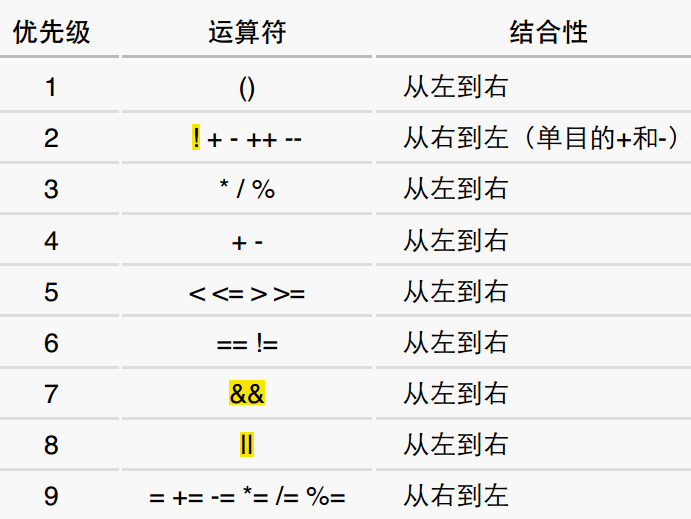

# 06 数据类型

C语言的变量，必须在使用前定义，并且确定类型。

C以后的语言向两个方向发展：

- C++、Java更强调类型，对类型的检查更严格
- JavaScript、python、PHP不看重类型，甚至不需要事先定义

C语言的类型：

1. **整数**：char, short, int, long, <u>long long (C99类型)</u>
2. **浮点数**：float, double, <u>long double (C99类型)</u>
3. **逻辑**：<u>bool (C99类型)</u>
4. **指针**
5. **自定义类型**

C语言类型有何不同：

- 类型名称：int, long, double
- 输入输出时的格式化：%d, %ld, %lf
- 所表达的数的范围：char < short < int < float < double
- 内存中所占据的大小：1字节到16字节
- 内存中的表达形式：二进制数（补码），编码

**sizeof**是一个运算符，给出某个类型或变量在内存中所占据的字节数。如`sizeof(int)`, `sizeof(i)`

- sizeof是静态云算法，它的结果再编译时刻就决定了
- 不要在sizeof的括号中做运算，这些运算是无效的。如`sizeof(i++)`

## 6.1 整数

### 6.1.1 整数

- char：一字节（8比特）
- short：2字节
- int：取决于编译器（CPU），通常意义是“一个字”
- long：取决于编译器（CPU），通常意义是“一个字”
- long long：8字节

用程序打印一下各个整数类型的字节数：

```c
int main()
{
	printf("char=%d\n",sizeof(char));
	printf("short=%d\n",sizeof(short));	
	printf("int=%d\n",sizeof(int));
	printf("long=%d\n",sizeof(long));
	printf("long long=%d",sizeof(long long));  
	return 0;
}

/*
char=1
short=2
int=4
long=4
long long=8
*/
```

(详细代码见：[01_si：zeof_int.c](./01_sizeof_int.c))

### 6.1.2 补码

- 计算机内部一切都是二进制。

  eg.  18: 00010010

  ​        0 : 000000000

  ​        -18 ?

- 如何表示二进制负数？

  一个字节可以表达的数为：0000 0000-1111 1111（0-225）

  表示负数有三种方案：

  1. 仿照十进制，有一个特殊的标志表示负数
  2. 取中间的数为0，如1000000表示0，比它小的是负数，比它大的是正数
  3. **补码**

- **补码**

```
以-1为例，我们希望"-1+1=0"，如何能做到？
	0: 0000 0000
	1: 0000 0001
	而 1111 1111 + 0000 0001 = 1 0000 0000，其中"1 0000 0000"，当如果这个数是1个字节（8比特），前面的1会被丢弃，"1 0000 0000"表示0 。

因为"0-1=-1"，所以 
	-1 = (1) 0000 0000 - 0000 0001 = 1111 1111
	所以， "1111 1111" 被当做纯二进制看待时是"255"，被当做补码看待时是"-1"
		  同理，对于"-a", 其补码就是"0-a"，实际上是"2^n-a"，n是这种类型的位数。
```

注：**对于"-a", 其补码就是"0-a"，实际上是"2^n-a"，n是这种类型的位数**

​       **补码的意思就是拿补码和源码可以加出一个溢出的"零"**

### 6.1.3 数的范围

对于一个字节（8位，char类），可以表达的数的范围是：

​	0000 0000 ~ 1111 1111

其中，

|      二进制看待       | 整数(补码) |
| :-------------------: | :--------: |
|       0000 0000       |     0      |
| 1111 1111 ~ 1000 0000 | -1 ~ -128  |
| 0000 0001 ~ 0111 1111 |  1 ~ 127   |

实例：

```c
# include <stdio.h>

int main()
{
	char c = 255; // 1111 1111
	char d = 3; // 0000 0011
	int i = 255; // 00000000 00000000 00000000 11111111
	printf("c=%d, d=%d, i=%d\n",c,d,i);
} 
// c=-1, d=3, i=255 
```

(详细代码见:[02_char.c](./02_char.c))

- **整数的范围**：
  - char: 1字节    (-128 ~ 127)
  - short: 2字节  (-32768 ~ 32757)
  - int: 通常一个字，4字节
  - long: 4字节
  - long long: 8字节

- **unsigned 无符号的** 

  在整形类型前加上unsigned使得它们成为无符号的整数。

  ```c
  int main()
  {
  	char c = 255; // 1111 1111
  	unsigned char d = 255; // 1111 1111
  
  	printf("char c=%d, unsigned char d=%d \n",c,d);
  } 
  // char c=-1, unsigned char d=255
  ```

  (详细代码见:[03_unsigned_char.c](./03_unsigned_char.c))

  - 如果在一个字面量常数想要表达自己是unsigned，可以再后面加上u或U
  - unsigned的初衷并非为了扩展数能表达的范围，而是为了做纯二进制运算，主要是为了异味


- **整数越界**

  **整数是以纯二进制方式进行计算的**

  所以，对char类型，有：

  ​	1111 1111 + 1 = 1 0000 0000 = 0

  ​	0111 1111 (127) + 1 = 1 0000 0000 = -128

  ​	1 0000 0000 -1 = 01111 1111 = 127

  

### 6.1.4 整数的输入输出

- 整数的输入只有两种形式：int或 long long
  - %d: int
  - %u: unsigned
  - %ld: long long
  - %lu: unsigned long long 

### 6.1.5  8进制和16进制

- 一个以0 (零)开始的数字字面量是8进制
- 一个以0x (零+小写x)开始的数字字面量是16进制
- %o用于8进制的输入输出，%x用于16进制输入输出

```c
int main()
{
	char c = 012;
	int i = 0x12;
	printf("c=0%o, c=%d, i=0x%x, i=%d\n", c, c, i, i);
} 
// c=012, c=10, i=0x12, i=18
```

(详细代码见：[04_8&16.c](./04_8&16.c))

- 16进制很适合表达二进制数据，因为4位二进制正好是一个16进制位

### 6.1.6 选择整数类型

- 为什么整数要有那么多种？

  为了准确表达内存，做底层程序的需要 (硬件)。

- **没有特殊需要，就选择int**
  1. 现代的CPU的字长普遍是32位或64位，一次内存读写就是一个int，一次计算也是一个int，选择更短的类型不会更快，甚至可能更慢。
  2. 现代的编译器一般会设计内存对齐，所以更短的类型实际在内存中有可能也占据一个int的大小。
- unsigned与否只是输出的不同，内部计算是一样的。

## 6.2 浮点数

​	**浮点类型**

|  类型  | 字长 |                       范围                       | 有效数字 | scanf | printf |
| :----: | :--: | :----------------------------------------------: | :------: | :---: | :----: |
| float  |  32  | $±(1.20*10^{-38} \sim 3.40*10^{38}), 0,±inf,nan$ |    7     |  %f   | %f, %e |
| double |  64  | $±(2.20*10^{-308} \sim 1.79*10^{308}), ±inf,nan$ |    15    |  %lf  | %f, %e |

注：

1. printf输出"±inf"表示超过范围的浮点数(正负无穷)，printf输出"nan"表示"不存在的浮点数"
2. %e输出科学计数法表示的结果
3. **在%和f之间加上".n"可以指定输出小数点之后几位，结果为四舍五入**

```c
int main()
{
	printf("%.3f\n", -0.0049);   //保留3位小数 
	printf("%.30f\n", -0.0049);  //保留3位小数 
	printf("%.3f\n", -0.00049);  // 保留3位小数
	printf("%f\n", 12.0/0.0);   //无穷大 
	printf("%f\n", -12.0/0.0);   //负无穷大 
	printf("%f\n", 0.0/0.0);   //nan无意义	  
} 
/*
-0.005
-0.004899999999999999800000000000
-0.000
1.#INF00
-1.#INF00
-1.#IND00
*/
```

(详细代码见:[05_float&double.c](./05_float&double.c) )

### 6.2.1 浮点数的精度

- 带小数点的字面量是double而非float，所以float需要用f或F后缀来表面身份

```c
int main()
{
	float a, b, c;
	a = 1.345f;
	b = 1.123f;
	c = a + b;
	if (c==2.468)
		printf("相等\n");
	else 
		printf("不相等！a = %.10f, b = %.10f, c = %.10f\n", a, b, c);
		 
	if (fabs(c-2.468)<1e-3)
		printf("判断条件为fabs(c-2.468)<1e-3时，c与2.468相等\n");
} 
/*
不相等！a = 1.3450000286, b = 1.1230000257, c = 2.4679999352
判断条件为fabs(c-2.468)<1e-3时，c与2.468相等
*/
```

(详细代码见: [06_float_precision.c](./06_float_precision.c))

有上面代码可知，对于浮点数，使用`f1 == f2`可能失败，正确判断相等的做法是`fabs(f1-f2)<1e-3`(fabs表示取绝对值，"1e-3"是需要表达浮点数的精度)

## 6.3 字符类型char

- **char**是一种**整数**，也是一种特殊的类型：**字符**

  - 用单引号表示的字符，如'a', '1'。printf和scanf里用**%c**来输入输出字符。

    ```c
    int main()
    {
    	char c,d;
    	c = 1;
    	d = '1';
    	printf("c = %d	d = %d", c, d);  // 字符'1'的ASCII码49 
    } 
     // c = 1   d = 49
    ```

    (详细代码见: [07_char.c](./07_char.c))

    **字符'1'的ASCII码49**

- 例：如何输入'1'这个字符给 char c?

  ```c
  char c;
  // 方法一
  scanf("%c", &c);  //然后输入1
  // 方法二
  int i;
  scanf("%d", &i); // 然后输出字符'1'对应的ASCII码49
  c=i;      // 然后把'1'赋值给char c    
  ```

  - 字符计算

常用ASCII码表

| ASCII值 | 字符 | ASCII值 | 字符 |
| :-----: | :--: | :-----: | :--: |
|   000   | NUL  |   065   |  A   |
|   048   |  0   |   ...   | ...  |
|   049   |  1   |   091   |  Z   |
|   ...   | ...  |   097   |  a   |
|   057   |  9   |   ...   | ...  |
|         |      |   122   |  z   |

```c
# include<stdio.h>

int main()
{
	//得到字符'A'后面的字符
	char c = 'A';
	c++;
	printf("字符'A'后面的字符：%c\n",c); 
	
	//两个字符相减，得到它们在表中的距离
	int i = 'Z'-'A';
	printf("字符'Z'和字符'A'在ASCII表中的距离：%d\n",i);  
	
	// 对任意表示字母的字符'd' ：
	//		(1) d + 'a'-'A' 可以把大写字母变成小写字母
	//		(2) d + 'A'-'a' 可以把小写字母变成大写字母
	char d = 'D';
	d = d + 'a' - 'A';
	printf("'D' + 'a'-'A'的结果为%c\n",d);	 
} 
/*
字符'A'后面的字符：B
字符'Z'和字符'A'在ASCII表中的距离：25
'D' + 'a'-'A'的结果为d
*/  
```

(详细代码见: [08_char_calculate.c](./08_char_calculate.c))

### 6.3.1 逃逸字符(转义字符)

- 用来表达无法印出来的控制字符或特殊字符
- 组成："\\"+"另一个字符"

| 字符 |      意义      | 字符 |    意义    |
| :--: | :------------: | :--: | :--------: |
| `\b` |    回退一格    | `\"` |   双引号   |
| `\t` | 到下一个表格位 | `\'` |   单引号   |
| `\n` |      换行      | `\\` | 反斜杠本身 |
| `\r` |      回车      |      |            |

## 6.4 类型转换

当运算符的两边出现不一致的类型时，会自动转换成较大的类型（大的类型能表达的数的范围更大）

- char → short → int → long → long long

- int → float → double

- 对于printf，任何小于int的类型会被转换成int；float会转换成double

- 但是scanf不会自动转换，要输入short，需要%hd

- **强制类型转换**：要把一个量强制转换成另一个类型（通常是较小的类型），用`(类型)值`方法实现。

  如，

  ```c
  (int)10.2   // 把10.2转换成int类型
  (short)32   // 把32转换成short类型
  // 注意小的变量不总能表达大的量
  (short)32768 //short能表达最大的值为32767，现在大了，结果变成"-32768"
  (char)32768  // 结果为0
  ```

  - 强制类型转换的优先级高于四则运算

    如，对 `int i = (int)a / b`要改成`int i = (int)(a / b)`

## 6.5 bool类型

- bool类型需要在头文件申明`#include <stdbool.h>`，之后可以使用bool, true, false

  ```c
  # include <stdio.h>
  # include <stdbool.h>
  int main()
  {
      bool b = 6>5;
      bool t = true;
      printf("%d\n",b); // 1
      return 0;
  }
  ```

## 6.6 逻辑运算

- 逻辑运算是对逻辑量进行的运算，结果只有0或1
- 逻辑量是关系运算或逻辑运算的结果



如，要表达"4 < x < 6"这样一个式子：`x > 4 && x < 6`

- **优先级**



- **短路：**逻辑运算是⾃左向右进⾏的，如果左边的结果已经能够决定结果了，就不会做右边的计算 

  对于&&，左边是false时就不做右边了 ；

  对于||，左边是true时就不做右边了 。

  **不要把赋值，包括复合赋值组合进表达式，避免短路造成错误**

  如，尽量不要写`a==6 && b==1 `这样的代码。

## 6.7 条件运算符

对于下面代码：

```c
if (count>20)
	{count = count-10;}
else
	{count = count+10;}
```

可以用条件运算符写成：

```c
count = (count>20) ? count-10 : count+10;
```

- 条件运算符的优先级高于赋值运算符，但是低于其他运算符。

  **不要使用嵌套的条件表达式，容易理解错误**

  如，不要写这样的代码：`w < x ? x + w : x < y ? x : y `

## 6.8 逗号运算符

- 逗号⽤来连接两个表达式，并**以其右边的表达式的值作为它的结果**。

  ```c
  int i;
  i = (3+4,5+6);   //i的结果是11
  ```

  

- 逗号的优先级是所有的运算符中**最低的**，所以它两边的表达式会先计算；

- 逗号的组合关系是⾃左向右，所以左边的表达式会先计算，⽽右边的表达式的值就留下来作为逗号运算的结果。
- 在for中使⽤ ，实现多个计算：`for ( i=0, j=10; i<j; i++, j- - )  `


----

### 参考资料

1. 翁恺讲义：[数据类型.pdf](./数据类型.pdf)
2. 翁恺讲义：[有些运算.pdf](./有些运算.pdf)
3. [C语言程序设计_第一单元测验.pdf](./C语言程序设计_第一单元测验.pdf)