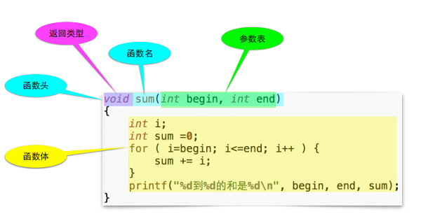
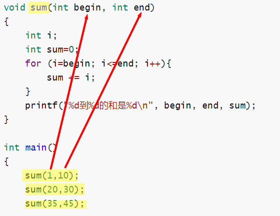

# 07 函数

- 函数是⼀块代码，接收零个或多个参数，做⼀件事情，并返回零个或⼀个值 。
- 可以先想像成数学中的函数： y = f(x) 

例1：求1~10、20~30和35~45的三个和

1. 方法一：不用函数

   ```c
   int main()
   {
   	int i;
   	int sum;
   	
   	for (i=1,sum=0;i<=10;i++){
   		sum +=i;
   	}
   	printf("%d到%d的和是%d\n", 1, 10, sum);
   	
   	for (i=10,sum=0;i<=30;i++){
   		sum +=i;
   	}
   	printf("%d到%d的和是%d\n", 10, 30, sum);
   	
   	for (i=35,sum=0;i<=45;i++){
   		sum +=i;
   	}
   	printf("%d到%d的和是%d\n", 35, 45, sum);
   	
   	return 0;
   } 
   ```

   (详细代码见: [01_sum_no_function.c](,.01_sum_no_function.c))

   可以看到上述代码中有三段几乎一模一样的代码，而**“代码复制”是程序质量不良的表现**。

2. 方法二：使用函数

   ```c
   // 计算从begin到end的和 
   void sum(int begin, int end)
   {
   	int i;
   	int sum=0;
   	for (i=begin; i<=end; i++){
   		sum += i;
   	}
   	printf("%d到%d的和是%d\n", begin, end, sum);
   }
   
   int main()
   {
   	sum(1,10);
   	sum(20,30);
   	sum(35,45);
   	
   	return 0;
   }
   /*
   1到10的和是55
   20到30的和是275
   35到45的和是440
   */
   ```

   (详细代码见: [02_sum_function.c](./02_sum_function.c))

## 7.1 函数定义与调用

- **函数定义**



- **函数调用：<u>函数名(参数值)</u> **

  1. "()"起到了表⽰函数调⽤的重要作⽤，即使没有参数也需要"()"

  2. 如果有参数，则需要给出正确的数量和顺序 ，这些值会被按照顺序依次⽤来初始化函数中的参数 

     

## 7.2 从函数中返回

- 从函数中返回值，使用**return停止函数**，并送回一个值。

  - return后面可以接表达式表示要返回值，也可以直接为空；

    ```c
    // 输出a和b中较大的值
    int max (int a, int b)
    {
        int ret;
        if (a>b){
            ret = a;
        }
        else{
            ret = b;
        }
        return ret;  //返回ret
    }
    ```

    

  - 一个函数中可以有多个return语句，执行到哪一个return语句，那个语句就起作用。

  

- **没有返回值的函数**：`void 函数名(参数表)`

  1. 不能使用带值的return (可以没有return)；

  2. 调用的时候不能做返回值的赋值 (因为没有返回值)。

     ```c
     // 计算从begin到end的和 
     void sum(int begin, int end)   //没有返回值的函数
     {
     	int i;
     	int sum=0;
     	for (i=begin; i<=end; i++){
     		sum += i;
     	}
     	printf("%d到%d的和是%d\n", begin, end, sum);
     }
     ```


## 7.3 函数原型

- **C的编译器自上而下顺序分析代码，所以函数间有先后关系，把要调用的函数写在上面才能直接调用成功。**

  如：

  ```c
  // 先定义sum函数
  void sum (int begin, int end)
  {
      ...
  }
  
  int main()
  {
      sum(1,10);  //后调用上面的sum函数
      ...
  }
  ```

- 当把要调用的函数放到下面时，需要对被调用函数做**申明**，即申明**函数原型**。

  1. 将函数头以分号";"结尾，放到主调用函数中或前，就构成**函数原型**；

  2. 函数原型的目的是告诉编译器函数的信息：名称、参数（数量及类型）、返回类型

  3. 原型中可以不写参数名称（类型一定要），但是一般要写上。如`vodi sum(int , int);`

     ```c
     
     void sum (int begin, int end);   //函数原型申明
     int main()
     {
         // void sum (int begin, int end); // 旧标准习惯也可以把函数原型卸载调用函数中
         sum(1,10);  //后调用下面的sum函数
         ...
     }
     
     // 定义sum函数
     void sum (int begin, int end)   // 实际的函数头
     {
         ...
     }
     ```

     

## 7.4 参数传递

- 如果函数有参数，调⽤函数时必须传递给它数量、**类型正确**的值 ；

- 可以传递给函数的值是表达式的结果，这包括： 

  1. 字⾯量 

  2. 变量

  3. 函数的返回值

  4. 计算的结果

     ```c
     double max(double a, double b);  // 函数原型申明
     int main()
     {
         int a, b, c;
         a = 5;
         b = 6;
         c = max(10, 12);
         c = max(c, 23);
         c= max(max(23,45), a);
         c= max(23+45, b);
     }
     ```

- **C语言在调用函数时，永远只能传值给函数。**

  比如对于下面的代码，可以实现交换a和b的值吗？

  答案是无法实现，因为`swap(a,b);  `实现的是将5和6的值传入swap函数，并不影响main函数本身a和b的值。

  ```c
  void swap(int a, int b);
  int main()
  {
  	int a = 5;
  	int b = 6;
  	swap(a,b);     
  	printf("a=%d  b=%d\n",a , b);  // 结果是：a=5  b=6 
  	return 0;
  }
  
  // 交换a和b 
  void swap(int a, int b)
  {
  	int t = a;
  	a = b;
  	b = t;
  }
  ```

  (详细代码见: [03_swap.c](./03_swap.c))

  1. 每个函数有⾃⼰的变量空间，参数也位于这个独⽴的空间中，和其他函数没有关系 ；
  2. 对于函数参数表中的参数，叫做“形式参数”，调⽤函数时给的值，叫做“实际参数”  (概念理解易混淆)；
  3. 我们理解**C语言在调用函数时，，实现的是参数和值的关系，传值给函数。**

## 7.5 本地变量

-  函数的每次运⾏，就产⽣了⼀个独⽴的变量空间，在这个空间中的变量，是函数的这次运⾏所独有的，称
  作**本地变量** 

  1. 定义在函数内部的变量就是本地变量 

  2. 参数也是本地变量 

- ⽣存期：什么时候这个变量开始出现了，到什么时候它消亡了 
- 作⽤域：在（代码的）什么范围内可以访问这个变量（这个变量可以起作⽤） 
- **对于本地变量，生存期和作用域都是在大括号内，这样一个大括号内的整体叫做块** 

## 7.6 函数其他细节

1.  **没有参数时**

   当函数没有参数时，可以

	1. `void fun(void);` 明确表示此函数没有参数` 
	
2. `void fun(); 表示fun函数的参数表未知，编译器可以通过。

2. **调⽤函数时的圆括号⾥的逗号是标点符号，不是运算符** 

   如：`f(a,b) `

3. **C语言不允许函数嵌套定义**
4. **int main()也是一个函数**
5. **return 0；**的意义：
   - Windows： if errorlevel 1 ...
   - Unix Bash： echo $? 
   - Csh： echo $status 

----

## 参考资料

1. 翁恺讲义：[函数的定义和使用.pdf](./函数的定义和使用.pdf)
2. 翁恺讲义：[参数与变量.pdf](./参数与变量.pdf)

