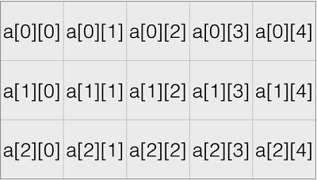

# 08 数组

## 8.1 数组的定义及使用

### 8.1.1 例：计算平均数

问题：写一个程序，计算用户输入的数的平均值，并输出所有大于平均数的数

分析：必须先记录每⼀个输⼊的数字，计算平均数之后，再检查记录下来的每⼀个数字，与平均数⽐较，决定是否输出 

```c
int main()
{
	int x;
	double sum = 0;
	int cnt = 0;
	int number[100];  // 定义数组
	scanf("%d",&x);
	// 当输入-1时，结束输入 
	while (x!=-1){
		number[cnt] = x; 
		sum += x;
		cnt++;
		scanf("%d", &x);
	}
	
	if (cnt>0){
		int i;
		double average = sum/cnt;
		printf("平均数是：%f\n，比平均值大的数有：\n",average);
		// 遍历数组，使用数组中的元素与平均数比较，输出大的数 
		for (i=0;i<cnt;i++){
			if (number[i] > average){
				printf("%d ",number[i]);    
			}
		}
	} 
}
/*
2 4 5 7 8 -1
平均数是：5.200000
，比平均值大的数有：
7 8
*/
```

(详细代码见: [01_exchange.c](./01_exchange.c))

这个代码存在安全隐患：定义的数组number[100]，只能接受100个数，超过程序就错误。


### 8.1.2  数组的定义及使用

- **定义数组**：`<类型> 变量名称[元素数量]`

  如： `int grades[100];`, `double weight[20];`

- 数组是⼀种容器（放东⻄的东⻄），特点是： 
  1. 其中所有的元素具有**相同的数据类型**； 
  2. ⼀旦创建，不能改变⼤⼩ 
  3. 数组中的元素在内存中是连续依次排列的 

- 例，定义一个`int a[10];`数组，有以下含义：
  1. 这是⼀个int的数组 
  2. 10个单元： a[0],a[1],…,a[9]，每个单元就是⼀个int类型的变量 
  3. 可以出现在赋值的左边或右边，如：`a[2] = a[1]+6; `

- **数组的单元 **：数组的每个单元就是数组类型的⼀个变量 

  - **使⽤数组时放在[]中的数字叫做下标或索引，下标从0开始计数：**。

  ​    如：grades[0] , grades[99] , average[5] 

  - **数组的下标范围需是有效的，不能越界[0,数组的⼤⼩－1]** ：

    1. 编译器和运⾏环境都不会检查数组下标是否越界，⽆论是对数组单元做读还是写 ；

    2. ⼀旦程序运⾏，越界的数组访问可能造成问题，导致程序崩溃 :segmentation fault!  (也有可能运行通过，但是必须避免发生越界。)

- ⻓度为0的数组: `int a[0];`，可以存在，但是⽆⽤ 

  


### 8.1.3 例：投票统计

问题：写⼀个程序，输⼊数量不确定的[0,9]范围内的整数，**统计每⼀种数字出现的次数**，输⼊-1表⽰结束 

分析：使用`int count[10]`记录0-9这10个数组出现的次数，如`count[1]`表示1出现次数，然后通过`count[1]++`来记录`count[1]`出现的次数。最好用循环遍历，打印每个数组出现出现次数。

```c
int main()
{
	const int number = 10;  // 数组大小 
	int x;
	int count[number];    //定义数组 
	int i;
	// 初始化数组，使count[0],count[1],...,count[9]都初始化为0 
	for (i=0; i<number; i++){
		count[i] = 0;
	}
	
	scanf("%d", &x);
	
	while (x!=-1){
		if (x>=0 && x<=9){
			count[x]++;  // 每读入一个数，让对应的count[x]都加一
		}
		scanf("%d", &x);
	}
	// 遍历数组元素 
	for (i=0; i<number; i++){
		printf("%d: %d\n", i , count[i]);
	}
}
/*
1 4 7 9 3 5 2 5 6 22 45 2 6 8 9 2 1 -1
0: 0
1: 2
2: 3
3: 1
4: 1
5: 2
6: 2
7: 1
8: 1
9: 2
*/
```

(详细代码见: [02_voting_statistics.c](./02_voting_statistics.c))


## 8.2 数组运算

### 8.2.1 例：元素查找

问题：一组给定的数据中，如何找出某个数据是否存在？

```c
# include<stdio.h>

/*
找出key在数组a中的位置
参数 key: 表示要寻找的数字 
参数 a : 表示要寻找的数组 
参数 length: 数组a的长度 
return:  如果找到了key，返回其在a中的位置；如果找不到则返回-1 
*/ 

int search(int key, int a[], int length);

int main()
{
	int a[] = {2,4,6,7,1,3,5,9,11,13,23,14,32};
	int x;
	int loc;
	printf("请输入一个数字：");
	scanf("%d", &x);
	loc = search(x, a, sizeof(a)/sizeof(a[0]));
	if (loc != -1){
		printf("%d在第%d个位置上\n", x, loc);
	}
	else{
		printf("%d不存在\n",x);
	}
	return 0;	 
}

int search(int key, int a[], int length)
{
	int ret = -1;
	int i;
	for (i=0;i<length; i++){
		if (a[i] == key){
			ret = i;
			break;
		}
	}
	return ret;
}
/*
请输入一个数字：3
3在第5个位置上
*/
```

(详细代码见: [03_search.c](./03_search.c))


### 8.2.1 数组的集成初始化

- 直接⽤⼤括号给出数组的所有元素的初始值 ，不需要给出数组的⼤⼩，编译器替你数数 

  例：`int a[] = {2,4,6,7,1,3,5,9,11,13,,23,14,32};`

- 如果给出了数组的⼤⼩，但是后⾯的初始值数量不⾜，则其后的元素被初始化为0 

  例：` int b[20] = {2};`

- 集成初始化时的定位：
  1. 用[n]在初始化数据中给出定位，
  2. 没有定位的数据接在前⾯的位置后⾯ ，
  3. 其他位置的值补零 ，
  4. 此方式特别适合初始数据稀疏的数组 
  
  例：`c[13] = {[1]=2,4,[5]=6};`

```c
// 测试集成初始化
int main()
{
	int a[] = {2,4,6,7,1,3,5,9,11,13,23,14,32};
	int b[13] = {2};
	int c[13] = {[1]=2,4,[5]=6};
	int i;
	printf("a[] = {2,4,...,14,32:\t");
	for (i=0;i<13;i++){
		printf("%d,", a[i]);
	}
	printf("\nb[13] = {2}:\t\t");
	for (i=0;i<13;i++){
		printf("%d,", b[i]);
	}
	printf("\nc[13] = {[1]=2,4,[5]=6}:");
	for (i=0;i<13;i++){
		printf("%d,", c[i]);
	}
	
}
/*
a[] = {2,4,...,14,32:   2,4,6,7,1,3,5,9,11,13,23,14,32,
b[13] = {2}:            2,0,0,0,0,0,0,0,0,0,0,0,0,
c[13] = {[1]=2,4,[5]=6}:0,2,4,0,0,6,0,0,0,0,0,0,0,
*/
```

(详细代码见: [04_initialization.c](./04_initialization.c))


### 8.2.3 数组的大小

对数组`a[]`

1. sizeof(a)给出整个数组所占据的内容的⼤⼩，单位是字节 

2. sizeof(a[0])给出数组中单个元素的⼤⼩，单位是字节 

3. 相除就得到了**数组的单元个数** : `length = sizeof(a)/sizeof(a[0]) `

4. 这样的代码，⼀旦修改数组中初始的数据，不需要修改遍历的代码 

   

### 8.2.4 数组的赋值

- 数组变量本⾝不能被赋值 

  **错误写法：**

  ```c
  int a[] = {2,4,6,7,1,3,5,9,11,13,23,14,32};
  int b[] = a; // ！这是错误写法，数组本身不能赋值
  ```

  

- 要把⼀个数组的所有元素交给另⼀个数组，必须采⽤**遍历** 

  通常都是使⽤for循环，让循环变量i从0到<数组的⻓度，这样循环体内最⼤的i正好是数组最⼤的有效下标 

  ```c
  for (i=0; i<length; i++){
  	b[i] = a[1];
  }
  ```

  常⻅错误是： 

  1. 循环结束条件是<=数组⻓度 
  2. **离开循环后**，继续⽤i的值来做数组元素的下标！ 

- **数组作为函数参数时，往往必须再用另一个参数来传入数组的大小**

  因为数组在作为函数的参数时，不能在[]中给出数组的大小，也不能用sizeof来计算数组的元素个数

  ```c
  int search(int key, int a[], int length);
  int main()
  {
  	loc = search(x, a, sizeof(a)/sizeof(a[0]));  
  }
  
  int search(int key, int a[], int length)
  {
  	...
  }
  ```

  如上诉代码，数组a作为函数search的参数，需要用变量 "length = sizeof(a)/sizeof(a[0])"来传入数组的大小，而不能直接在search函数内部计算数组的大小。

### 8.2.5 例：判断素数

**方法一：从2到x-1测试是否整除**

前面for循环章节有判断一个整数是否是素数的问题及代码(见[05_for循环和循环控制 02_prime_number.c](../05_for循环和循环控制/02_prime_number.c))，将其改写成函数形式：

```c
int isPrime(int x);
int main()
{
	int x;
	scanf("%d", &x);
	if (isPrime(x) ){
		printf("%d是素数\n",x);
	} 
	else {
		printf("%d不是素数\n",x);
	}
	return 0; 
} 
// 判断是否是素数函数，从2到x-1测试是否整除
int isPrime(int x)
{
	int ret = 1;  // ret=1,初始化为素数
	int i;
	if (x ==1){
		ret = 0;
	}  
	for(i=2; i<x; i++){
		if (x%i == 0){
			ret = 0;  // 当x可以被i整除时，ret=0,表示不是素数 
			break;
		}
	}
	return ret;
}
```

(详细代码见: [05_prime_number1.c](./05_prime_number1.c))

分析：**此算法判断一个数x是否是素数，要循环x-1遍 (当x很大时，就是需要x遍)**。


**方法二：去掉偶数后，从3到x-1，每次加二**

```c
// 判断是否是素数函数，去掉偶数后，从3到x-1，每次加二
int isPrime2(int x)
{
	int ret = 1;
	int i;
	if (x ==1 || (x%2 == 0 && x!=2)){
		ret = 0;
	}
	for (i=3; i<x; i+=2){
		if (x%i == 0){
			ret = 0;
			break;
		}
	}
	return ret;
}
```

分析：**此算法，当x是偶数时，立刻结束，否则可能循环(x-1)/2+1遍 (当x很大时，就是需要x/2遍)**。


**方法三：去掉偶数后，3到sqrt(x)，每次加二**

```c
	// 只要修改上面算法的循环条件即可
	for (i=3; i<sqrt(x); i+=2)
```

分析：**此算法，只要循环sqrt(x)遍，比上面算法效率高**


**方法四：判断能否被已知的且<x的素数整除**

```c
# include<stdio.h>

int isPrime(int x, int knownPrimes[], int number_of_Known_Primes);

// 打印前100个素数 
int main(void)
{
	const int number = 100;
	int prime[100] = {2};   // 定义素数数组
	int count = 1;
	int i = 3;
	while (count < number){
		if (isPrime(i, prime, count)){
			prime[count++] = i;   // 如果 i是素数，写入数组 
		}
		i++;
	} 
	for (i=0; i<number; i++){
		printf("%d",prime[i]);
		if ((i+1)%5){
			printf("\t");
		}
		else {
			printf("\n");
		}
	}
	return 0;
} 

// 判断能否被已知的且<x的素数整除
int isPrime(int x, int knownPrimes[], int number_of_Known_Primes)
{
	int ret = 1;  // ret=1,初始化为素数
	int i;  
	for(i=0; i<number_of_Known_Primes; i++){
		if (x % knownPrimes[i] == 0){
			ret = 0;  // 当x可以被knownPrimes[i]整除时，ret=0,表示不是素数 
			break;
		}
	}
	return ret;
}


/*
2       3       5       7       11
13      17      19      23      29
31      37      41      43      47
...
503     509     521     523     541
*/
```

(详细代码见: [06_prime_number2.c](./06_prime_number2.c))


## 8.3 二维数组

定义一个二维数组：`int a[3][5];`，通常理解为a是⼀个3⾏5列的矩阵 



### 8.3.1 二维数组的遍历

```c
for (i=0; i<3; i++){
    for (j=0; j<5; j++){
        a[i][j] = i*j;
    }
}
```

- `a[i][j]`表示第i行第j列的单元，类型是int型
- 注意不能表达为`a[i,j]`,`a[i,j]`表达的是一维数组`a[j]`


### 8.3.2 二维数组的初始化

```c
int a[][5] = {
			{0,1,2,3,4},
			{2,3,4,5,6},
}
```

- **二维数组的列数必须给出，行数由编译器来数**
- 每⾏⼀个{}，逗号分隔 
- 如果省略，初始化为0

- 例：tic-tac-toe游戏

  - 读⼊⼀个3X3的矩阵，矩阵中的数字为1表示该位置上有⼀个X，为0表⽰为O 

  - 程序判断这个矩阵中是否有获胜的一方，输出表⽰获胜一方的字符X或O，或输出无⼈获胜 

    代码见讲义[数组运算.pdf](./数组运算.pdf)。


----

## 参考资料

1. 翁恺讲义：[数组.pdf](./数组.pdf)
2. 翁恺讲义：[数组运算.pdf](./数组运算.pdf)

