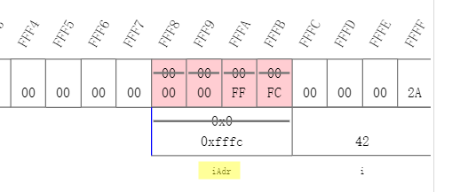

# 09 指针

[TOC]


## 9.1 指针

### 9.1.1 取地址运算符&

- `scanf(“%d”, &i);`⾥的**"&" 获得变量的地址，它的操作必须是变量。** 

  如：

  ```c
  int main()
  {
  	int i = 0;
  	int p;
  	p = (int)&i;   // 把i的地址(&i)强制赋值给p
  	printf("0x%x\n",&i);
  	printf("%p\n",&i);
  	printf("%p\n",p);	
  	return 0;
  }
  /*
  32位架构下运行结果： 
  0x61fea8
  0061FEA8
  0061FEA8
  
  64位环境下运行结果：
  0x9ffe48
  00000000009FFE48
  00000000009FFE48 
  */
  ```

  (详细代码见: [01_&.c](./01_&.c))

  解释：

  1. 地址的⼤⼩是否与int相同取决于编译器 

  2. 第一条"0x61fea8"表示的是变量i的16进制地址；第二条"0x61fea8 "表示的是变量i的地址，由于系统是32位，所以两个地址一样，如果是64位，那么结果都是"00000000009FFE48"

  注：**%p**表示打印地址, **%x**表示以十六进制形式打印，我们打印地址要用**%p**


- &不能对没有地址的东⻄取地址 

  ```c
  	int i = 0;
  	int p;
  	p = &(i++);   // "i++"没有地址，此语句error
  ```

  

- &的结果的sizeof 

  ```c
  	int i = 0;
  	int p;
  	p = (int)&i;   // 把i的地址(&i)强制赋值给p
  	printf("%lu\n",sizeof(int));  // int类型的大小
  	printf("%lu\n",sizeof(&i));   // i的地址的大小
  
  	/*	
  	32位架构下运行结果： 
  	4
  	4
  	64位环境下运行结果：
  	4
  	8 
  	*/
  ```

  

- 相邻的变量的地址 

  ```c
  	// 相邻变量的地址
  	int i ;
  	int p;
  	printf("%p\n",&i);
  	printf("%p\n",&p);
  	/*
  	0061FEAC
  	0061FEA8
  	*/
  ```

  

- 数组的地址

  ```c
  	int a[10];
  	
  	printf("%p\n",&a);      // 数组的地址
  	printf("%p\n",a);	
  	printf("%p\n",&a[0]);   // 数组单元的地址
  	printf("%p\n",&a[1]);	// 相邻的数组单元的地址 
  	/*
  	0061FE88
  	0061FE88
  	0061FE88
  	0061FE8C
  	*/
  ```

  

### 9.1.2 指针变量就是记录地址的变量

- **指针就是保存地址的变量 **

  `p = &i;`表示：将i的地址赋值给变量p， 称**p为 '指向' i 的指针**。

  ```c
  int i;
  int *p = &i; // p是一个指针，它指向的是"i的地址", 此时，叫做"p指向i"
  ```

  

- 普通变量的值是实际的值 

  **指针变量的值是具有实际值的变量的地址** (如`*p`中的p是具有实际值的变量的地址)


- **作为参数的指针，在被调用的时候得到了某个变量的地址** 

  ```c
  void fun(int *p);
  
  int main(void)
  {
  	int i = 6;
  	printf("&i=%p\n", &i);
  	fun(&i);
  	printf("i=%d\n",i);
  	return ;
  } 
  
  void fun(int *p)
  {
  	printf("p=%p\n", p);      // 指针"p"表示的是地址
  	printf("*p=%d\n", *p);    // // "*p"表达的是一个变量，是保存的地址的变量
  	*p = 26;
  	
  }
  /*
  &i=0061FEAC
  p=0061FEAC
  *p=6
  i=26
  */
  ```

  (详细代码见: [03_pointer_in_function.c](./03_pointer_in_function.c))

  

- **运算符***

  `*`是一个单目运算符，用来访问指针的值所表示的地址上的**变量**。

  可以做左值也可以做右值，如

  - `int k = *p;`
  - `*p = k+1;`


- **左值**：出现在赋值号左边的不是变量，而是值，是**表达式计算的结果**。

  如，`a[0] = 2;`中左边 "a[0]" 是表达式计算的结果，不是一个变量

  ​        `*p = 3;`中左边的"*p"也是表达式计算的结果


- 指针的运算符`&` 和`*`的关系：**互相反作用**，`&`获得变量的地址，`*`访问指针的值所表示的地址上的变量。

  1. `*&p` =  `*(&p)`  = `*(p的地址)`  = 得到那个地址上的变量 =`p`
  2.  `&*p` =  `&(*p)`  = `&(变量p)`  = 得到变量p的地址，也就是p =`p`
  


### 9.1.3 指针总结

1. 语句` p = &i;`表示：将i的地址赋值给变量p， 称**p为 '指向' i 的指针。**

   **指针变量的值是具有实际值的变量的地址** (如`*p`中的p是具有实际值的变量i的地址)

2. `*`是一个单目运算符，用来访问指针的值所表示的地址上的**变量**。

3. **作为参数的指针，在被调用的时候得到了某个变量的地址** 

示例：
		&i=0061FEAC  
		p=0061FEAC       ---- p是地址
		*p=6                     ---- *p 是地址上的变量


## 9.2 指针的应用场景

### 9.2.1 交换两个变量的值

```c
#include <stdio.h>
void swap(int *pa, int *pb);

int main(void)
{
	//! showMemory(start=65520) 这里使用edX中C语言课程提供的编译器，展示运行过程地址变化
    int a = 5;
	int b = 6;
	swap(&a,&b);
	printf("After swap, a = %d, b = %d", a, b);
	return 0;
}

void swap(int *pa, int *pb)
{
	int t = *pa;
	*pa = *pb;
	*pb = t;
}
```

(详细代码见: 04_swap.c)

函数运行过程中地址变化如下：


### 9.2.2 函数返回多个值

- **函数返回多个值，某些值就只能通过指针返回**

  传入的参数实际上是需要保存带回的结果的变量。

例：

```c
// 打印数组中最大和最小元素 
void minmax(int a[], int len, int *max, int *min);

int main()
{
	int a[] = {1,2,3,4,5,6,7,87,45,23,55};
	int min,max;
	minmax(a, sizeof(a)/sizeof(a[0]), &min, &max);
	printf("min=%d, max=%d", min, max);   // min=87, max=1
	return 0;
}
void minmax(int a[], int len, int *max, int *min)
{
	int i;
	*min = *max = a[0];
	for (i=1; i<len; i++){
		if (a[i] < *min){
			*min = a[i];
		}
		if (a[i] > *max){
			*max = a[i];
		}
	}

}
```

(详细代码见: [05_min_mix.c](./05_min_mix.c))

### 9.2.3 函数返回运算的状态

- **函数返回运算的状态，结果只能通过指针返回**

- 常用的套路是让函数返回特殊的不属于有效范围内的值来表示出错：-1或0。但是当任何数值都是有效的可能结果时，就得分开返回了 ，后续的语⾔（C++,Java）采⽤了异常机制来解决这个问题 

  ```c
  // 如果除法成功，返回1；否则返回0
  
  int main(void)
  {
  	int a = 5;
  	int b = 2;
  	int c;
  	if (divide(a, b, &c)){
  		printf("%d/%d = %d\n", a, b, c); // 5/2 = 2
  	}
  	return 0;
  } 
  
  int divide(int a, int b, int *result)
  {
  	int ret = 1;
  	if (b==0){
  		ret = 0;
  	} 
  	else {
  		*result = a/b;  
  	}
  	return ret;  // 返回运算的状态
  }
  ```

  

### 9.2.4 指针场景错误

- **定义了指针变量，还没有指向任何变量，就开始使用指针。**

  ```c
  int main()
  {
  	int *p;
  	*p = 12;	 
  	
  	return 0;
  }
  // 此代码直接运算会奔溃，因为指针*p没有指向任何变量，
  // 而是直接定义为了常量12，而12的地址是未知的
  ```

  

## 9.3 指针与数组

- 传入函数的数组成了什么？ 

  **函数参数表中的数组实际上是指针** 

  ```c
  # include<stdio.h>
  void minmax (int a[], int len, int *min, int *max);
  int main(void)
  {
  	int a[] = {1,2,3,4,5,6,7,8,9,12,16,17,21,23,55,};
  	int min,max;
  	printf("在main函数里，数组a的大小: %lu\n", sizeof(a)); 
  	printf("在main函数里，数组a的地址：%p\n", a); 
  	minmax(a, sizeof(a)/sizeof(a[0]), &min, &max);
  	printf("经过调用minmax函数，此时a[0]的值：%d\n", a[0]);
  	
  	return 0;
  	
  }
  
  void minmax (int a[], int len, int *min, int *max)
  {
  	int i;
  	printf("在minmax函数里，数组a的大小: %lu\n", sizeof(a)); 
  	printf("在main函数里，数组a的地址：%p\n", a);
  	a[0] = 1000;
  	*min = *max = a[0];
  	for (i=1; i<len; i++) {
  		if (a[i] < *min){
  			*min = a[i];
  		}
  		if (a[i] > *max) {
  			*max = a[i];
  		}
  	}
  }
  /*
  在main函数里，数组a的大小: 60
  在main函数里，数组a的地址：0061FE74
  在minmax函数里，数组a的大小: 4
  在main函数里，数组a的地址：0061FE74
  经过调用minmax函数，此时a[0]的值：1000
  */
  ```

  (详细代码见: [07_minmax_pointer.c](./07_minmax_pointer.c))

  由上诉代码可以，传入函数后，

  1. 一个数组的大小和一个指针的大小是一样的，都占了4个字节(32位编译环境)。
  
  2. 函数里数组的地址可以函数外的地址是一样的 (实现功能跟指针一样了)

  3. 在函数里里面改变数组的一个元素，函数外的那个元素也要变化 (如a[0])
  
     
  
  **函数参数表中的数组实际上是指针，而且可以用数组运算符进行运算** 


- 以下四种函数原型是等价的：

  ```c
  int sum (int *ar, int n);
  int sum (int *, int);
  int sum (int ar[], int n);
  int sum (int [], int);
  ```

  

- **数组变量本身表达地址**

  ```c
  int a[10];
  int *p = a; // 数组变量本身表达地址，无需用&取地址
  int b;
  b = &a[0];  // 但是数组的单元表达的是变量，所以要用&取地址
  ```

  

- []运算符可以对数组做，也可以对指针做

  *运算符可以对指针做，也可以对数组做


- **数组变量是const的指针，所以不能被赋值**

  **int a[]  = int * const a**


## 9.4 指针与const (C99 only)

### 9.4.1 指针与const

1. **指针是const**：表示一旦得到了某个变量的地址，不能在指向其他变量

   ```c
   int * const q = &i;      // 指针q是const
   *q = 26;  // Ok,可以修改变量的值
   q++;    // error, 不能再指向其他变量（地址不能变）
   ```

   

2.   **所指变量是const**：表示不能通过这个指针去修改那个变量 (并不能使得那个变量成为const)

   ```c
   int i;
   const int *p = &i;  
   *q = 26;  // error, (*p)这个变量是const，不能通过指针p去修改变量的值
   i = 26;  // Ok，变量i本身没有定义成const，值还是可以修改
   p = &j;  // Ok，指针指向地址可以修改
   ```

   

- 当要传递的参数的类型比地址大的时候，可以把一个非const的值转换成const。因为：

  1. 能用比较少的字节数传递值给参数

  2. 能避免函数对外面的变量的修改

     ```c
     void f(const int *x);  // 一个所指变量是const的函数
     int a=15;
     f(&a);   // OK
     
     const int b = a;
     f(&b);   // OK
     b = a + 1;  // error!
     
     ```

     

### 9.4.2  const数组

```c
const int a[] = {1,2,3,4,5,6};
```

1. 数组变量a[] 已经是const的指针了，这里的const表面数组的每个单元都是const int
2. 必须通过初始化赋初值


- 保护数组值

  因为把数组传入函数时，传递的是地址，所以被传入函数内部，可以修改数组的值，有时为了保护数组不被函数破坏，可以设置成const：

  ```c
  int sum (const int a[], int length);  // 设置传入的数组是const
  ```

  

##  9.5 edX指针课程补充

指针部分还学习了[edX课程 C Programming: Pointers and Memory Management](./<https://courses.edx.org/courses/course-v1:Dartmouth_IMTx+DART.IMT.C.04+1T2018/course/>)作为补充。

### 9.9.1 指针定义过程内存情况

```c
#include <stdio.h>
int main(void) {
    //! showMemory(start=65520)
    int i = 42;
    int * iAdr; 
    iAdr = &i;    // alternatively int * iAdr = &i;
    printf("Address of i is %p and i = %d.\n", iAdr, *iAdr);
    // Address of i is fffc and i = 42.

    return(0);
}
```

对上述代码，运行后内存地址情况如下图，可以看到**指针变量"iAdr"上存放的就是变量"i"的地址**



在printf后加入语句`*iAdr = 50;`后，内存地址情况：


可以看到，结果显示，"iAdr"本身并没有变化，还是原先存的地址，但是变量"i"已经修改。


### 9.9.2 函数调用指针内存情况

- **C语言在调用函数时，实现的是参数和值的关系，传值给函数**

```c
#include <stdio.h>
void timesTwo(int);
int main(void) {
    //! showMemory(start=65520)
    int n;
    printf("Please enter an integer: ");
    scanf("%d", &n);
    timesTwo(n);
    return 0;
}

void timesTwo(int num) {
    num = num * 2;
}
```

下面是参数运行过程中内存情况：


- **作为参数的指针，在被调用的时候得到了某个变量的地址** 

```c
#include <stdio.h>
void timesTwo(int *);
int main(void) {
    //! showMemory(start=65520)
    int n;
    printf("Please enter an integer: ");
    scanf("%d", &n);
    timesTwo(&n);
    return 0;
}

void timesTwo(int * numptr) {
    *numptr = *numptr * 2;
}
```


## 9.6 指针运算

- 给指针加1表示要让指针指向下一个变量

  如下面代码，`*p==a[0]`, 则`*(p+1)==a[1]`
  
  注：如果指针不是指向一片连续分配的空间，比如数组，则这种运算没有意义。

```c
#include<stdio.h>
int main()
{
	//! showMemory(start=65520)
    char ac[] = {0,1,2,3,4};
    char *p = ac;
    printf("p = %p\n", p);
    printf("p+1 = %p\n", p+1);
    int ai[] = {0,1,2,3,4};
    int *q = ai;
    printf("q = %p\n", q);
    printf("q+1 = %p\n", q+1);
    return 0;
}
/*
p = fffb                                                                        
p+1 = fffc                                                                      
q = ffe3                                                                        
q+1 = ffe7 
*/
```

下面是代码中地址变化图：


- 除了指针加1，指针还可以做下面的算术运算：
  1. 给指针加、减一个整数(+, +=, -, -+)
  2. 递增递减(++, --)
  3. 两个指针相减


- ***p++**：先取出p所指的那个数据来，之后把p移到下一个位置。常用于数组类连续空间操作。

  

- **0地址**：内存中存在0地址，但是通常不能用。0地址可以用来表示返回的指针是无效或指针没有被真正初始化等特殊的事情。

  NULL是一个预定义的符号，表示0地址。


- **无论指向什么类型，所有的指针的大小都是一样的，因为都是地址。**(如上面代码地址图可以看出，p指向的是char类型，q指向的是int类型，但是它们的大小是一样的，都是4字节)

  为了避免用错指针，不同类型的指针是不能直接相互赋值的。


- **`void*`表示不知道指向什么东西的指针**，计算时与`char `相同(但不相通)。


## 9.7 动态内存分配

- **传统数组的缺点**

  1. 传统数组必须事先制定，且只能是常整数，不能是变量

  2. 传统形式定义的数组，该数组的内存程序员无法手动释放，在一个函数的运行期间，系统为该函数中数组所分配的空间会一直存在，直到该函数运行完毕时，数组的空间才会被系统释放

  3. 数组的长度一旦定义，其长度就不能在更改，数组的长度不能在函数运行过程中动态的扩充或缩小

  4. 传统方式定义的数组不能跨函数使用

     

- C99可以用**变量定义数组的大小**，其他不可以。

  ```c
  #include<stdio.h>
  
  int main()
  {
  	int number;
  	scanf("%d", &number);
  	int a[number];  // 用变量定义数组的大小
  	return 0;
  }
  ```

  (详细代码见: [08_array_number.c](./08_array_number.c))

- C99前，只能使用动态内存分配来实现

  **动态分配内存**：`int *a = (int*)malloc(n*sizeof(int));`

  **malloc**:

  1. 函数原型：`void *malloc(size_t size)`
  2. `malloc(size_t size)`表示程序向系统申请一块大小为size的内存空间，函数返回一个`void*`,指向系统给其分配内存的首地址。**如果返回为NULL，表示没有这么多空间可以分配了，即分配失败**。
  3. 系统分配的只是连续的size大小的内存（以字节为单位），并不管你向这个内存里存什么类型数据，所以malloc函数返回void指针。
  4. 如果需要在该内存区间存放自己需要的类型，使用强制类型转换即可 (如在malloc前加`(int*)`转换成int类型)

  

  
  ```c
#include<stdio.h>
  #include<stdlib.h>  // 要使用malloc先申明头文件 

  int main()
  {
  	int number;
  	int *a; 
  	int i;
  	scanf("%d", &number);
  	a = (int*)malloc(number*sizeof(int));  // 这样才能定义大小是number的int数组a
  	
  	// 下面可以对数组a(或者叫指针a做各种操作) 
  	printf("Input items for a[number]:", number);
  	for (i=0; i<number; i++){
  		scanf("%d", &a[i]);
  	}
  	printf("a[%d] = ", number);
  	for (i=number-1; i>=0; i--){
  		printf("%d ", a[i]);
  	}
  	free(a);   //最终必须把申请得来的空间还给系统 
  	return 0;
  }
  /*
  5
  Input items for a[number]:2 5 7 2 9
  a[5] = 9 2 7 5 2
  */
  ```
  
  (详细代码见: [09_array_malloc.c](./09_array_malloc.c))
  
  用代码来计算总共可以从系统中分配多少内存：

  ```c
  #include<stdio.h>
  #include<stdlib.h> 
  
  int main()
  {
      void* p=NULL;
      int cnt=0;
      while(p=malloc(100*1024*1024)) //当p为NULL(0)时，表示此时无法再分配空间，跳出循环
      {
      	cnt++;
      }
      printf("分配了%d00MB空间\n",cnt);
      return 0;
  }
  /*
  在32位编译器中运行结果： 
  分配了1900MB空间
  */
  ```
  
  (详细代码见: [010_malloc_system.c](./010_malloc_system.c))


- **free()内存释放**

  1. free()把申请得来的空间还给"系统"

  2. 申请过得空间，最终都应该要还

  3. 只能还申请来的空间的首地址

     ```c
         void* p;
         p = malloc(100*1024*1024);
         p++;
         free(p);//不可以，只能free申请来的空间的首地址
     ```

     

  4. 只能free来自malloc动态分配得来的内存

     ```c
     	int i;
     	void *p;	
     	p = &i;
     	free(p);  //  会出错，因为i不是malloc来的
     ```

     

  5. free(0)或free(NULL)是合法的

- 常见问题：
  1. 申请了动态地址，没有free()，否则会造成内存泄漏；
  2. 释放后记得把指针指向NULL，防止程序后面不小心对它操作；
  3. 不能释放多次，除了空指针；
  4. 地址变过了，直接去free会出错，记住**free()只能还申请来的空间的首地址**


----

## 参考资料

1. 翁恺讲义：[指针.pdf](./指针.pdf)

2. 翁恺讲义：[指针运算.pdf](./指针运算.pdf)

3. [edX课程 C Programming: Pointers and Memory Management](./<https://courses.edx.org/courses/course-v1:Dartmouth_IMTx+DART.IMT.C.04+1T2018/course/>)

4. [博客园-C语言学习笔记-动态内存分配](https://www.cnblogs.com/renren-study-notes/p/11379031.html)

5. [CSDN博客-翁恺C笔记|动态内存分配](<https://blog.csdn.net/darlingwood2013/article/details/52200087>)

   

 