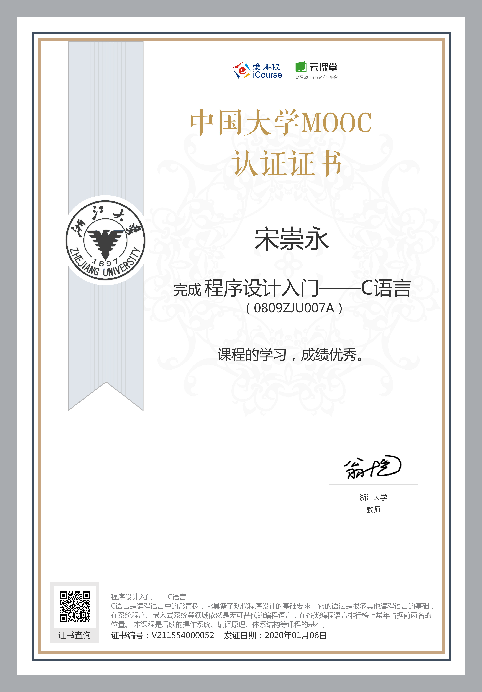
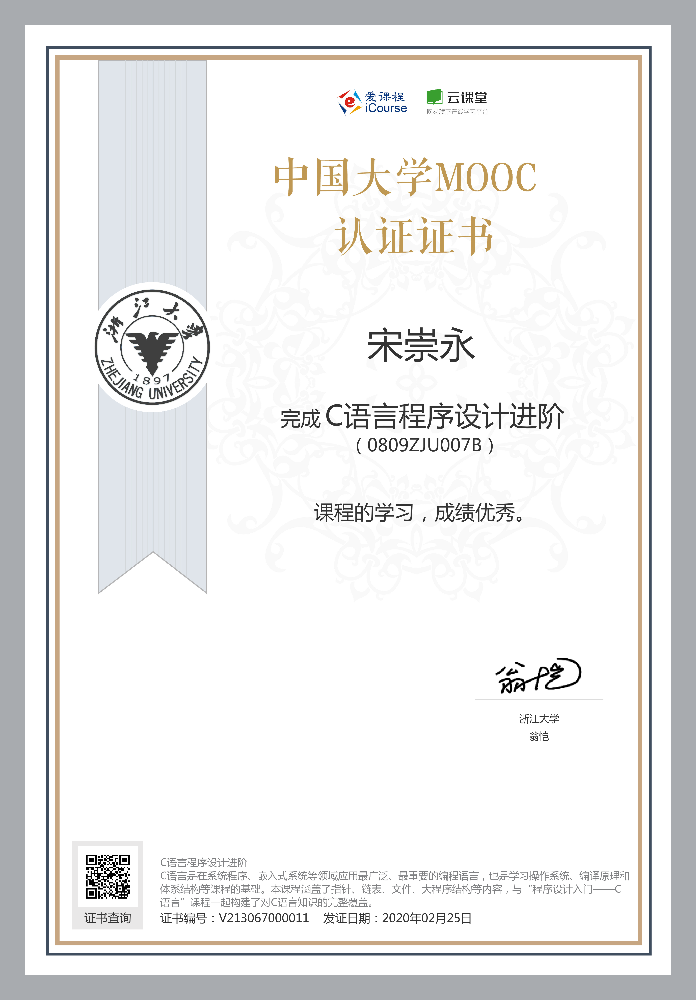

# C语言设计

主要学习的是中国大学MOOC翁恺老师的《C语言设计》课程的笔记，为后续学习《数据结构与算法》建立基础。

在学习过程中，指针、数组、链表还学习了edX的C Programming课程，帮助理解。

注：C程序编译环境是Windows的Dev C++，在编译过程(学到一半)发现Windows文件的tab space居然是8空格，所以很多文件出现了tab space的混乱，暂时没有找到方法批量修改成4空格的，后续会想办法统一、修改。

- [01_计算机&程序&C语言](./01_计算机&程序&C语言)
- [02_变量和表达式](./02_变量和表达式)
- [03_判断_分支结构](./03_判断_分支结构)
- [04_循环](./04_循环)
- [05_for循环和循环控制](./05_for循环和循环控制)
- [06_数据类型和处理](./06_数据类型和处理)
- [07_函数](./07_函数)
- [08_数组](./08_数组)
- [09_指针](./09_指针)
- [010_字符串](./010_字符串)
- [011_结构类型](./011_结构类型)
- [012_可变数组&链表](./012_可变数组&链表)
- [013_程序结构](./013_程序结构)
- [014_文件&位运算](./014_文件&位运算)

拿到中国大学MOOC的证书了，撒花。

-----

## 参考资料

1. [翁恺《C语言程序设计》中国大学MOOC](<http://www.icourse163.org/course/ZJU-9001>) (学习的是2014年第一次开课内容)
2. Brian W.Kernighan等著《C程序设计语言》
3. [edX-C Programming: Pointer and memory management](https://www.edx.org/course/c-programming-pointers-and-memory-management)
4. [edX-C Programming: Advanced Data Types](https://www.edx.org/course/c-programming-advanced-data-types)
5. [B站视频 edX-C Programming: Advanced Data Type](https://www.bilibili.com/video/av78845925)

