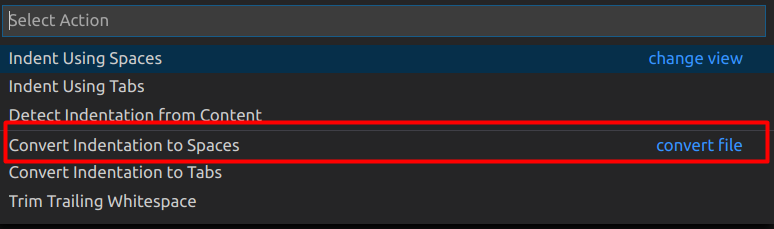

## Tab space修改

Windows在新建C或C++文件时默认的tab space是8个空格，我找了好几个修改方式，都没有成功。

后面发现一个可以实现的方式：

**用VSCode打开文件，然后用下面的快捷键，修改所有的tab space 为4空格**

- VSCode on Windows - Shift + Alt + F

- VSCode on MacOS - Shift + Option + F

- VSCode on Ubuntu - Ctrl + Shift + I

或者用VSCode打开，点一下右下的Space按钮，在弹出的选择框里选择"convert file"

----

## 参考资料

1. [How to change indentation in Visual Studio Code?](https://stackoverflow.com/questions/34174207/how-to-change-indentation-in-visual-studio-code)